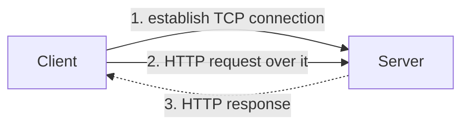
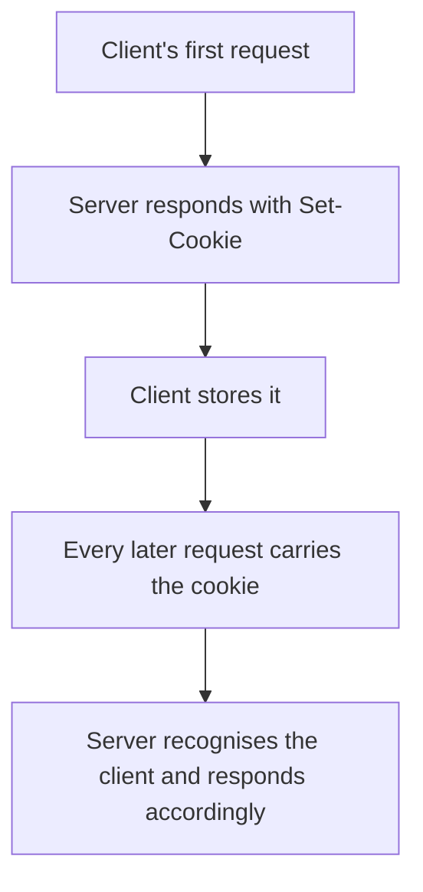

HTTP is an application-layer protocol, so it sits at the top of the stack and relies on everything beneath it. Two properties matter more than the rest: it is built on TCP, and it remembers nothing.

# It runs on TCP

Application-layer protocols do not move data themselves. They depend on the transport layer below, where two protocols live: **TCP** and **UDP**.

> [!important] **HTTP depends on TCP.** A client and server cannot simply exchange an HTTP request and response — a **TCP connection has to be established first**, and the HTTP exchange then happens over it.



Which is why the ordering from earlier material holds: a three-way handshake, then a TCP connection, then HTTP on top. The request you write is the last step of several.

> [!info] **Payload** is the term for the data being carried — the contents of the parcel rather than the addressing on it. A request payload is what the client is sending; a response payload is what comes back.

# It is stateless

The single most consequential property of HTTP.

> [!important] **HTTP is a stateless protocol. The server stores no information about the client.**

Each request is served independently of every other. The server does not know who is asking, whether they have asked before, or whether they asked for this same thing a moment ago. Request the same resource ten times and it will be produced ten times, because nothing recognises the repetition.

## What that costs, and who pays

> [!important] Any optimisation across requests is **the developer's responsibility**, not the protocol's. If a client keeps asking for the same thing, nothing in HTTP will notice — you have to put something in front of it, such as a cache, that does.

Statelessness is a deliberate design choice with real benefits, since a server holding no per-client state is far easier to scale. But it means anything requiring memory across requests has to be built.

# What travels

Two messages per exchange: a **request** from the client, a **response** from the server. Both carry more than their contents.

Alongside the request URL, method and body, the headers include:

| Header | What it says |
|---|---|
| **User-Agent** | Which client is making the request |
| **Accept-Language** | The language the client would prefer |
| **Connection** | Whether this connection should stay open |

**User-Agent** matters when a server serves genuinely different pages to different clients — not a responsive layout, but different content depending on what is asking.

**Connection** distinguishes a **persistent** connection from a **non-persistent** one. Non-persistent means the connection closes after the exchange; persistent means it stays open for further requests, avoiding the cost of establishing TCP again.

> [!info] The response carries a **status code** saying what happened, described in the REST material. The ranges are the same wherever you meet them: 1xx informational, 2xx success, 3xx redirection, 4xx client error, 5xx server error.

# Cookies

Now the consequence of statelessness.

## The problem

You are browsing a shopping site. The server needs to know whether you are logged in — a logged-in visitor should see their cart, an anonymous one should not.

But the server keeps nothing about you. Every request arrives as though it were the first. **How can it possibly know?**

## The mechanism

> [!important] A **cookie** is a unique identifier string, set by the server through HTTP headers, and stored by the client.

The server issues one by including it in a response:

```text
1  Set-Cookie: <value>
```

> [!important] Once stored, the client **sends that cookie back with every subsequent request to the same server.**



Which resolves the contradiction. The server still stores nothing — **the client carries the identifier and presents it each time**. State exists, but it lives on the client and travels with each request rather than sitting on the server.

That is what lets a stateless protocol support something as stateful as being logged in.

## The privacy question

> [!warning] The same mechanism that recognises you across requests recognises you across **visits** — and can be used to recognise you across **sites**. That is why cookies are the subject of consent prompts and regulation. The technical capability that makes sessions possible is the capability that makes tracking possible; they are not separable.
