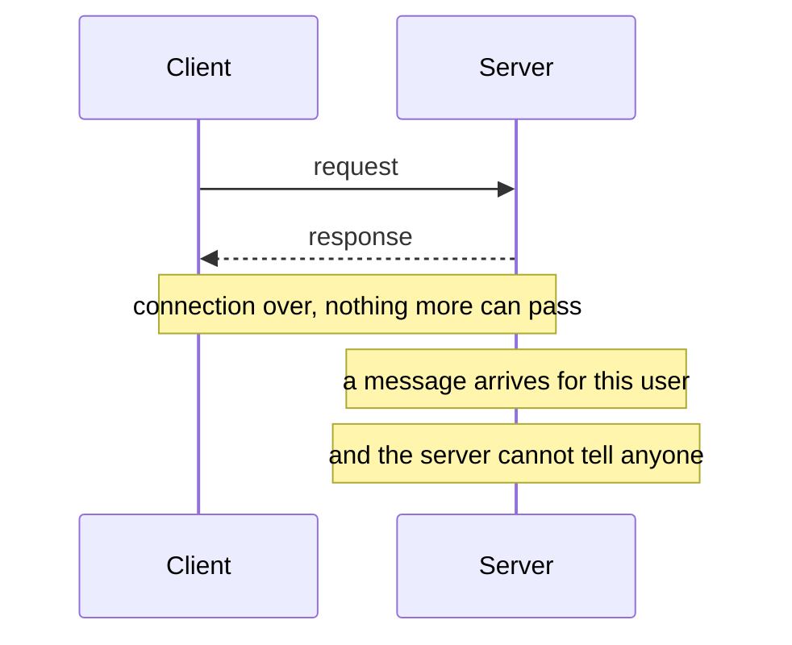
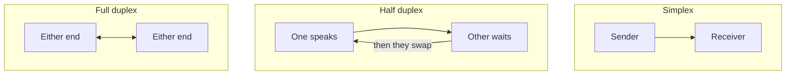
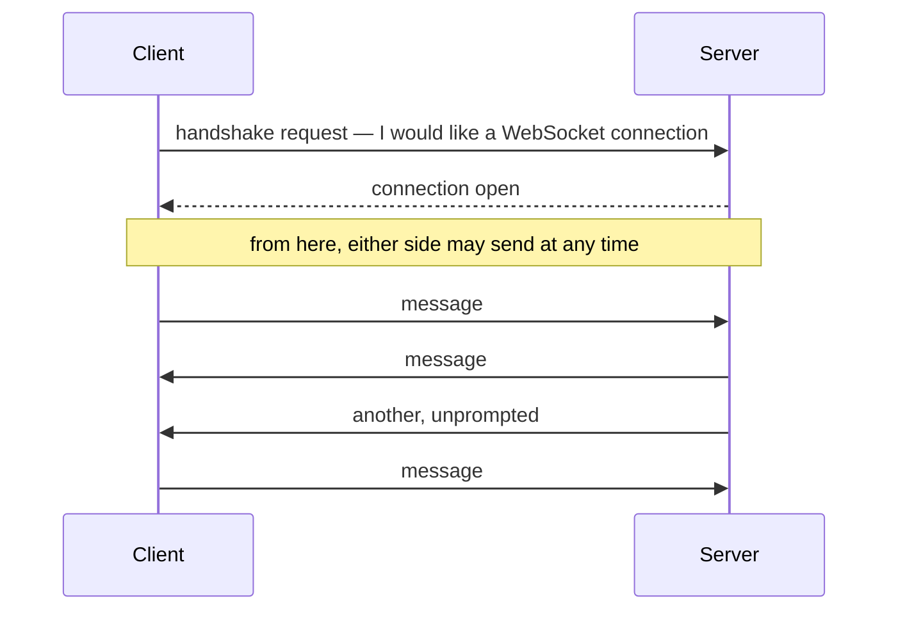

Statelessness has just been established as HTTP's defining limitation. There is a second one sitting beside it: the exchange is one-directional. The client asks, the server answers, and it is over. That shape makes a whole category of application awkward, and WebSockets is the answer to it.

# The problem, stated plainly

Open an inbox in a browser and new mail does not appear until you refresh. Open a chat and messages appear on their own, with no refresh, immediately.

The difference is not effort or polish. **Under HTTP the server has no way to speak first.**

The server knows. It cannot say so. Nothing can travel until the client asks again, so the only way to appear live is to keep asking — every second, forever, almost always for nothing.

# Three ways data can flow

Before the solution, the vocabulary, because the whole point is which one you get.

| Mode | Data flows | Like |
|---|---|---|
| **Simplex** | One direction only, never back | A broadcast |
| **Half duplex** | Both directions, but only one at a time | A walkie-talkie |
| **Full duplex** | Both directions, simultaneously | A telephone call |

Half duplex is genuinely two-way, and it is still not enough for a conversation — you cannot interrupt someone on a walkie-talkie, because while they transmit you cannot.

# What WebSockets is

> [!important] **WebSockets is a communication protocol providing a full-duplex, bidirectional connection between two machines.** Both ends may send at any moment, including at the same moment, over a connection that stays open.

Two things change compared to HTTP.

**The roles dissolve.** Under HTTP one side is the client and the other is the server, permanently. Over a WebSocket **both ends can initiate**, so the distinction stops meaning much.

**The connection is stateful and persistent.** It is not created per message and torn down. It is established once and stays up until somebody closes it.

> [!info] **It runs on TCP** — the same protocol HTTP runs on. This is not an alternative to the transport layer; it is a different way of using it.

# Opening one

**The client sends a handshake request.** The server, if it agrees, responds that the connection is open. After that the exchange is symmetric — the fourth line in that diagram, a server sending without being asked, is the thing HTTP cannot do.

> [!important] **If either side closes the channel, the whole channel closes.** There is one connection, shared, and it ends when either participant ends it.

# What persistent buys you

The connection surviving is not merely a saving on setup cost.

> [!important] Because the pipeline stays open, a client that **loses its network and comes back finds the connection reactivating**, and data that was waiting flows through. Under HTTP there is nothing to reactivate — there was no connection to lose.

That is why a chat application feels different from an inbox. The channel is a standing arrangement rather than a series of unrelated requests.

# What it is used for

- **Chat applications** — the obvious case, and the one that made the technology famous
- **Live feeds and notifications** — anything that has to appear without the user acting
- **Multiplayer games** — where both ends are constantly informing each other
- **Collaborative editing** — two people typing in the same document and seeing each other's changes as they happen

The last one is a good test of whether you have understood the requirement. Collaborative editing needs both directions simultaneously — you are typing while receiving what the other person types. **Half duplex would not do**, and polling would make it unusable.

# What it costs

| Advantage | |
|---|---|
| Persistent | The connection is not rebuilt per message |
| Low latency | Nothing to establish before sending |
| Bidirectional | Either side may speak first |
| Flexible payloads | Text or binary, so images and files travel over the same channel |

| Drawback | |
|---|---|
| Browser compatibility | Not uniformly supported across every environment |
| Firewalls | A long-lived connection is the kind of thing corporate networks interfere with |

> [!info] You rarely implement the protocol yourself. Most ecosystems have a library that wraps it — Socket.IO in Node.js, Action Cable in Ruby on Rails, and equivalents elsewhere. The mechanism is the same underneath; only the interface differs.

# When not to reach for it

WebSockets is not a better HTTP. It is a different shape, and it is the wrong shape for most requests.

> [!important] **If the client always asks first and the server only ever answers, HTTP is correct.** Fetching a page, submitting a form, calling an API — none of these need a standing connection, and giving them one means holding open a resource on the server for every connected user with nothing to show for it. Reach for WebSockets when the server genuinely needs to speak unprompted.
