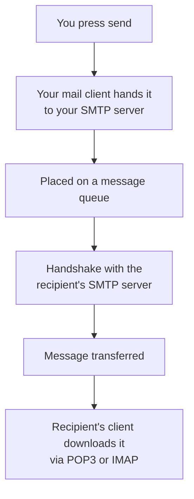

Both protocols so far were built for the web, and both are recent by comparison with what comes next. Email predates the web and works nothing like it. Following a message from send to inbox explains why it behaves the way it does — including why it is noticeably slower than a chat message.

# Three protocols, two directions

> [!important] **SMTP** — Simple Mail Transfer Protocol — **sends** email.
> **POP3** and **IMAP** **retrieve** it.

That split is the key fact, and it has a name:

| Protocol | Direction | Type |
|---|---|---|
| **SMTP** | Sending | **Push** — the sender initiates |
| **POP3** | Retrieving | **Pull** — the receiver initiates |
| **IMAP** | Retrieving | **Pull** |

> [!info] A **push** protocol carries data outward from whoever has it. A **pull** protocol fetches data on the receiver's initiative. Email needs both because sending and collecting are genuinely different actions performed by different parties at different times.

# The path a message takes



**Your client sends it to your SMTP server.** Which server that is has been configured in your mail client — a mail service's client is configured to use that service's SMTP server.

**It goes on a queue.** Not sent immediately; queued for sending.

**Your server contacts the recipient's server** and performs an **SMTP handshake** — the agreed opening exchange before any mail passes.

> [!info] If sender and recipient are on the **same** mail service, no separate connection is needed. The message never leaves that server.

**The message transfers.** This is the moment it actually moves between organisations.

**The recipient's client downloads it** — with POP3 or IMAP, and only when that client asks.

# Why email is slow

> [!important] There is no direct path from your machine to theirs. The message is queued, handed between two independent servers, stored, and then waits until the recipient's client comes to collect it.

A chat message is delivered over a connection built for immediate two-way traffic. Email is a store-and-forward system, and each stage adds delay. The lag is the design, not a fault.

> [!info] Which is also why it is **reliable**. Every stage stores the message before passing it on, so a failure anywhere does not lose it. Email is decades old and still in use precisely because that property matters more than speed.

# When delivery fails

Two failure modes, handled differently.

**No such recipient.** The recipient's server cannot find that address, so the message is **returned to the sender** with a not-delivered notice.

**The recipient's server is offline.** The sending server **retries after a delay**, repeatedly. It does not try forever — after a set threshold, measured in days, it gives up and marks the message undelivered.

> [!important] That retry behaviour is the store-and-forward design paying off. The message was not lost when the far end was unreachable; it sat on a server and was attempted again.

# POP3 and IMAP

Both retrieve mail, and they differ on what happens to it afterwards.

| | **POP3** | **IMAP** |
|---|---|---|
| Where mail lives | Downloaded to the device | **Stays on the server** |
| On the device | The copy | A cached copy |
| Deletion | Download-and-keep, or download-and-delete | Only when the user says so |
| Several devices | Awkward — whichever device downloaded it has it | Natural — every device sees the same mailbox |

> [!important] **IMAP keeps the server authoritative.** Devices hold cached copies, and mail is removed from the server only when you explicitly delete it — so every device sees the same state.
>
> **POP3 treats download as the transfer.** The message moves to whichever device collected it, which is a poor fit the moment you read mail on more than one.

That difference explains everyday behaviour: deleting a message on your phone and finding it gone on your laptop is IMAP working as designed.

# What configuring it looks like

Setting up an application to send mail through a provider means giving it that provider's SMTP details:

```text
1  address:  smtp.gmail.com
2  port:     587
3  domain:   gmail.com
4  username: you@gmail.com
5  password: your account password
```

> [!important] Recognise the shape — it is the same connection configuration as any other server: an address, a port, and credentials. The protocol differs; the requirements do not.

> [!warning] A password sitting in configuration is exactly the situation environment variables exist for. Lines 4 and 5 belong outside the file that is committed.
