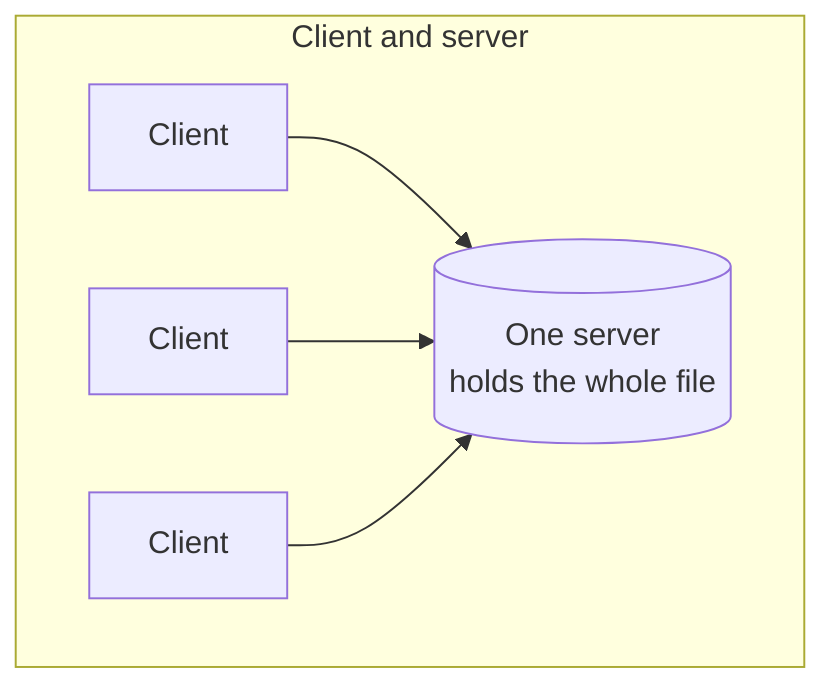
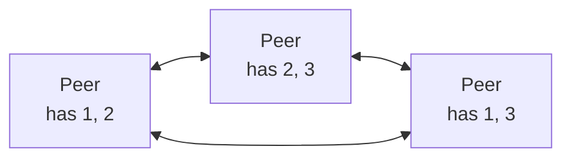
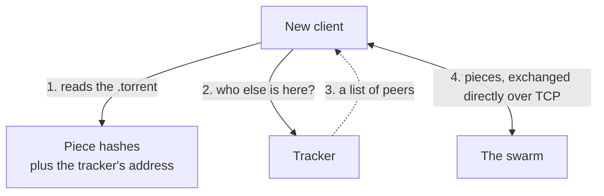

Every protocol so far has kept one machine at the centre. The data lives on a server and everyone else fetches it from there — and even WebSockets, which lets both ends speak freely, still has one side hosting and the other connecting. That shape has a weakness, and it is not subtle. Ten thousand people downloading the same film all pull it from the same machine, and that machine has a finite connection. File sharing solved this by abandoning the assumption.

# Protocol and client are different things

Two words get used interchangeably and should not be.

> [!important] **Torrent is a protocol** — a set of rules for sharing files between machines. **BitTorrent and uTorrent are clients** — applications that implement those rules. The protocol is the agreement; the client is a program that speaks it.

Which is the same distinction as HTTP and a browser. HTTP is the rulebook, Chrome is a program that follows it, and swapping the browser does not change the rules.

# Nobody is only a client

In the client-server arrangement the roles are fixed. One machine holds the data, everyone else asks for it.

Peer-to-peer drops that.

> [!important] In a **peer-to-peer** architecture every machine is both client and server. Each one holds some part of the file it can give away, and wants some other part it does not have yet.

The more people who want the file, the more machines there are to serve it. That is the opposite of what happens to a single server, and it is the whole reason the architecture exists.

## Except it is not purely peer-to-peer

One question has no answer yet. A new machine wants to join. **How does it find out who else has the file?** It knows nothing about anyone.

> [!important] Torrent is a **hybrid architecture**. The file transfer is peer-to-peer, but finding the peers in the first place goes through a central point.

# The pieces

A file is not transferred whole. It is cut into **pieces**, and each piece is fetched independently, possibly from a different machine.

> [!important] **Piece size is a power of two, most commonly 256 KB.** Older clients used 1 MB. A one gigabyte film at 256 KB per piece is about four thousand pieces.

Cutting it up is what makes the parallelism possible. You can pull piece 1 from a machine in one country while pulling piece 2 from a machine in another, and neither has to hold the whole file.

And every time a client finishes a piece, it announces it:

> [!important] **A completed piece is immediately advertised as available.** The client that just downloaded it becomes a source for it. A file with one holder becomes a file with two holders the moment the first transfer completes, and the supply grows as the demand does.

# The vocabulary

> [!important] A **swarm** is the collection of collaborating clients working on one file.

Within a swarm, clients are described by what they contribute:

| Term | Means |
|---|---|
| **Seeder** | Has the complete file and is uploading it |
| **Leecher** | Is still downloading, and uploading the pieces it already has |

A client shows you both counts while a download runs. They predict the experience directly: **many seeders means a fast download, one or two means a slow one.** With a single seeder you are effectively downloading from one machine, which is the client-server situation the architecture was meant to escape.

# The `.torrent` file

The small file you download first is not the content. It is the description of it.

| It contains | Used for |
|---|---|
| Information about the file being shared — name, total size | Knowing what you are getting and how much is left |
| A hash for every piece | Verifying each piece as it arrives |
| The address of a tracker | Finding the other participants |

## The tracker

> [!important] A **tracker** is a server that keeps a list of who is currently participating in a swarm. A client asks it who else is here, receives a list of peers, and then talks to those peers directly.

That is the central point that makes the architecture hybrid. The tracker never holds or transfers the file — it answers one question, and the actual data never touches it.

Steps 1 to 3 happen once. Step 4 is the entire rest of the download, and the tracker takes no part in it.

> [!info] **Very large swarms can drop the tracker.** Managing a tracker for a swarm of that size becomes expensive, so trackerless torrents exist, where peers discover each other between themselves rather than through a central list.

## It runs over TCP

Piece exchange between peers uses TCP, which means every transfer is a connection that has to be established first and gives reliable, in-order delivery. For file transfer that is not negotiable — a film missing a few hundred bytes in the middle is a broken film.

# Verifying what arrives

You are downloading from strangers. Nothing about the architecture makes them trustworthy, so a piece that arrives has to be checked before it is believed.

> [!important] The `.torrent` file carries **one hash per piece**. When a piece finishes downloading, the client hashes what it received and compares. Match and the piece is kept and advertised. Mismatch and it is thrown away and requested again from someone else.

> [!info] **Filled from the protocol specification.** A capture gap covers this passage. The specification defines the `pieces` field of the metainfo file as a string whose length is a multiple of 20, subdivided into 20-byte SHA-1 hashes, one per piece in order.

## What that defence was built against

The check exists because the attack existed.

Around the release of a popular television series, downloads across the network began failing in a way nobody could explain. Clients would fetch a piece, find the hash did not match, discard it, request it again, and receive another bad copy. Downloads that should have taken an hour did not complete at all.

**What had been noticed was that the bad pieces came from unusually fast peers.** Machines with far more bandwidth than an ordinary participant, joining swarms in numbers, serving pieces that were deliberately wrong.

> [!important] The widely held explanation is that the rights holder joined the swarms itself and flooded them with corrupt pieces — not to break the protocol, but to make using it unbearable. The hashing worked exactly as designed: every bad piece was caught and discarded. **Detection was never the problem. Exhaustion was.**

> [!info] At the time there was no way to refuse a peer. Clients can now **blacklist** a peer that repeatedly serves failing pieces, which is what stops the same attack from working today.

# Deciding what to download first

A client wanting twenty pieces could ask for them in order. It does not.

> [!important] **Rarest first.** A client downloads the piece held by the fewest peers before any other.

The reasoning is about the swarm rather than about you. Common pieces are available from many machines and will still be there in ten minutes. **A rare piece is one departure away from being unavailable to everyone** — and if a piece exists nowhere in the swarm, nobody can complete the file, no matter how much of the rest they have.

So the rare piece is replicated first, and stops being rare. The policy protects the swarm's ability to finish, and every member benefits from that including the one running it.

# Deciding who to upload to

A second problem is human rather than technical. Downloading costs you nothing. Uploading costs you bandwidth. **Why would anyone upload?**

If everybody reasons that way there is nothing to download, and the whole thing collapses.

> [!important] **Tit-for-tat.** You send data to the peers who send data to you. Peers who contribute more get better bandwidth from you and therefore download faster.

Which turns generosity into self-interest. Uploading is no longer charity — it is how you get a fast download. The peers who give the most get the most, and the ones who take without giving find themselves served last.

> [!info] **BitTyrant** is a later protocol that pushes the same idea further, giving even more preference to peers that seed heavily.

# What this architecture buys

> [!important] **Capacity grows with popularity instead of collapsing under it.** A file that ten thousand people want is served by ten thousand machines. The same file on one server is served by one machine, and the ten-thousandth person waits behind the other nine thousand nine hundred and ninety-nine.
