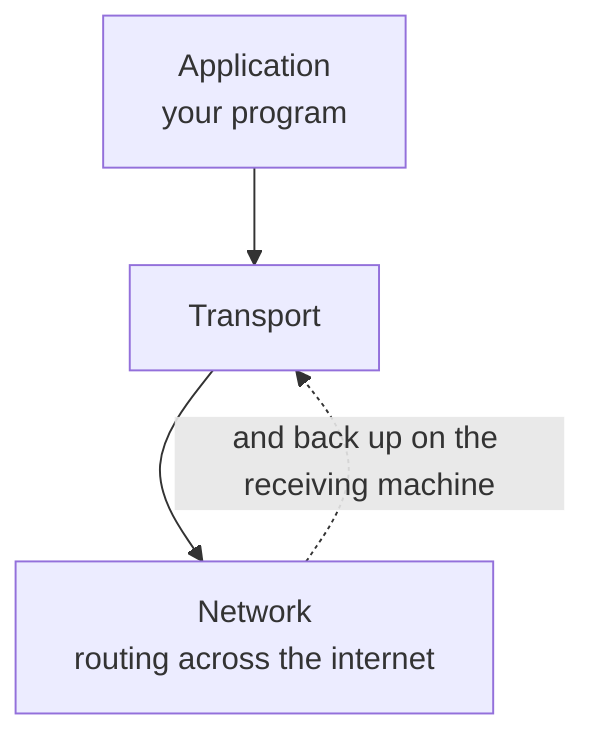

The layer stack named a transport layer and said it divides data into chunks. That is one of its three jobs, and the choice it forces on you — which of two protocols to use — is the most consequential decision in this part of the stack.

# Where it sits, and what that means

Transport sits between the application and the network. Above it is your program. Below it is everything to do with routing packets across the world.

> [!important] Like the application layer, **transport runs on the end systems** — the sending machine and the receiving machine. It does not run on the routers in between. Those deal in packets and paths and know nothing about which application a packet belongs to.

# Three responsibilities

## Segmentation

The application hands down whatever it has, in whatever size it happens to be. A ten megabyte upload arrives as ten megabytes.

> [!important] Transport **divides that into small, manageable pieces**, because nothing below it can carry an arbitrarily large block. The pieces have different names depending on which protocol is used, and the names are worth getting right early.

| Protocol | A piece is called |
|---|---|
| **TCP** | A **segment** |
| **UDP** | A **datagram** |

On the receiving machine the same layer reassembles them before handing anything to the application.

## Application-to-application delivery

The network layer gets data to a **machine**. That is not enough — a machine is running a browser, a mail client, a database and forty other things.

> [!important] Transport provides **logical delivery between applications**, not between machines. Two programs on two different machines get what amounts to a direct channel, and neither has to know anything about the route the data took.

## Multiplexing and demultiplexing

Many applications on one machine are all sending and receiving at once, over one network connection.

> [!important] **Multiplexing** is combining the outgoing data of many applications onto that one connection. **Demultiplexing** is taking what arrives and delivering each piece to the application it belongs to.

Which is the same combine-and-separate problem that appears everywhere in networking, solved here at the level of programs on a single machine.

# The two protocols

> [!important] **TCP** — Transmission Control Protocol. **UDP** — User Datagram Protocol.

They are not different qualities of the same thing. They make opposite choices about what to do when something goes wrong, and each choice is correct for a different kind of application.

| | **TCP** | **UDP** |
|---|---|---|
| A piece is called | Segment | Datagram |
| Delivery | **Reliable and in order** | **Not guaranteed** |
| Corruption | Detects it **and corrects it** | Detects it, **does nothing about it** |
| Speed | Slower | **Faster** |
| Typical uses | Web pages over HTTP, email, file transfer | Voice calls, live streaming, gaming |

**Reliable and in order** means two separate promises. Nothing sent is lost, and what arrives arrives in the order it was sent. UDP promises neither.

# Why anyone would choose to lose data

Giving up reliability sounds like a strictly worse deal. It is not, and the clearest way to see why is to compare two things you have both used.

## A recorded video

Watch something on a video site with a poor connection and it stops. A spinner appears. When the connection recovers, **it resumes from exactly where it stopped.** The frames it had not received are still fetched — nothing is skipped.

That is TCP. A missing chunk is requested again, and again if necessary, until it arrives. Playback waits, because the alternative is a hole in the video.

## A live stream

Now watch something live with the same poor connection. It stops. When the connection recovers, **it resumes at whatever is happening now.** The five minutes you missed are gone and are never fetched.

That is UDP, and here it is obviously right. **Delivering those five minutes late would be worse than not delivering them at all** — the point of a live stream is being live, and a viewer five minutes behind is watching something else.

## And the version that costs you something

The same thing in a game is more visceral. You are moving through a level. Your connection stutters, and frames describing what other players did are dropped. When it recovers, the game resumes at the present moment.

**On someone else's screen you were standing in the open the whole time.** They shot you. Your machine never received the frames showing them take aim, and it never will, because those frames were dropped and dropping them is the design.

> [!important] The trade is exactly this. **TCP treats late data as better than no data. UDP treats late data as worthless.** Which is correct depends entirely on whether your data has a deadline.

# Why UDP is faster

Not because it uses a faster wire. Because of what it does not do.

> [!important] TCP tracks what was sent, waits for confirmation, keeps timers, retransmits what is missing, and holds data back to put it in order. **All of that costs time.** UDP does none of it: it sends, and moves on.

A loading web page is the opposite case, and shows why TCP earns its cost. A page that arrives with a random paragraph missing is not a slightly worse page. It is broken. There is no deadline by which a missing byte becomes worthless, so waiting for it is always the right call.
