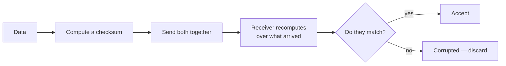
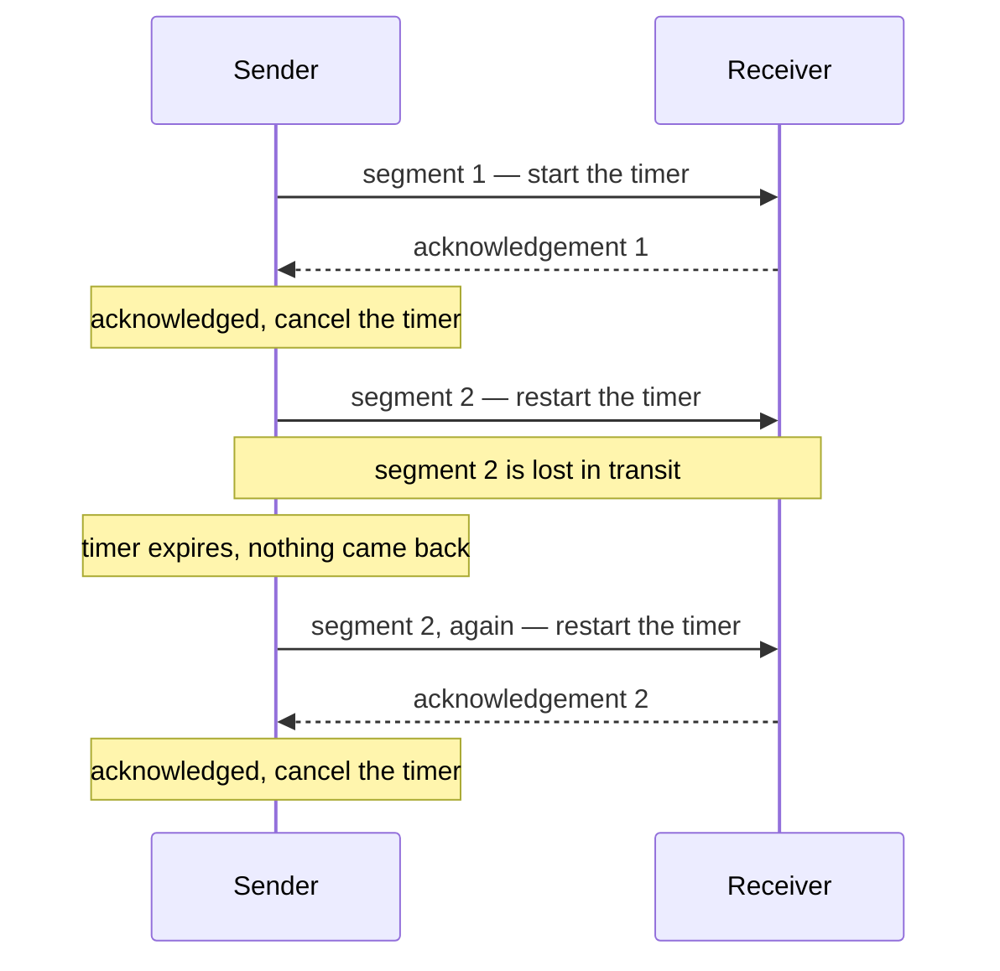
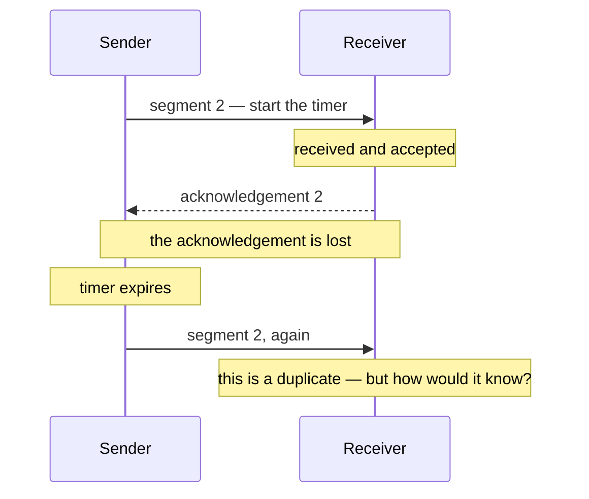

TCP promises reliable, in-order delivery over a network layer that promises neither. Three things can go wrong underneath it, and each one has a specific mechanism built to answer it. Taken in order, each mechanism creates the problem the next one solves.

# What the layer below does not guarantee

| Imperfection | What it looks like |
|---|---|
| **Corruption** | The data arrives, but some bits have changed |
| **Loss** | The data never arrives at all |
| **Duplication and reordering** | The data arrives twice, or out of sequence |

None of these is a fault. The network layer was never designed to prevent them — it routes packets and does its best. Everything that follows is transport making up the difference.

# Corruption, and checksums

The data arrived. Some of it is wrong. Nothing about the packet announces this.

> [!important] A **checksum** is a value computed from the data and sent alongside it. The receiver computes the same value over what it received and compares. Different values mean the data changed in transit.

The simplest version is arithmetic: add up the bits, send the sum, and have the receiver add them up again.



## What it does and does not do

> [!important] **Checksums detect errors. They do not correct them.** Knowing the data is wrong is enough — the data can be requested again. Working out what it should have been is a much harder problem and is not attempted here.

And there is an honest hole in it:

> [!warning] **If the checksum itself is corrupted, the check is meaningless.** The comparison fails even though the data is fine, or in an unlucky case succeeds even though it is not. A simple arithmetic checksum does not handle every corner case. It handles the overwhelming majority, which is what makes it worth its very low cost.

# Loss, and retransmission timers

Now the harder case. The data never arrived. There is nothing to checksum, and nothing to notice.

The receiver cannot report this — it does not know anything is missing. So the sender has to work it out, and the only evidence available is silence.

## Acknowledgements

> [!important] The receiver sends an **acknowledgement** for data it receives. The absence of one is the sender's only signal that anything is wrong.

## Round trip time

Silence means nothing on its own. Data takes time to travel, and so does the acknowledgement. How long is too long?

> [!important] **Round trip time** is the time for data to reach the receiver plus the time for its acknowledgement to come back. It is the shortest possible wait before an acknowledgement could arrive.

> [!important] A **retransmission timer** is started when a segment is sent, and set to **round trip time plus a margin**. Longer than the round trip, because anything less would fire while a perfectly good acknowledgement is still in flight. Plus a margin, because the network is not consistent.

## Watching it work



Segment 1 is straightforward. Segment 2 is lost, no acknowledgement comes, the timer expires, and the sender resends. The receiver eventually gets it.

## And the mechanism creates a new problem

Consider a different failure. **The segment arrived perfectly. The acknowledgement was lost on the way back.**



From the sender's side these two failures are **indistinguishable**. Both look like silence. So it does the only thing it can and resends.

> [!important] The receiver now has segment 2 twice. **The retransmission timer has no way to tell a lost segment from a lost acknowledgement**, and so it manufactures duplicates while solving loss.

# Duplication and reordering, and sequence numbers

Both are the same problem underneath: the receiver cannot tell which segment is which.

> [!important] A **sequence number** is attached to every segment — a consecutive number identifying it.

Two problems fall to one mechanism:

**Duplicates become visible.** A segment arrives carrying a number the receiver has already seen. It is a copy, and it is discarded.

**Order becomes recoverable.** Segments arriving as 1, 3, 2 can be put back in order, because their numbers say what the order was. Without them, arrival order is the only order there is.

# Waiting is expensive

Everything so far describes one segment at a time: send, wait for the acknowledgement, send the next. It is correct and it is very slow.

> [!important] The sender spends almost all of its time waiting. If the round trip is 100 milliseconds, sending one thousand segments strictly one at a time takes **one hundred seconds**, and the connection sits idle for nearly all of it.

The obvious fix is to send several without waiting. That works, and immediately introduces a new failure:

> [!warning] **Send everything at once and you overwhelm the receiver.** It has a finite buffer to hold what arrives before the application reads it. Fill it faster than the application drains it and data is dropped — not by the network, but by the receiver itself.

# The sliding window

So the answer is neither one at a time nor all at once.

> [!important] A **window** is a number of segments the sender may have outstanding — sent but not yet acknowledged — at any moment. **The sender and receiver agree the window size when the connection is established**, so the receiver is never sent more than it said it could hold.

It is called sliding because of how it moves.

```text
window size 3

send 1, 2, 3          [ 1  2  3 ] 4  5  6      three outstanding, wait
ack 1 arrives          1 [ 2  3  4 ] 5  6      window slides, 4 may now be sent
ack 2 arrives          1  2 [ 3  4  5 ] 6      slides again, 5 may now be sent
ack 3 arrives          1  2  3 [ 4  5  6 ]     slides again
```

The window advances by one every time an acknowledgement arrives, and each advance permits exactly one new segment. **The sender never waits for a full round trip before sending anything at all, and never gets more than the window ahead of the receiver.**

> [!important] So the window is doing two jobs at once. It **keeps the connection busy**, by allowing several segments in flight. And it **protects the receiver**, by capping how many.

# When a windowed transfer loses something

Sending several at a time makes recovery harder. If segment 2 of five is lost, what should happen to 3, 4 and 5, which arrived fine?

Two protocols answer that differently:

| Protocol | On a loss |
|---|---|
| **Go-back-N** | Resend the lost segment **and everything after it** |
| **Selective repeat** | Resend **only** the lost segment |

Go-back-N is simpler and wastes bandwidth resending data that arrived. Selective repeat wastes nothing and requires the receiver to buffer out-of-order segments and track exactly which are missing.

> [!important] Which is the shape of the whole layer. **Every mechanism here buys a guarantee with a cost**, and the protocols differ in which costs they are willing to pay.
