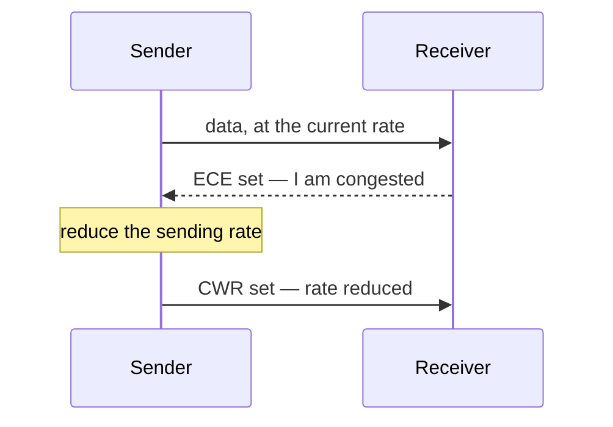
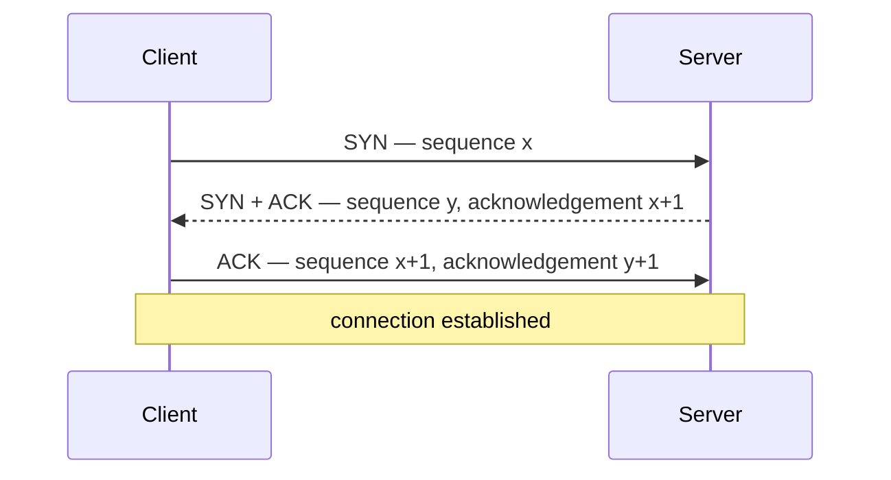

The reliability mechanisms exist in the abstract. TCP is the protocol that assembles them into something usable, and its header shows exactly which ones it carries.

# What it is responsible for

## Sending at the right rate

Two failures sit either side of the correct speed.

**Too slow** wastes capacity that was available and paid for. **Too fast** causes congestion — the network cannot forward what it is given, queues build, and packets are dropped, so pushing harder makes throughput worse rather than better.

> [!important] TCP has to find a rate fast enough to use the available capacity and slow enough not to cause congestion, and that rate is not knowable in advance. It is discovered by sending, watching what happens, and adjusting.

## Segmenting

The application hands down an unbroken stream of whatever size it likes. There is no limit on how much it may pass at once.

> [!important] TCP divides that into **segments** — each one a collection of bytes taken from the stream, sized appropriately for what is below.

And what is below may divide it again:

> [!info] If a segment is still too large for the network layer, the network layer **breaks it into several messages of its own**. The receiving machine's transport layer then has to reassemble those before it can reassemble the segments. The stack does this without the application knowing, which is the point of having layers.

## Identifying and retransmitting

> [!important] TCP is **acknowledgement based**. Every segment that arrives is confirmed, and that feedback is what tells the sender whether anything needs sending again.

# Where it is used, and why

| Application | Why it needs TCP |
|---|---|
| **FTP**, file transfer, on ports 20 and 21 | Missing or reordered bytes change the file |
| **SSH**, secure shell | A command delivered with characters missing is a different command |
| **Email** | A message must arrive complete |
| **HTTP and HTTPS**, web browsing | A page with a hole in it is broken |

The pattern is the same each time. **These are cases where late data is better than no data**, which is precisely the condition that makes TCP the right choice.

> [!important] HTTP is worth stating explicitly: **a browser cannot send an HTTP request directly.** A TCP connection is established first, and the HTTP request travels over it. Every web page you have ever loaded involved a TCP connection being set up before a single byte of HTTP was sent.

# Its properties

**Connection oriented.** A long-lived connection is established between the two machines and persists until one of them terminates it. This is the opposite of sending something to an address and hoping.

**Full duplex.** Both ends may send at the same time. Neither is only a sender or only a receiver.

**Point to point.** Exactly two endpoints, always.

> [!important] Point to point means **broadcasting and multicasting are impossible over TCP.** Sending one message to a thousand recipients means a thousand connections. This is not a limitation to be worked around; it follows from a connection being a negotiated agreement between two specific parties.

**Error detection**, and **congestion and flow control**, both as described above.

# The segment header

Every segment carries a header before the data. Each field maps onto something the protocol has to do.

```text
 0                   1                   2                   3
 0 1 2 3 4 5 6 7 8 9 0 1 2 3 4 5 6 7 8 9 0 1 2 3 4 5 6 7 8 9 0 1
+-------------------------------+-------------------------------+
|          Source port          |       Destination port        |
+---------------------------------------------------------------+
|                        Sequence number                        |
+---------------------------------------------------------------+
|                     Acknowledgement number                    |
+-------+-----------+-----------+-------------------------------+
| Hdr   | Reserved  |  8 flags  |          Window size          |
| len   |           |           |                               |
+-------+-----------+-----------+-------------------------------+
|           Checksum            |        Urgent pointer         |
+-------------------------------+-------------------------------+
|                     Options, then the data                    |
+---------------------------------------------------------------+
```

| Field | Size | What it is for |
|---|---|---|
| **Source port** | 2 bytes | Which application on the sending machine |
| **Destination port** | 2 bytes | Which application on the receiving machine |
| **Sequence number** | 4 bytes | Identifies this segment, so duplicates can be spotted and order restored |
| **Acknowledgement number** | 4 bytes | Confirms what has been received |
| **Header length** | 4 bits | Where the header stops and the data starts |
| **Reserved** | | Set aside for future use |
| **Flags** | 8 bits | Eight one-bit switches, below |
| **Window size** | 2 bytes | How much the receiver is willing to accept |
| **Checksum** | 2 bytes | Error detection |
| **Urgent pointer** | 2 bytes | Where the urgent data ends |

> [!info] **Header length exists because the header is not a fixed size.** Options may follow the fixed fields, so the receiver cannot assume the data begins at a known offset — it has to be told.

# The eight flags

Each is one bit, on or off.

| Flag | Name | Meaning when set |
|---|---|---|
| **ACK** | Acknowledgement | This segment acknowledges something received |
| **SYN** | Synchronise | Start a connection |
| **FIN** | Finish | This side has finished sending; close the connection |
| **RST** | Reset | Terminate the connection immediately |
| **PSH** | Push | Deliver the buffer to the application now, do not wait |
| **URG** | Urgent | This segment contains urgent data |
| **ECE** | ECN-Echo | I am congested; slow down |
| **CWR** | Congestion window reduced | Understood; I have slowed down |

## Reset

RST tears the connection down without ceremony. It is sent in situations where continuing makes no sense: the machine does not recognise the connection, it has crashed and restarted, or it is refusing the connection attempt.

## The congestion pair

ECE and CWR are two halves of one conversation.



> [!important] The receiver sets ECE to report that it is struggling. The sender replies with CWR to confirm it has slowed down. **Congestion is handled by asking rather than by dropping**, which is considerably cheaper than discovering the problem through lost packets.

## Push

Normally the receiver accumulates arriving segments in a buffer and hands them up together, because delivering data in larger pieces is more efficient than delivering it in tiny ones.

> [!important] **PSH says do not wait.** Flush whatever is in the buffer to the application immediately, regardless of how little it is.

The clearest case is a remote terminal session, where **every keystroke is a command**. Buffering keystrokes until there are enough of them would mean typing into a program that answers in bursts. Each character has to go up the moment it arrives, even though one character is a wildly inefficient thing to deliver.

## Urgent

URG marks data inside the stream as needing attention before the receiver works through what is queued ahead of it.

The example that makes it concrete: **you are uploading a large file and realise it is the wrong one.** The stop command must not wait behind the remaining gigabytes of a transfer you no longer want. It has to overtake them.

> [!info] **The urgent pointer is the companion field**, marking where in the segment the urgent data ends, so the receiver knows how much of what arrived is the urgent part.

# Establishing a connection

Connection oriented means the connection has to be created before anything is sent. That takes three messages.



**First message.** The client sends a random starting sequence number `x`, with the SYN flag set and no acknowledgement.

**Second message.** The server replies with its own random sequence number `y`, acknowledges the client's with `x+1`, and sets both SYN and ACK.

**Third message.** The client acknowledges the server's with `y+1`, sets ACK, and clears SYN.

> [!important] Each side sends a starting number and has it acknowledged. That is why three messages are needed rather than two: **two would confirm only one direction**, and TCP is full duplex, so both directions have to be established before either can be trusted.

Only after those three does anything real travel. Every HTTP request, every SSH command, every file transfer waits for this exchange to complete first.
