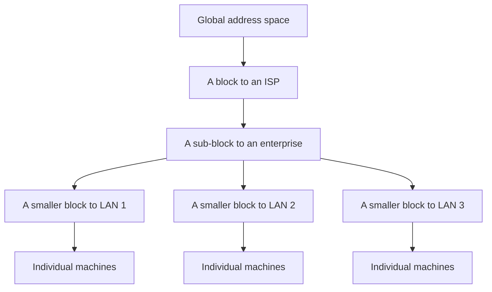

An IP address identifies a machine on the internet. Handing them out sounds like it should be trivial — keep a counter, give out the next one. That approach works, and it would have made the internet impossible. Understanding why is the whole of this note.

# What the protocol was designed to be

Three decisions were made at the start, and everything since follows from them.

## Unreliable and connectionless

> [!important] IP provides an **unreliable, connectionless** service. No connection is established before sending, and no delivery is promised.

That sounds like a defect until you see what it buys.

> [!important] Because there is no connection, **every packet can take a different route.** Nothing binds a packet to the path its predecessor took, so if a link fails or becomes congested, the next packet simply goes another way.

A connection-oriented network layer would have to hold a fixed path for the duration and rebuild it whenever anything changed. Reliability is not abandoned here — it is moved up to the transport layer, where TCP provides it for the applications that want it and UDP omits it for those that do not.

## A fixed 32-bit address

An IPv4 address is four numbers separated by dots:

```text
x.y.z.w
```

> [!important] Each of `x`, `y`, `z` and `w` is an **octet** — 8 bits. Four octets make **32 bits** in total, which is why an IPv4 address is called a 32-bit address.

The octet boundaries are not cosmetic. Almost every scheme for dividing addresses up uses them, so it is worth fixing the picture now: **four groups of eight, and each group can hold 0 to 255.**

## Variable length packets

The protocol had to carry packets of differing sizes rather than one fixed size, since the things people send vary enormously.

# The naive way to hand them out

Machines appear on the internet and need addresses. The simplest possible policy:

> First come, first served. A machine asks, it gets the next address in sequence.

It is easy to implement and it is fair. Work through what it produces.

```text
2.3.4.5   → a machine in India
2.3.4.6   → a machine in Belgium
2.3.4.7   → a machine in Brazil
```

Adjacent addresses, scattered across the planet. Nothing about an address tells you anything about where it is.

## Why that is fatal

To deliver a packet, a router has to know where to send it next. It consults a **routing table** — a lookup from destination to next hop.

With first-come-first-served allocation, **no address can be grouped with any other**, because neighbouring addresses are unrelated. So the table needs one entry per address.

> [!important] A 32-bit address gives **2^32 possible addresses — about 4.3 billion.** Every router on the internet would need a routing table with billions of entries, consulted for every single packet, and updated whenever anything anywhere changed.

That is not a slow system. It is not a system.

> [!important] So the constraint is not about running out of addresses. **It is that addresses have to be groupable**, and first-come-first-served destroys the possibility of grouping before anything else can go wrong.

# Subnetting

The fix follows directly from the diagnosis.

> [!important] Routers should maintain routes to **blocks of addresses**, not to individual machines. One entry covering a million addresses instead of a million entries.

Which requires those million addresses to belong together — to be a contiguous range, allocated as one unit, all reachable through the same path.

> [!important] A **subnet** is a block of addresses allocated as a unit, grouping machines that belong to the same organisation or network.

## How blocks get distributed

Allocation is hierarchical, and each level subdivides what it was given.



Blocks go to ISPs. ISPs allocate sub-blocks to organisations. An organisation is typically several LANs joined by routers, so it splits its block again, one piece per LAN. Individual machines get addresses from their LAN's piece.

> [!important] **Every level of that tree is a summary.** A router elsewhere in the world holds one entry for the ISP's whole block. It does not know or care how the ISP subdivided it — that is the ISP's problem, and solving it locally is exactly what makes the global table small.

# The two parts of an address

Grouping only works if an address says which group it belongs to. So it is read as two parts rather than one.

> [!important] Every IP address splits into a **subnetwork ID** and a **host ID**. The subnetwork ID says which block. The host ID says which machine inside that block.

```text
      x  .  y  .  z  .  w
    └──────────┘ └────────┘
    subnetwork ID  host ID
```

The split point is not fixed — where it falls is what the addressing schemes in the notes that follow are about. But the principle is constant:

> [!important] A router examining a destination address **reads the subnetwork ID and ignores the host ID.** It only needs to reach the right block; getting to the right machine inside it is the responsibility of whatever router sits at the edge of that block.

Which is why the whole design works. The address is not an arbitrary label — **it carries the routing hierarchy inside it**, and that is precisely what first-come-first-served allocation threw away.
