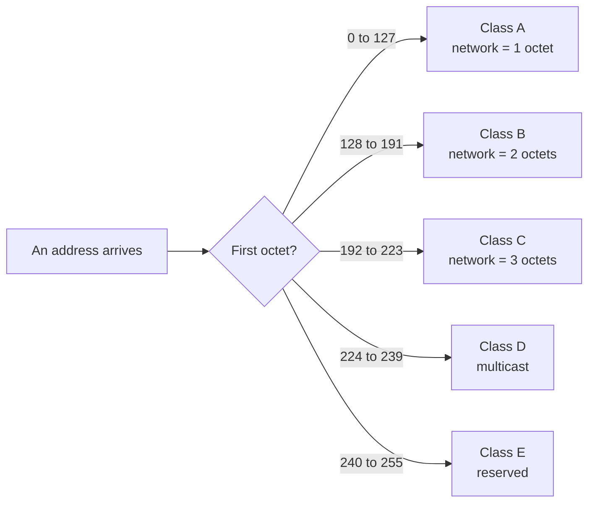

An address splits into a subnetwork part and a host part. The question left open is where that split falls, and the first answer was to fix it in advance — encode the split point in the leading bits of the address itself.

# The idea

> [!important] **Classful addressing** uses the **high-order bits** of an address to say how long the subnetwork ID is. The subnetwork ID always occupies the leading bits and the host ID always occupies the trailing ones, and how many belong to each is determined by the pattern the address starts with.

Read the first few bits and you know the structure of the rest. No extra information has to travel with the address.

Five classes were defined: **A, B, C, D and E.**

# Masks, and how to use one

A router receiving a packet needs the network ID, not the whole address.

> [!important] A **mask** is a value with 1 bits over the network part and 0 bits over the host part. **A bitwise AND of the address with its mask yields the network ID.**

Each class below states its own mask. Take `13.7.13.2`, whose mask turns out to be `255.0.0.0`.

```text
address    13 . 7   . 13  . 2
mask      255 . 0   . 0   . 0
AND       ---------------------
network    13 . 0   . 0   . 0
```

`255` is eight 1 bits, so ANDing leaves the first octet untouched. `0` is eight 0 bits, so ANDing forces the other three to zero. **The network ID is `13.0.0.0`.**

That is the only operation a router performs to decide where a packet belongs, and a bitwise AND is about as cheap as a computation gets.

With that in hand, each class can be taken in turn.

# Class A

> [!important] The first bit is always **0**.

**How many addresses.** One bit is fixed, 31 are free, so **2^31 addresses** belong to class A. That is half of the entire address space in one class.

**Where the split falls.** The **first octet** is the network ID; the remaining three octets are the host ID.

**How many networks.** The first octet has 8 bits, one of which is fixed at 0, leaving 7 free — so **2^7 = 128 networks**.

**How many hosts per network.** Three octets remain, so 24 bits — **2^24 addresses per network**, about 16.7 million.

**The range.** The first octet runs from `00000000` to `01111111`, which is 0 to 127.

```text
0.0.0.0  →  127.255.255.255
```

**The mask.** `255.0.0.0`

# Class B

> [!important] The first two bits are always **10**.

The first bit cannot be 0 — that is class A. So it is 1, and the second bit is fixed at 0 to distinguish this class from the ones after it.

**How many addresses.** Two bits fixed, 30 free — **2^30 addresses**.

**Where the split falls.** The **first two octets** are the network ID; the last two are the host ID.

**How many networks.** 16 bits in two octets, two of them fixed, leaving 14 — **2^14 networks**, which is 6 free bits in the first octet times 8 free bits in the second.

**How many hosts per network.** Two octets, 16 bits — **2^16 addresses per network**, about 65,000.

**The range.** First octet from `10000000` to `10111111`, which is 128 to 191.

```text
128.0.0.0  →  191.255.255.255
```

**The mask.** `255.255.0.0`

# Class C

> [!important] The first three bits are always **110**.

**How many addresses.** Three bits fixed, 29 free — **2^29 addresses**.

**Where the split falls.** The **first three octets** are the network ID; the last one is the host ID.

**How many networks.** 24 bits, three fixed, leaving 21 — **2^21 networks**, about two million.

**How many hosts per network.** One octet, 8 bits — **2^8 = 256 addresses per network**.

**The range.** First octet from `11000000` to `11011111`, which is 192 to 223.

```text
192.0.0.0  →  223.255.255.255
```

**The mask.** `255.255.255.0`

# Classes D and E

These are not allocated to ordinary networks and have no network or host split at all.

| Class | Leading bits | Range | For |
|---|---|---|---|
| **D** | `1110` | 224 to 239 | **Multicasting** — one message to a group of machines |
| **E** | `1111` | 240 to 255 | Reserved for special and military use |

> [!important] In ordinary work you are dealing with **A, B and C only.**

# All of it at once

| Class | Leading bits | First octet | Network part | Networks | Hosts per network | Default mask |
|---|---|---|---|---|---|---|
| **A** | `0` | 0–127 | 1 octet | 2^7 | 2^24 | `255.0.0.0` |
| **B** | `10` | 128–191 | 2 octets | 2^14 | 2^16 | `255.255.0.0` |
| **C** | `110` | 192–223 | 3 octets | 2^21 | 2^8 | `255.255.255.0` |
| **D** | `1110` | 224–239 | — | — | — | — |
| **E** | `1111` | 240–255 | — | — | — | — |



**Reading the first octet is the entire classification.** That is what the scheme was designed to make possible.

# Two addresses you cannot use

Inside every network, two addresses are reserved.

> [!important] With `x` as the network part: **`x.0.0.0` is the network ID itself**, and **`x.255.255.255` is the broadcast address**.

The broadcast address is the useful one. **Send to it and the message is routed to every machine on that network**, without needing to know how many there are or what their addresses are.

Since neither can be given to a machine:

> [!important] A class A network has 2^24 addresses but **2^24 − 2 usable hosts**. The same subtraction applies to every class: 2^16 − 2 for class B, 2^8 − 2 for class C.

# Why this was replaced

The scheme is elegant and it wastes addresses on an enormous scale.

> [!warning] **The classes are far too coarse.** An organisation needing 300 addresses is too big for class C, which offers 254. So it gets a class B — and receives **65,534**, of which it uses 300. Sixty-five thousand addresses are consumed and unusable by anyone else.

A class A allocation is worse: 16.7 million addresses to an organisation that will never have a fraction of that many machines. Half the entire address space sat in class A, distributed among at most 128 organisations.

> [!important] The problem is that **there are only three usable sizes**, and real organisations come in every size. Every allocation rounds up to the next class, and the rounding error is the waste.

Two smaller complaints follow: allocation and maintenance are laborious, and the scheme is easy to get wrong.

The fix is to stop rounding to three fixed sizes and let the split fall anywhere.
