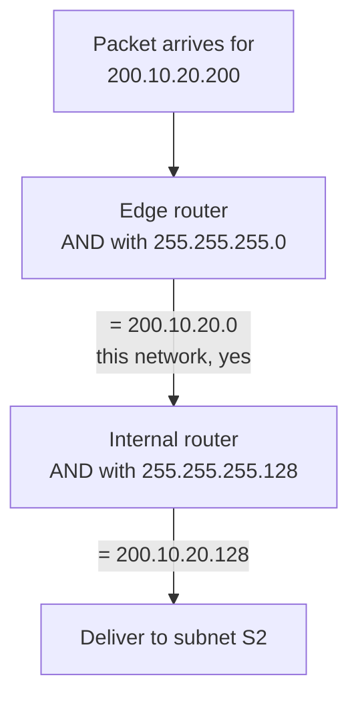

Classful addressing offered three block sizes and forced every organisation into one of them. The waste came from the rounding. The fix is to remove the classes entirely and let a block be any size that is a power of two.

# The notation

> [!important] **Classless addressing** has no classes and no default masks. It has **blocks**, and every block states its own split point.

```text
x.y.z.w/n
```

> [!important] The number after the slash is the **prefix length** — how many of the 32 bits belong to the block. The remaining `32 − n` bits belong to the host.

Nothing about the address itself determines this. **The `/n` has to travel with the address**, because there is no longer any rule that would let you work it out from the leading bits.

# Building the mask

The mask is not looked up in a table any more. It is constructed from `n`.

Take `200.10.20.40/28`.

`n` is 28, so the mask is **28 ones followed by 4 zeros**:

```text
11111111 11111111 11111111 11110000
   255   .   255  .   255  .   240
```

And the block address comes from the same bitwise AND as before:

```text
address   200 . 10 . 20 . 40        11001000 00001010 00010100 00101000
mask      255 . 255. 255. 240       11111111 11111111 11111111 11110000
AND       ------------------------  -----------------------------------
block     200 . 10 . 20 . 32        11001000 00001010 00010100 00100000
```

**The block is `200.10.20.32/28`.**

## How big is it

32 bits total, 28 in the prefix, so **4 bits for hosts**.

**2^4 = 16 addresses**, of which the first is the block address and the last is the broadcast address, leaving **2^4 − 2 = 14 usable hosts.**

> [!important] That is the point of the whole scheme. Classful addressing could offer 254 or 65,534. This offers 14, or 30, or 62, or 1,022 — **whatever power of two actually fits.**

# The rules a block must follow

Three constraints, and each one exists to keep the bitwise AND working.

**Addresses in a block must be contiguous.** A block is a range, not a collection.

**The number of addresses must be a power of two.** A mask is a run of ones followed by a run of zeros, and the number of trailing zeros is what sets the size — so only powers of two are expressible.

**The first address must be divisible by the block size.** The block address is produced by zeroing the host bits, so it necessarily ends in zeros, which means it is necessarily a multiple of the block size.

> [!important] None of these is an arbitrary rule imposed from outside. **All three are consequences of the mask being a bitwise AND**, which is what makes routing cheap enough to do for every packet.

# Subnetting a block

An organisation given a block usually needs to divide it further — one piece per LAN. The method is the same in both schemes, and it is direct.

> [!important] To create subnets, **fix some bits at the start of the host part.** Fixing `X` bits gives **2^X subnets.**

## One bit, two subnets

Start with `200.10.20.0` — first octet 200, so classful reading makes it class C, mask `255.255.255.0`, with the last octet as the host part.

Fix the **first host bit**:

| Subnet | First host bit | Address range |
|---|---|---|
| **S1** | `0` | `200.10.20.0` → `200.10.20.127` |
| **S2** | `1` | `200.10.20.128` → `200.10.20.255` |

Everything with a leading 0 in that octet falls between 0 and 127. Everything with a leading 1 falls between 128 and 255. One bit has cut the network in half, and **seven host bits remain** in each half.

## The subnet mask

The router at the edge of this network now needs to tell S1 from S2, and it does it exactly the way it told networks apart before.

> [!important] Build the **subnet mask** by taking the network part as it is, putting **1** in each of the bits you fixed, and **0** everywhere else.

Network part `200.10.20`, one bit fixed:

```text
200 . 10 . 20 . 10000000
200 . 10 . 20 . 128
```

**The subnet mask is `255.255.255.128`.** A bitwise AND of any incoming address with it yields `200.10.20.0` for anything in S1 and `200.10.20.128` for anything in S2, which is precisely the decision the router needs to make.



**Two ANDs, two decisions.** The first says the packet belongs to this network; the second says which subnet inside it.

## More subnets

| Bits fixed | Subnets | Host bits left | Hosts per subnet |
|---|---|---|---|
| 1 | 2 | 7 | 2^7 − 2 = 126 |
| 2 | 4 | 6 | 2^6 − 2 = 62 |
| 3 | 8 | 5 | 2^5 − 2 = 30 |

> [!important] The trade is visible in the table and it is unavoidable. **Every bit spent on more subnets is a bit not spent on hosts.** Doubling the number of subnets halves the size of each.

# Subnetting without classes

The procedure is identical, with one difference at the start.

> [!important] In classful addressing you look up the default mask from the class. In classless addressing there is no class, so you **take the mask from the `/n`** — and everything after that is the same. Fix `X` bits from the host part, get 2^X subnets, and build the subnet mask by putting ones in the fixed positions.

Which is the real benefit of dropping the classes. **The mechanism did not become more complicated; one lookup was replaced by a number carried alongside the address**, and in exchange the block size stopped being rounded up to one of three options.
