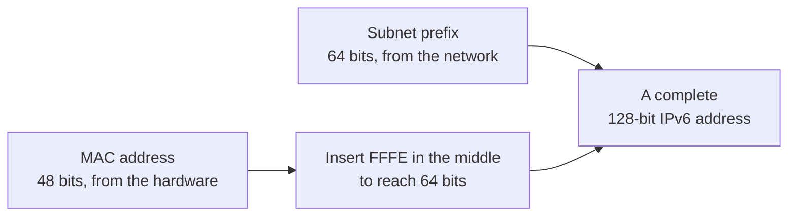

IPv4 gives 4.29 billion addresses. That was never going to be the reason it ran out — and understanding why it did run out, despite most of those addresses being unused, is the point of the successor.

# What IPv4 was for

> [!important] The original job was to **stitch many networks together** — which is why routers hold routes to networks rather than to individual machines, and why addresses carry their hierarchy inside them.

It did that job. What changed was not the job but the number of things wanting an address.

# Running out with most of it spare

Overall utilisation of the IPv4 space was around 35%. Roughly two thirds of all possible addresses were not in use by anything.

**And organisations were still running out.** Particular networks — densely populated regions especially — could not obtain the addresses they needed while billions sat unallocated elsewhere.

> [!important] The shortage was **local, not global.** Addresses were allocated in fixed blocks to whoever asked first, and once a block was assigned it belonged to that holder whether or not they used it. Blocks handed out early to organisations that never grew into them could not be reclaimed for networks that needed them now.

What turned a slow squeeze into a hard limit was what joined the internet after it:

> [!important] The address space was sized for computers. Then came **smartphones**, one or more per person, and then **internet-connected devices** — appliances, sensors, meters, vehicles. The population of things needing an address stopped resembling the population of computers.

# The successor

| | IPv4 | IPv6 |
|---|---|---|
| Address size | **32 bits** | **128 bits** |
| Total addresses | 2^32 ≈ 4.29 × 10^9 | 2^128 ≈ 3.4 × 10^38 |

Four times the bits, but the count is not four times larger — every added bit doubles the space, so 96 extra bits multiply it by 2^96.

> [!info] For a sense of the scale: spread across the earth's entire surface, IPv6 provides about **4.3 × 10^20 addresses per square inch.** The number is not meant to be useful — it is meant to make clear that the space is not going to be exhausted by counting things.

> [!info] The first specification was published in **1995** and revised in **1998**, though meaningful adoption came considerably later.

# Writing one down

An IPv6 address is **128 bits, written as 8 blocks of 16 bits each, in hexadecimal, separated by colons.**

```text
2001:0db8:0000:0000:0000:ff00:0042:8329
```

> [!warning] These blocks are sometimes called octets. **They are not.** An octet is 8 bits; these are 16 bits each. Eight of them make 128.

## Collapsing zeros

Long runs of zero blocks are common, and writing them out is tedious.

> [!important] A run of all-zero blocks may be replaced with **two colons**.

```text
2001:0db8:0000:0000:0000:ff00:0042:8329
2001:0db8::ff00:0042:8329
```

Three zero blocks vanish. The reader recovers them by counting: six blocks are written, so the `::` must stand for the missing two — and this is why it may appear **only once** in an address. Two of them would make the count ambiguous.

## In a URL

A colon in a URL already means something — it separates the host from the port. An address full of colons would be unreadable.

> [!important] In a URL, an IPv6 address goes **inside square brackets**.

```text
http://[2001:0db8::ff00:0042:8329]:80/index.html
```

The brackets end the address, so the `:80` after them is unambiguously the port.

# Address assignment

Unchanged in principle from classless IPv4.

> [!important] An IPv6 address splits into a **subnet prefix** and a **host suffix**, and the split point is given by a `/n` exactly as before.

A common arrangement gives 64 bits to the subnet prefix and 64 to the host.

# Building your own host part

With a 64-bit subnet prefix, 64 bits remain for the host — and a device can generate those itself from hardware it already has.

## Starting from the network card

> [!important] An **Ethernet address**, also called a MAC address, is **48 bits** built into the network hardware. The **first 24 bits identify the manufacturer** — Apple, Cisco, HP. The **last 24 identify the device**, giving each manufacturer 2^24 devices.

That gives 48 bits where 64 are needed. Sixteen are missing.

## Padding it out

> [!important] The missing 16 bits are supplied by inserting the hexadecimal value **`FFFE`** between the manufacturer half and the device half.

```text
MAC       AA:BB:CC          DD:EE:FF
          └ manufacturer ┘  └ device ┘
                24 bits       24 bits

insert    AA:BB:CC : FF:FE : DD:EE:FF
          └───────── 64 bits ────────┘
```

`FFFE` in binary is `1111111111111110` — fifteen ones and a zero.

Append that to the 64-bit subnet prefix and the address is complete.



> [!important] A device given only a subnet prefix can **work out its own full address** without asking anything. Under IPv4, an address had to be handed to it.

> [!info] One detail completes the mechanism: a bit in the manufacturer half is also flipped during the conversion, marking the identifier as derived rather than globally assigned. The resulting 64-bit value is called a **modified EUI-64** identifier.

# The consequence worth carrying

The interesting part of IPv6 is not that the number is larger.

> [!important] IPv4 forced addresses to be **rationed** — assigned centrally, tracked, reclaimed, and worked around with translation when a network had more machines than addresses. **At 3.4 × 10^38, rationing stops being necessary at all.** A device can generate its own address from its own hardware and simply be reachable, which is a different way of running a network rather than a bigger version of the same one.
