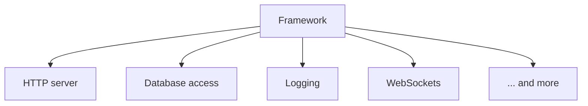
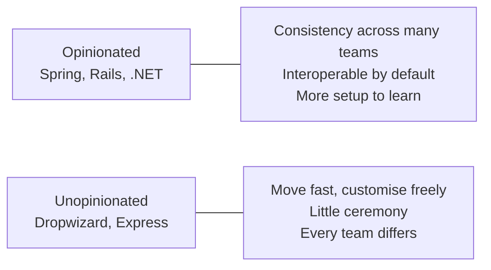

Everything so far has been concepts — processes, protocols, contracts, storage. Writing the actual server means picking a framework, and in the Java world that means Spring. But Spring and Spring Boot are two different things, and knowing which is which explains most of what a generated project contains.

# Nobody builds from scratch

Cooking dinner does not begin with growing vegetables. Someone farmed them, someone kept them fresh, someone handled the logistics to the shop. You buy them and cook. And frozen meals push it further — somebody did the cooking too, and you only reheat.

The reason this arrangement exists is that **everyone needs the same thing**. Rather than every household farming independently, one group solves it once for everybody.

Software is identical. Open any two applications — a ticket booking site and a shopping site — and both have a sign-in and a sign-up. Every application needs users to authenticate. Every application that stores data needs to connect to a database server. These are not interesting differences between products; they are the same work, repeated.

> [!important] So somebody solves it once and packages it. You pull it in, configure it, and build your own thing on top instead of rebuilding the foundation.

# Libraries and frameworks

The packaging comes in two sizes.

**A library solves one specific problem.** Retrofit, for instance, exists to make HTTP requests — which, by the definitions from earlier, is what makes your program a client. That is its entire scope.

**A framework is many libraries amalgamated**, so that the whole shape of an application is covered in one place. A server-side application typically needs database access, an HTTP server, possibly WebSockets, logging, and more. A framework gathers those so you can reach for whichever you need without assembling the collection yourself.

Some examples to make the split concrete:

| | Solves | Examples |
|---|---|---|
| **Library** | One or two specific problems. Light, focused, fewer lines of code | React (building components), Hibernate (talking to a database from Java in Java-like terms rather than SQL), Sequelize (the same job for JavaScript) |
| **Framework** | A large set of problems at once, end to end | Ruby on Rails, Angular, Spring Boot |

> [!important] **The trade is convenience against control.** Go back to the cooking comparison: buying vegetables leaves you doing the cooking, but you decide exactly what the dish becomes. A ready-made meal is far less work and you cannot change what is in it.
>
> **Frameworks give convenience and take control.** A great deal happens from very little code, and some of it will feel like magic — which is another way of saying you cannot see or alter it. **Libraries give control and take convenience.** You write considerably more code, and every part of it is yours to change.

Django is one, in Python. Ruby on Rails is one, in Ruby. **Spring is one, in Java.**

# Spring

Spring is an open-source framework for the Java ecosystem, and being open source matters — you can read the code and judge its stability rather than trusting it blindly.

It runs a great deal of software: large enterprise systems, well-known products, and plenty of startups. Applications built on it range from web apps to microservices to event-driven systems.

> [!info] **Even the exceptions argue for learning it.** Google does not use Spring — it wrote its own internal Java framework, which is not open source and is heavily inspired by Spring. So even where Spring itself is absent, what replaced it often borrows its ideas. And the habits transfer sideways: knowing Spring makes picking up Rails or Django considerably faster, because the underlying shape is shared.

## Spring projects

Within Spring, the smaller libraries are called **projects**, each solving one problem under the same umbrella:

| Project             | What it does                                                                   |
| ------------------- | ------------------------------------------------------------------------------ |
| **Spring Security** | Customisable authentication and access control                                 |
| **Spring Web**      | Building web and REST applications                                             |
| **Spring AI**       | Applying Spring's design principles — portability, modular design — to AI work |
| **Spring gRPC**     | Spring-friendly abstractions for developing gRPC applications                  |

There is a project for most use cases, and plenty of third-party libraries integrate cleanly alongside them. That breadth is what makes the ecosystem worth committing to.

## The philosophies underneath

Four ideas are what make Spring as modular and extendable as it is. Each gets proper treatment later; naming them now is enough:

- **Inversion of control**
- **Dependency injection**
- **Aspect-oriented programming (AOP)**
- **The ecosystem of projects** built on top

# So why not just use Spring

> Because setting up a plain Spring project takes a considerable number of steps, and a lot of boilerplate configuration before anything runs.

That friction is the problem **Spring Boot** exists to remove.

> [!important] **Spring Boot takes decisions on your behalf.** It is opinionated: given a project to set up, it makes sensible default choices automatically rather than asking you for each one. Its own description is that it makes it easy to create standalone, production-grade Spring-based applications **that you can just run**.

What it does concretely:

- **Embeds a web server** — Tomcat, Jetty or Undertow — so a web application has one running out of the box.
- **Provides opinionated starter dependencies**, so your build configuration begins in a working state.
- **Auto-configures Spring and third-party libraries wherever possible.** Not always, and not everything: only where a library has been made compatible.

## You are not locked in

This is the part that matters and is easy to miss.

> [!important] A Spring Boot application **is** a Spring application. The only difference is that some configuration decisions were made for you. Anything you want to change, you can change — Spring Boot gives you the facility to override its choices. And if you do not want Spring Boot at all, you can use plain Spring and configure everything yourself.

That flexibility is not universal among opinionated frameworks. Rails, for instance, will generate a working application from a couple of commands — but its auto-configuration is not something you can simply decline. Spring lets you opt out entirely.

# Opinionated or not, and when each fits

Worth understanding as a design question rather than a preference, because it explains why different companies choose so differently.

**Large organisations tend to want opinions enforced.** If every team builds however it likes, the results do not interoperate and do not scale organisationally. A framework that dictates structure makes everything consistent — which is why one very large company built its own Java framework with its house conventions baked in, and why another leans on a comparably structured platform.

**Smaller organisations tend to want speed.** When the priority is to build fast and iterate, a lightweight, unopinionated framework avoids a lot of setup and lets you customise as you go. One large Indian e-commerce company runs many of its post-2015 services on Dropwizard for exactly this reason — a deliberately lightweight Java framework aimed at rapid development.

Neither is correct in general. It depends on the size of the organisation and what it needs to optimise for.

# The summary worth keeping

**Spring** is a framework made of **many smaller libraries, called projects,** so that common needs do not have to be rebuilt. Its drawback is that setting one up by hand means a lot of manual configuration and boilerplate.

**Spring Boot** is **another project** in that ecosystem, and **its job is to set up a Spring project with sensible defaults** — starter dependencies, initial configuration, working boilerplate — for Spring's own libraries and for compatible third-party ones.

That is the whole distinction, and it is why a generated project arrives with so many files already in it.
