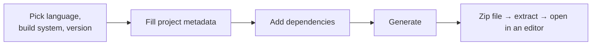

Spring Boot's promise is that a project arrives ready to run. Collecting on that promise means a web form and a download, and the choices it asks for are worth understanding rather than clicking through.

# start.spring.io

There is a web application at `start.spring.io` whose only job is to generate a Spring Boot project. You make a handful of selections, press Generate, and a zip file downloads.

## The choices

| Field | Options | What to pick and why |
|---|---|---|
| **Language** | Java, Kotlin, Groovy | Java |
| **Build system** | Maven, Gradle | Gradle |
| **Gradle DSL** | Groovy, Kotlin | Groovy — easier, and it reads like configuration rather than like a program |
| **Spring Boot version** | Several | The pre-selected one. Spring Boot is open source and evolving, so versions accumulate |
| **Project metadata** | Name, description, group, artifact | Descriptive only |
| **Java version** | Several | 21 |

> [!info] Other build systems exist — Bazel among them — but the generator offers only Maven and Gradle. Using anything else means configuring it by hand.

## Dependencies

The right-hand side is where you add individual **Spring projects**, and some third-party libraries too. A reasonable starting set:

| Dependency                         | What it gives you                                                                                                       |
| ---------------------------------- | ----------------------------------------------------------------------------------------------------------------------- |
| **Spring Web**                     | Building web and REST applications. This is what you need to write REST APIs                                            |
| **Lombok**                         | **Not a Spring project at all** — a third-party library, integrated easily because Spring Boot configures a lot for you |
| **Spring Configuration Processor** | Generates **metadata** so your editor can offer contextual help and **completion for custom configuration**             |
| **Spring Boot DevTools**           | Fast application restarts and live reload while developing                                                              |

> [!important] **Nothing here is a permanent decision.** If you do not add a dependency now, you can add it later by editing one file. The generator is a convenience, not a commitment.

## And then

Press Generate, save the zip, extract it, and open the folder in whatever editor you use. The structure is identical regardless of editor.

> [!tip] Some IDEs and editor extensions embed this same generator, so the project can be created without leaving the editor. It produces the same result.

That is the entire setup procedure, and it is the same every time — for a new project, a new microservice, anything.

# Maven or Gradle

The one choice above that deserves more than a line, because the difference is real.

Both are build systems. A build system is what compiles your code, resolves and downloads your dependencies, and packages the result into something runnable.

| | **Maven** | **Gradle** |
|---|---|---|
| Config file | `pom.xml` | `build.gradle` |
| Written in | XML | Groovy or Kotlin |
| Custom logic in the build file | Limited | Yes |
| Incremental builds and caching | Now supported | Had it first |

## Why Gradle can contain logic

Because **Groovy and Kotlin are programming languages.** A `build.gradle` file is written in one of them, so it can contain real logic — conditionals, computed values, custom tasks — in a way an XML document cannot.

## Incremental builds

The other historical difference, and the one with numbers behind it.

Building a project from nothing means compiling everything. **But between one build and the next you rarely change much** — maybe two or three files.

> [!important] With **incremental builds**, the previous build is reused and only the changed portion is rebuilt. On a project of 10,000 files where 2 have changed, the difference between rebuilding everything and rebuilding two files is the difference between waiting and not waiting.

**Caching** is the same idea applied to **dependencies and intermediate outputs — computed once**, reused until something invalidates them.

Gradle shipped with both from the start. Maven has since gained them. Bazel offers them too, and is used at some very large companies, though its overall adoption remains much smaller.

## Where you will meet each

Older Spring projects commonly use Maven. More recently started ones often use Gradle. Android projects use Gradle out of the box, and a lot of Android work is still Java, so the tool shows up there constantly.

Either will build the project fine. The rest of these notes use Gradle.
