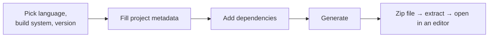
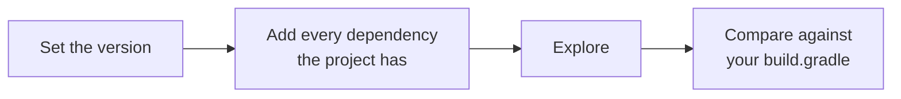

Spring Boot's promise is that a project arrives ready to run. Collecting on that promise means a web form and a download, and the choices it asks for are worth understanding rather than clicking through.

# start.spring.io

There is a web application at `start.spring.io` whose only job is to generate a Spring Boot project. You make a handful of selections, press Generate, and a zip file downloads.



## The choices

| Field | Options | What to pick and why |
|---|---|---|
| **Language** | Java, Kotlin, Groovy | Java |
| **Build system** | Maven, Gradle | Gradle |
| **Gradle DSL** | Groovy, Kotlin | Groovy — easier, and it reads like configuration rather than like a program |
| **Spring Boot version** | Several | The pre-selected one. Spring Boot is open source and evolving, so versions accumulate |
| **Project metadata** | Name, description, group, artifact | Descriptive only |
| **Java version** | Several | 21 |

> [!info] Other build systems exist — Bazel among them — but the generator offers only Maven and Gradle. Using anything else means configuring it by hand.

## Dependencies

The right-hand side is where you add individual **Spring projects**, and some third-party libraries too. A reasonable starting set:

| Dependency                         | What it gives you                                                                                                       |
| ---------------------------------- | ----------------------------------------------------------------------------------------------------------------------- |
| **Spring Web**                     | Building web and REST applications. This is what you need to write REST APIs                                            |
| **Lombok**                         | **Not a Spring project at all** — a third-party library, integrated easily because Spring Boot configures a lot for you |
| **Spring Configuration Processor** | Generates **metadata** so your editor can offer contextual help and **completion for custom configuration**             |
| **Spring Boot DevTools**           | Fast application restarts and live reload while developing                                                              |

> [!important] **Nothing here is a permanent decision.** If you do not add a dependency now, you can add it later by editing one file. The generator is a convenience, not a commitment.

## And then

Press Generate, save the zip, extract it, and open the folder in whatever editor you use. The structure is identical regardless of editor.

> [!tip] Some IDEs and editor extensions embed this same generator, so the project can be created without leaving the editor. It produces the same result.

That is the entire setup procedure, and it is the same every time — for a new project, a new microservice, anything.

# It is a reference, not only a starting point

The generator looks like something used once and abandoned. It is more useful than that, and the reason is worth understanding before the first time you need it.

> [!important] **A dependency line is not knowledge to be searched for. It is output to be generated.** The generator knows what is correct **for the version you selected**, because it is maintained alongside the framework. A search result carries no version at all, and you cannot tell from a page which one it was written against.

## Explore rather than download

Pressing **Explore** — or `Ctrl+Space` — opens the generated files in the browser instead of downloading a zip. The complete `build.gradle` is right there, and nothing is created on disk.



> [!important] **This works for a project that already exists.** Set the version you are actually on, tick everything you actually use, and compare the result against your own build file. Anything that differs is either something you are missing or something that has been renamed.

## Select the whole stack, never one at a time

The mistake that makes this fail is checking dependencies individually.

> [!warning] **The output depends on the combination, not on each dependency separately.** Some pairs require a bridging module that exists only because both are present — a library that adapts one to the other. Select either alone and that module never appears, however carefully you read the result.

So the unit of work is the whole stack. Ticking one box to answer one question will silently give an incomplete answer, and the missing piece is invisible because nothing reports it.

## Artifact names change between major versions

The second reason to generate rather than search.

> [!warning] **An artifact that exists in one major version may not exist in the previous one.** Names get changed, split apart, or moved between groups when a major version lands. An article written against the older version names something that will not resolve at all, and the error you get points at the missing artifact rather than at the article.

> [!important] This is at its worst precisely when it hurts most — **on a version that has just been released.** Articles, forum answers and accumulated search results all describe the previous one, because they were written before this one existed. **The newer your version, the less the web is worth**, and the more the generator is.

## The same thing without the browser

The generator answers plain HTTP, which is convenient when you want the file rather than the page:

```text
1  curl "https://start.spring.io/build.gradle?type=gradle-project&language=java2  &bootVersion=4.1.1&javaVersion=21&dependencies=web,data-jpa,lombok"
```

`dependencies` takes the short identifiers, comma-separated. The full list of what is available:

```text
1  curl -H "Accept: application/vnd.initializr.v2.2+json" https://start.spring.io/metadata/client
```

> [!info] That metadata also lists which Spring Boot versions are currently offered, which is a quick way to see whether the version you are on is still supported.

## Where the generator is not the answer

It gives dependencies. It does not give configuration.

> [!important] For a **property name** — anything written in `application.yml` — the source is the **Common Application Properties** appendix in the reference documentation, read at the version you are on. Property names get renamed between major versions exactly as artifact names do, and an old property is worse than a missing one: it does not fail, it is simply ignored.

# Maven or Gradle

The one choice above that deserves more than a line, because the difference is real.

Both are build systems. A build system is what compiles your code, resolves and downloads your dependencies, and packages the result into something runnable.

| | **Maven** | **Gradle** |
|---|---|---|
| Config file | `pom.xml` | `build.gradle` |
| Written in | XML | Groovy or Kotlin |
| Custom logic in the build file | Limited | Yes |
| Incremental builds and caching | Now supported | Had it first |

## Why Gradle can contain logic

Because **Groovy and Kotlin are programming languages.** A `build.gradle` file is written in one of them, so it can contain real logic — conditionals, computed values, custom tasks — in a way an XML document cannot.

## Incremental builds

The other historical difference, and the one with numbers behind it.

Building a project from nothing means compiling everything. **But between one build and the next you rarely change much** — maybe two or three files.

> [!important] With **incremental builds**, the previous build is reused and only the changed portion is rebuilt. On a project of 10,000 files where 2 have changed, the difference between rebuilding everything and rebuilding two files is the difference between waiting and not waiting.

**Caching** is the same idea applied to **dependencies and intermediate outputs — computed once**, reused until something invalidates them.

Gradle shipped with both from the start. Maven has since gained them. Bazel offers them too, and is used at some very large companies, though its overall adoption remains much smaller.

## Where you will meet each

Older Spring projects commonly use Maven. More recently started ones often use Gradle. Android projects use Gradle out of the box, and a lot of Android work is still Java, so the tool shows up there constantly.

Either will build the project fine. The rest of these notes use Gradle.
