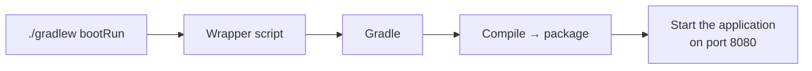

An editor will build and run a Spring Boot project for you with a button. Learning the commands underneath is still worth doing, and there is a concrete reason why.

# Why the command line

> [!important] **A deployed server has no screen.** When your code is running on a machine somewhere, there is no editor and no play button — you reach it over SSH and drive it from a terminal. Controlling your project from the CLI is not an alternative to the IDE; it is the only option in the environment that matters.

And the button was never doing anything else. Watch your editor's log output while it builds and you will see the same commands going past. The GUI is a wrapper around exactly what follows.

# The wrapper

Commands go through the wrapper script in the project root — `./gradlew` on Unix, `gradlew.bat` on Windows.

The `./` prefix means the script in the current directory. So `./gradlew build` runs the wrapper script sitting beside you and asks it for the `build` task.

# The commands

| Command                                  | What it does                                        |
| ---------------------------------------- | --------------------------------------------------- |
| `./gradlew build`                        | Compiles, runs checks, and **packages the project** |
| `./gradlew clean`                        | Deletes the `build` folder                          |
| `./gradlew clean build`                  | Both, in order — **a build from a clean slate**     |
| `./gradlew bootRun`                      | Builds if needed, then runs the application         |
| `./gradlew build --refresh-dependencies` | Rebuilds, re-resolving dependencies from scratch    |

## Building

```bash
# terminal, in the project root
1  ./gradlew build
```

```text
1  > Task :compileJava
2  > Task :processResources
3  > Task :classes
4  > Task :resolveMainClassName
5  > Task :bootJar
6  > Task :jar
7  > Task :assemble
8  > Task :compileTestJava NO-SOURCE
9  > Task :processTestResources NO-SOURCE
10 > Task :testClasses UP-TO-DATE
11 > Task :test NO-SOURCE
12 > Task :check UP-TO-DATE
13 > Task :build
14
15 BUILD SUCCESSFUL in 1s
16 5 actionable tasks: 5 executed
17 Consider enabling configuration cache to speed up this build: https://docs.gradle.org/9.2.1/userguide/configuration_cache_enabling.html
```

> [!info] Line 17 is a standing suggestion Gradle prints on every build, not a warning about anything you did. The configuration cache stores the result of working out what the build has to do, so later builds skip that step.

Worth reading the task list rather than skipping it. A build is not one action — it is a sequence, and the output names every step. `NO-SOURCE` means there was nothing to do; `UP-TO-DATE` means the previous result was still valid and got reused, **which is incremental building visible in practice.**

## Cleaning and rebuilding

`clean` removes the `build` folder. Combined:

```bash
# terminal
1  ./gradlew clean build
```

```text
1  Starting a Gradle Daemon, 1 stopped Daemon could not be reused, use --status for details
2  > Task :clean
3  > Task :compileJava
4  > Task :processResources
5  > Task :classes
6  > Task :resolveMainClassName
7  > Task :bootJar
8  > Task :jar
9  > Task :assemble
10 > Task :compileTestJava NO-SOURCE
11 > Task :processTestResources NO-SOURCE
12 > Task :testClasses UP-TO-DATE
13 > Task :test NO-SOURCE
14 > Task :check UP-TO-DATE
15 > Task :build
16
17 BUILD SUCCESSFUL in 4s
18 6 actionable tasks: 6 executed
19 Consider enabling configuration cache to speed up this build: https://docs.gradle.org/9.2.1/userguide/configuration_cache_enabling.html
```

Compare that against the previous run. **`:clean` now appears as the first task** (line 2), which is what makes it six actionable tasks rather than five.

> [!info] Line 1 appears because no Gradle daemon was already running and a previous one could not be reused, so a fresh one started. It is about the state of your machine, not about your project, and it is absent when a daemon is already warm.

> [!tip] Reach for `clean build` when results stop making sense — when a change you made does not seem to take effect. Stale output is a genuine cause of confusion, though as the environment-variables material shows, it is not the only one and it gets blamed more often than it deserves.

## Running

```bash
# terminal
1  ./gradlew bootRun
```

The application starts, and the whole startup log looks like this:

```text
1   > Task :compileJava UP-TO-DATE
2   > Task :processResources
3   > Task :classes
4   > Task :resolveMainClassName
5
6   > Task :bootRun
7
8     .   ____          _            __ _ _
9    /\\ / ___'_ __ _ _(_)_ __  __ _ \ \ \ \
10  ( ( )\___ | '_ | '_| | '_ \/ _` | \ \ \ \
11   \\/  ___)| |_)| | | | | || (_| |  ) ) ) )
12    '  |____| .__|_| |_|_| |_\__, | / / / /
13   =========|_|==============|___/=/_/_/_/
14
15   :: Spring Boot ::                (v4.0.2)
16
17  INFO 5043 --- [TodoApp] [restartedMain] com.example.demo.TodoAppApplication      : Starting TodoAppApplication using Java 25.0.1 with PID 5043 (<project>/build/classes/java/main started by <user> in <project>)
18  INFO 5043 --- [TodoApp] [restartedMain] com.example.demo.TodoAppApplication      : No active profile set, falling back to 1 default profile: "default"
19  INFO 5043 --- [TodoApp] [restartedMain] .e.DevToolsPropertyDefaultsPostProcessor : Devtools property defaults active! Set 'spring.devtools.add-properties' to 'false' to disable
20  INFO 5043 --- [TodoApp] [restartedMain] .e.DevToolsPropertyDefaultsPostProcessor : For additional web related logging consider setting the 'logging.level.web' property to 'DEBUG'
21  INFO 5043 --- [TodoApp] [restartedMain] o.s.boot.tomcat.TomcatWebServer          : Tomcat initialized with port 8080 (http)
22  INFO 5043 --- [TodoApp] [restartedMain] o.apache.catalina.core.StandardService   : Starting service [Tomcat]
23  INFO 5043 --- [TodoApp] [restartedMain] o.apache.catalina.core.StandardEngine    : Starting Servlet engine: [Apache Tomcat/11.0.15]
24  INFO 5043 --- [TodoApp] [restartedMain] b.w.c.s.WebApplicationContextInitializer : Root WebApplicationContext: initialization completed in 342 ms
25  INFO 5043 --- [TodoApp] [restartedMain] o.s.boot.tomcat.TomcatWebServer          : Tomcat started on port 8080 (http) with context path '/'
26  INFO 5043 --- [TodoApp] [restartedMain] com.example.demo.TodoAppApplication      : Started TodoAppApplication in 0.686 seconds (process running for 0.854)
```

> [!info] That is the complete log, with two edits for width: the leading timestamp has been dropped from lines 17 to 26, and the absolute project path on line 17 replaced with `<project>` and `<user>`. Nothing else is removed.

Several things in it are worth reading rather than scrolling past:

- **Lines 1 to 4** are Gradle building before it runs anything. `UP-TO-DATE` on line 1 means the code had not changed since the last build, so compilation was skipped.
- **Line 15** names the Spring Boot version actually in use.
- **Line 21** initialises the web server and **line 25** confirms it is accepting requests. Two separate events — initialised is not yet serving.
- **Line 23** names the embedded server: Apache Tomcat. That is Spring Boot having chosen and bundled one for you, exactly as advertised.
- **Line 26** reports startup time.

Port **8080** on lines 21 and 25 is Spring Boot's default. Nothing in the project asked for it — that is an opinionated default being applied, and it can be changed.

> [!info] **Verified.** This log is from a run with no `server.port` configured anywhere. With a port set in configuration, lines 21 and 25 report that port instead.

## Refreshing dependencies

Occasionally you add a dependency and your editor does not seem to see it — no autocompletion, no import resolution. This forces a re-resolve:

```bash
# terminal
1  ./gradlew build --refresh-dependencies
```

> [!info] If that alone does not fix the editor, restarting it usually does. The dependency is present as far as the build is concerned; the editor's index is what has fallen behind.

# When a build fails

Build failures are normal and the output tells you where to look. Here is a real one, produced by mistyping a single character in a dependency — `spring-boot-startr-web` instead of `spring-boot-starter-web`:

```text
1  > Task :compileJava FAILED
2
3  FAILURE: Build failed with an exception.
4
5  * What went wrong:
6  Execution failed for task ':compileJava'.
7  > Could not resolve all files for configuration ':compileClasspath'.
8     > Could not find org.springframework.boot:spring-boot-startr-web:.
9       Required by:
10          root project 'demo'
11
12 * Try:
13 > Run with --stacktrace option to get the stack trace.
14 > Run with --info or --debug option to get more log output.
15 > Run with --scan to generate a Build Scan (powered by Develocity).
```

> [!info] **Verified** by actually introducing the typo. The structure is worth learning because every Gradle failure has it: **which task failed** (line 1 and line 6), **why** (lines 7 to 10), and **what you can do next** (lines 12 to 15).

**Line 8 is the one that matters** — it echoes back the exact string it could not find. Compare that against the coordinates the library documents and the wrong character is usually obvious. These strings are precise, and one character is enough to break them.

> [!tip] Note that the failure is reported against `:compileJava`, not against `build.gradle`. Gradle is telling you where the build stopped, which is not always where the mistake is. The mistake was in the dependency declaration; the symptom appeared when compilation needed the missing library.

> [!warning] **Deleting a failing test to get past a build is not a fix.** It is occasionally done to clear early friction, and it should be recognised for what it is — the test is gone, not passing. Tests deserve setting up properly rather than removing.

# One recovery worth knowing

Deleting the wrong folder while clearing caches is easy to do, and losing `gradle/wrapper/` breaks `./gradlew` entirely, since the wrapper needs the files in it.

```bash
# terminal — regenerates the wrapper files
1  gradle wrapper
```

That restores them. Useful precisely at the moment when the thing you would normally use to fix problems is the thing that is broken.

# What actually runs



The same chain runs whether the command came from your terminal or from a button in your editor. Knowing it means you can drive the project anywhere — including on a machine that has nothing but a shell.
