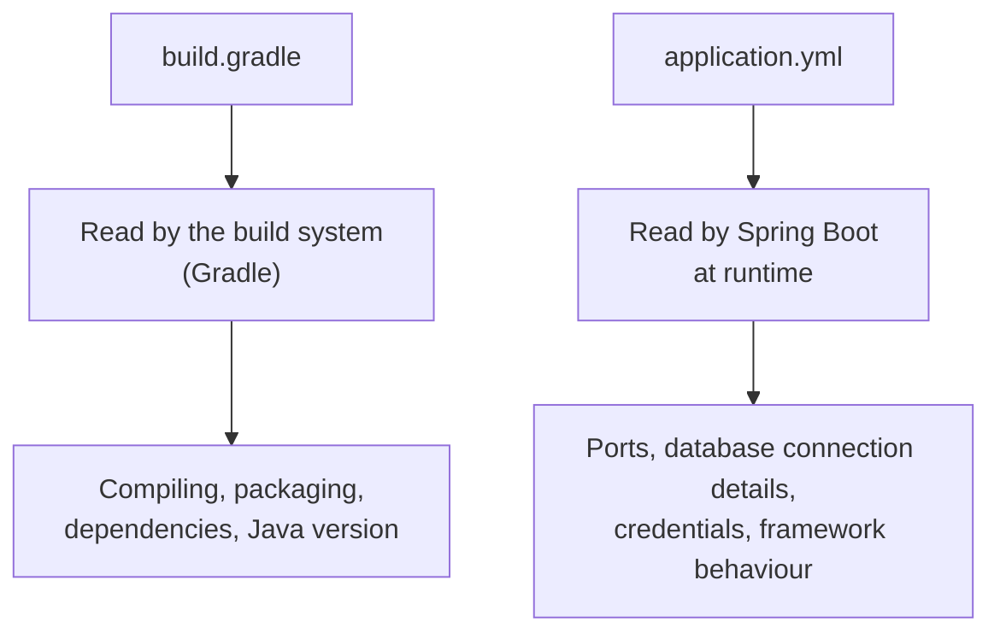

> [!important] A project that arrives with opinions applied needs a way to disagree with them. That is what the configuration file in `src/main/resources` is for — and there is a distinction between it and `build.gradle` that causes real confusion until it is stated plainly.

# Changing a default

A generated application runs on port 8080. Nothing in the project said so; it is one of Spring Boot's defaults.

Overriding it takes one line:

```properties
1  # src/main/resources/application.properties
2  server.port=8081
```

Restart the application and the log confirms it:

```text
1  Tomcat started on port 8081 (http)
```

> [!important] **This is the override mechanism.** Spring Boot applies its defaults, then reads this file. Anything set here wins. You are not fighting the framework — the framework is asking whether you want something else.

# Properties or YAML

The generated file is `application.properties`. Modern projects commonly rename it to `application.yml` and write YAML instead.

The same configuration both ways:

```properties
1  # src/main/resources/application.properties
2  spring.application.name=TodoApp
3  server.port=8081
```

```yaml
1  # src/main/resources/application.yml
2  spring:
3    application:
4      name: TodoApp
5
6  server:
7    port: 8081
```

The difference is how nesting is expressed. Properties files repeat the full path on every line. **YAML is indentation-driven** — each level of nesting is one more indent, and a shared prefix is written once.

> [!info] **This matters more as configuration grows.** Database and persistence settings in particular produce many keys sharing long prefixes, and writing that prefix out on every line becomes noise. YAML keeps the shape visible.

> [!important] It is a preference, not a correctness question. Either file works, and neither will cause you problems. Pick one and be consistent.

# The distinction that trips people up

Two files now hold configuration — `build.gradle` and `application.yml`. Both are settings. What goes where?



> [!important] **`build.gradle` is for the build tool.** It concerns compiling your code, resolving dependencies and packaging the result. It stops mattering once the application is built.
>
> **`application.yml` is for Spring Boot.** It concerns how the application behaves when it runs — which port to listen on, which database to connect to, at what address and with what credentials.

One more consequence worth stating: `application.properties` and `application.yml` are **not** **build-system files at all**. They are nothing to do with Gradle, Maven or Bazel, and switching build systems does not affect them. They are Spring Boot files, read and managed by Spring Boot.

# Referring to values from outside the file

Configuration files can pull values in rather than stating them, using `${...}`:

```yaml
1  # src/main/resources/application.yml
2  server:
3    port: ${PORT}
```

That tells Spring Boot to look up `PORT` rather than use a literal. Which raises the obvious question of what happens when it is not there — and the answer is that the application refuses to start:

```text
1  ***************************
2  APPLICATION FAILED TO START
3  ***************************
4
5  Description:
6
7  Failed to bind properties under 'server.port' to java.lang.Integer:
8
9      Property: server.port
10     Value: "${MISSING_PORT_VAR}"
11     Origin: class path resource [application.yml] - 6:9
12     Reason: failed to convert java.lang.String to java.lang.Integer (caused by java.lang.NumberFormatException: For input string: "${MISSING_PORT_VAR}")
13
14 Action:
15
16 Update your application's configuration
```

> [!info] **Verified** by running with a variable that does not exist. Read what it actually says — it is more useful than a generic failure.
>
> **Line 10** shows Spring Boot found no value and kept the placeholder text `${MISSING_PORT_VAR}` as a literal string. **Line 12** is the real failure: it then tried to convert that string to an integer, which is not a number. **Line 11** names the file and the exact position, `6:9` — line 6, column 9 of `application.yml`. And **line 16** tells you what to do.

## Always give a fallback

```yaml
1  # src/main/resources/application.yml
2  server:
3    port: ${PORT:8081}
```

The colon introduces a default. **If `PORT` is available, it is used. If not, 8081 is used**, and the application starts anyway.

> [!important] For anything the application cannot start without, provide a fallback. Someone will forget to set the value, or a deployment will miss it, or a name will be misspelled — and the difference between a sensible default and a crash on boot is one colon.

The complete file from a working project:

```yaml
1  # src/main/resources/application.yml
2  spring:
3    profiles:
4      active: ${PROFILE:dev}
5    application:
6      name: TodoApp
7
8  server:
9    port: ${PORT:8081}
```

Two externalised values, both with fallbacks. Where those values come from, and why putting them in the file directly is a bad idea in the first place, is the subject of its own note.
