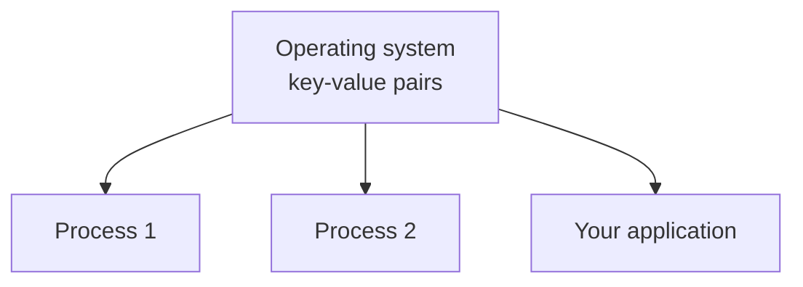
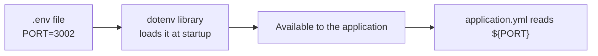

Configuration files can pull values in from outside instead of stating them. This note is why that matters, and the sequence of increasingly good answers to the question of where those values should actually live.

# The problem

To connect to a database, an application needs the address of the machine, the port, and — since databases are usually protected — a username and password. All four have to be available to the code, or the connection cannot be made.

The obvious move is to write them into the project. And the obvious move is a serious mistake.

> [!danger] **Push that project to a public repository and every credential goes with it.** Database address, port, username, password — all readable by anyone. The same applies to cloud provider access keys and anything else that grants access to something.

This is not a Java problem or a Spring problem. Any project in any language has it.

## The proper answer, and the practical one

The proper answer is a **secret manager** — **a service built to hold credentials, or a self-hosted configuration service that keeps them separate from your code.**

For a small project there is a simpler answer that is still far better than hardcoding: **environment variables.**

# What an environment variable is

Your machine runs many processes. Each holds values that were written into its own code. But there is also a set of values held by the **operating system itself**, as key-value pairs, which any process running on that machine can read.



Those pairs are **environment variables**.

> [!info] **A locker at home.** Nobody outside the household can get in, so anything in the locker is safe from strangers — but any family member can open it. Environment variables work the same way: they live on your machine and stay there, and every process on that machine can read them.

And your application qualifies. A server is a process; a running Spring Boot application is a process; so it can read them like anything else.

To see the ones currently set:

```bash
# terminal
1  env
```

> [!important] This is **relatively** secure, not maximally secure. The value is that it stays on your machine instead of being published. Anyone with access to your machine can read it.

# Attempt one: set it in the shell

The naive attempt does nothing at all:

```bash
# terminal — this does NOT set an environment variable
1  SAMPLE=12345
2  env | grep SAMPLE
3  # → nothing
```

The correct form on Unix-based systems needs `export`:

```bash
# terminal
1  export SAMPLE=12345
2  env | grep SAMPLE
3  # → SAMPLE=12345
```

Now read it from the configuration file:

```yaml
1  # src/main/resources/application.yml
2  server:
3    port: ${SERVER_PORT}
```

```bash
# terminal
1  export SERVER_PORT=3000
2  ./gradlew bootRun
3  # → Tomcat started on port 3000
```

Working. Two problems, though.

**It lasts one terminal session.** Open a new terminal and the variable is gone. Run the application there and it fails, because the value it needs no longer exists:

```text
1  Failed to bind properties under 'server.port'
```

**It is Unix-only.** Windows sets environment variables differently, so this is not a procedure you can hand to everyone.

## Add a fallback while you are here

Regardless of how the value gets set, the configuration should not crash without it:

```yaml
1  # src/main/resources/application.yml
2  server:
3    port: ${SERVER_PORT:8081}
```

Now a missing variable means port 8081 rather than a failed startup.

# Attempt two: put the export in a shell startup file

Unix systems load a file every time a new terminal session opens — `.zshrc`, `.bashrc`, or a similar rc file, depending on your shell.

> [!info] These are shell scripts. Whatever commands they contain run at the start of every session.

So put the export inside one:

```bash
# ~/.zshrc
1  export SERVER_PORT=3000
```

Open a new terminal and the variable is there. Open another and it is there too. **The session problem is solved** — you no longer set it by hand each time.

It is still Unix-only. And it is still a fair amount of ceremony: find the right file, edit it, know which shell you use.

# Attempt three: a `.env` file

**What is wanted is one mechanism that works the same on every operating system, without anyone needing to know which file their shell reads.**

That is what a **dotenv** library does. There is one for essentially every ecosystem — Java, Python, Node, and the rest — and the procedure is identical in all of them:

1. Create a file called `.env` in the project root. No name, just the extension.
2. Put key-value pairs in it.
3. **Configure it to be loaded before the application starts.**

When the file loads, every pair in it becomes available as an environment variable.



> [!important] **The operating system stops mattering.** Windows, Linux or macOS, the steps are the same: put a `.env` in the project root, list your values, run. No per-platform instructions.

## Add the dependency

```groovy
1  // build.gradle
2  dependencies {
3  	implementation 'io.github.cdimascio:dotenv-java:3.2.0'
4  }
```

## Create the file

```bash
1  # .env — in the project root, beside .gitignore
2  PORT=3002
3  PROFILE=dev
```

## Ignore it, immediately

```bash
1  # .gitignore
2  .env
```

> [!danger] **Do not skip this.** Putting secrets in a `.env` and then committing it achieves nothing whatsoever — the credentials are on the hosting platform either way. The file must be excluded from version control, or the entire exercise was pointless.

## Load it before Spring starts

The values have to exist before the framework comes up, which means before `SpringApplication.run`:

```java
1  // src/main/java/com/example/demo/TodoAppApplication.java
2  package com.example.demo;
3
4  import org.springframework.boot.SpringApplication;
5  import org.springframework.boot.autoconfigure.SpringBootApplication;
6
7  import io.github.cdimascio.dotenv.Dotenv;
8
9  @SpringBootApplication
10 public class TodoAppApplication {
11
12 	public static void main(String[] args) {
13 		// Load the env variables from the .env file
14 		Dotenv dotenv = Dotenv.configure().load();
15
16 		dotenv.entries().forEach((entry) -> System.setProperty(entry.getKey(),                                                              entry.getValue()));
17
18 		SpringApplication.run(TodoAppApplication.class, args);
19 	}
20
21 }
```

Two steps, and the second is the one people miss.

**Line 14** loads the file. `Dotenv.configure()` builds the loader; `.load()` reads it. **No path is given because the default is the project root**, which is where the file is.

**Line 16** is the bridge. **Loading the file puts the pairs into a `Dotenv` object** — that alone does not make them visible to Spring. **So every entry is copied into the JVM's own system properties with `System.setProperty`**, which is a platform-independent way to configure the JVM at runtime. Only then can the configuration file see them.

## Read them

```yaml
1  # src/main/resources/application.yml
2  spring:
3    profiles:
4      active: ${PROFILE:dev}
5    application:
6      name: TodoApp
7
8  server:
9    port: ${PORT:8081}
```

```bash
# terminal
1  ./gradlew bootRun
2  # → Tomcat started on port 3002
```

> [!info] **Verified.** With `PORT=3002` in `.env`, the application starts on 3002 and serves requests — `GET /api/v1/todos` returns 200. Removing the `.env` and rebuilding falls back to 8081.

# Two traps

## The stale shell variable

If you followed attempt two and put `export SERVER_PORT=3000` in your `.zshrc`, it is still there. It will keep being set in every new terminal, and it will keep winning — while you change `.env`, clear caches, and rebuild, wondering why nothing takes effect.

> [!warning] **Cached build output gets blamed for this constantly, and it is usually innocent.** Before deleting `build`, `.gradle` or anything else, run `env` and look at what is actually set in your shell. A leftover export from an earlier experiment will shadow everything downstream of it.

Clearing the line from the rc file and opening a fresh terminal resolves it at once.

## A missing `.env` can stop the application dead

`Dotenv.configure().load()` **throws when there is no `.env` file**:

```text
1  Exception in thread "main" io.github.cdimascio.dotenv.DotenvException:
2      Could not find /.env on the classpath
```

Since `.env` is correctly excluded from version control, anyone who clones the project has no `.env` — so for them the application does not start at all.

```java
1  // tolerates a missing file instead of crashing
2  Dotenv dotenv = Dotenv.configure().ignoreIfMissing().load();
```

> [!warning] `.ignoreIfMissing()` makes the load a no-op when the file is absent, and the fallbacks in `application.yml` then supply the defaults. Without it, a fresh clone crashes on startup with the exception above. **Verified by running a clean copy with no `.env` present.** Whether you want this depends on the value: for a port with a sensible fallback, tolerate the absence; for a credential the application genuinely cannot work without, failing loudly at startup is the better outcome.

# The progression

| Approach | Survives a new terminal | Cross-platform | Safe from being committed |
|---|---|---|---|
| Hardcoded in the file | Yes | Yes | **No** |
| `export` in the shell | No | No | Yes |
| `export` in an rc file | Yes | No | Yes |
| `.env` plus a dotenv library | Yes | Yes | Yes, once it is in `.gitignore` |

Each row fixes the row above it. That is worth more than the final answer on its own — the reason `.env` looks like it does is that it is the accumulation of three earlier problems being solved.

> [!info] **Why not just a JSON config file that you also gitignore?** A reasonable question, and the answer is effort. Java does not read JSON out of the box — you would need file input and output plus a serialisation library to turn the JSON into an object. A dotenv library is doing that work for you. There is also a smaller benefit: values loaded from `.env` are set on your application's own JVM rather than exported to the whole machine, so other processes never see them, and they have no reason to.
