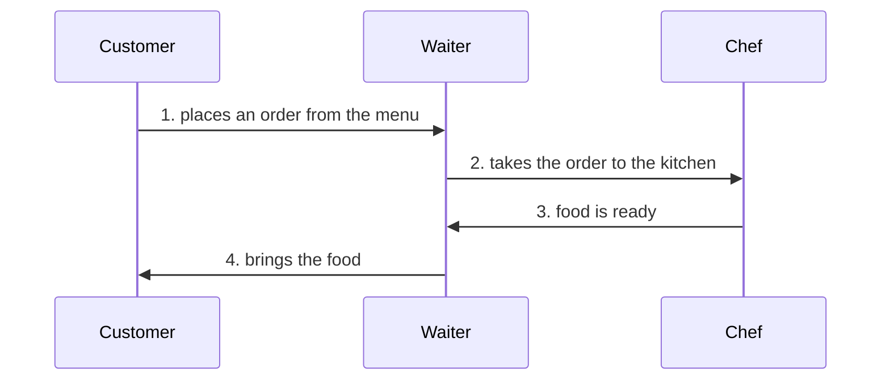
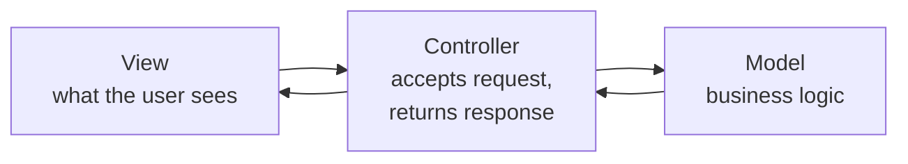

Two machines can talk to each other, a server can expose an API, and a project can be set up and run. What none of that settles is how the code inside the server should be arranged. That arrangement turns out to matter as much as the design around it.

# Three properties worth optimising for

Imagine opening a restaurant chain. The menu is planned and the marketing is done, but whether it becomes anything depends on something less glamorous: how the day-to-day operation is arranged. Can you add a new dish without disrupting everything? Can you serve more customers without rebuilding the kitchen? When something goes wrong, can you find it?

Software is the same. However good the idea, an implementation that is not arranged well starts to come apart.

| Property | The question it answers |
|---|---|
| **Scalability** | When more users arrive, can the application cope? |
| **Extendability** | When you have to add a feature, can the code accommodate it? |
| **Maintainability** | When bugs and complications arrive, can you keep the thing working? |

> [!important] **Availability is deliberately not on that list.** How you arrange your code does not directly affect whether your system is up. Availability comes from fault tolerance — redundancy, failover, handling the failure of a component. Arrangement affects the other three and not that one, and conflating them leads to reaching for the wrong fix.

# Architectures are arrangements of code

There are several established ways to arrange a codebase, and MVC is the most widely known. Others exist — clean architecture and domain-driven design among them.

These are usually called **architectural design patterns**, and MVC has close relatives you will meet by name:

| Pattern | Stands for | Commonly seen in |
|---|---|---|
| **MVC** | Model View Controller | Backend applications |
| **MVP** | Model View Presenter | Application and UI codebases |
| **MVVM** | Model View ViewModel | Mobile codebases, and some frontends |

All three are doing the same job — separating concerns so that one piece of code has one purpose — and they differ in how they cut up the middle.

> [!info] **This is not a backend-only concern, and not a language-only concern.** Frontend codebases have their own arrangements, such as atomic design, where components are grouped as atoms, molecules and organisms alongside hooks, contexts, pages and utilities. Mobile codebases often use MVVM. And the arrangements described here look essentially the same whether the code is Java, Go, Node or PHP — this is a way of thinking, not a language feature.

In practice, almost nobody adopts one architecture exactly as published. The published forms are strict; real teams take what fits and combine it.

# The restaurant

Here is the example everyone uses for MVC, because it works.

You walk into a restaurant as a customer. A **menu** is handed to you. You read it and speak to a **waiter**. The waiter takes your order to the **chef** in the kitchen. The chef cooks. The chef tells the waiter the food is ready. The waiter brings it to you.



Now look at what each one is responsible for.

**The waiter** takes the order and passes it on, then brings the result back. That is all. A waiter does not cook, does not know the recipes, and does not know what is in the dish. What they are good at is the interaction with the customer — taking the request politely, handling questions, being the first point of contact.

**The chef** applies all their expertise to preparing the food. The recipes and the ingredients and the technique are the chef's.

> [!info] **Business logic** is a phrase you will meet constantly. It means the logic the business actually runs on. For a payments company it is how payments get made. For a restaurant it is the cooking — the recipes, the ingredients, the preparation. **The chef holds the business logic.**

**The menu** is what the customer sees and interacts with. It is how they find out what is possible.

# The mapping

That restaurant is MVC, exactly.

MVC stands for **Model, View, Controller**, and each letter names a part of your code — a set of functions, classes, interfaces or structs, depending on the language.

| MVC | Restaurant | Responsibility |
|---|---|---|
| **Controller** | The waiter | Accept the request, pass it on, return the response |
| **Model** | The chef | The business logic |
| **View** | The menu | What the user sees and interacts with |



The controller mapping should feel familiar. A server is a process that accepts a request, processes it, and sends a response — so inside a server there must be code doing each of those three. **The controller is the part that accepts and responds.** The model is the part that processes.

# What MVC actually is

Strip away the letters and one idea is left:

> [!important] **MVC is a way of distributing code according to responsibility.** One part of the code has one job. Another part has another job. That is the whole thing.

Which is worth stating because it is easy to learn MVC as three folder names rather than as the principle underneath.

## The Single Responsibility Principle

That principle has a name: **SRP**, the Single Responsibility Principle.

> [!important] A piece of code — a function, a class, an interface, a struct — should have **one responsibility, and one reason to change.**

A car is built this way almost everywhere you look. The brake pedal decelerates the car. That is all it does. Press it harder and it brakes harder; it never starts accelerating. The suspension has one job. So do the tyres, the gearbox, the clutch, the accelerator, the steering wheel. Nearly every component does exactly one thing, and does it reliably.

The alternative is the thing to picture: an entire application in a single file. Every feature, every rule, every query, all in one place. Adding to it is hard, changing it safely is harder, and finding anything is a chore. Distributing code by responsibility is what stops that.

> [!info] **Separation of concerns is a consequence, not a separate rule.** You will see that phrase used alongside SRP as though it were a second principle to follow. It is what you get: apply single responsibility consistently and concerns end up separated. There is nothing extra to do.

## Why it matters more as the project grows

On a small application, how you arrange the code barely matters. You can find everything, and nothing takes long to change.

The calculation changes as the project grows, because the number of moving pieces grows with it. A realistic backend has to fetch data from a database, manipulate it according to business rules, call third-party services, manage configuration, and shape responses. Once all of that is present, arranging it deliberately is what keeps any single change from touching everything.

# A framework built around it

MVC is not just a diagram — some frameworks are constructed around it and will arrange your project for you.

**Ruby on Rails** is the clearest case. Generate a Rails project and the `app/` folder already contains:

```
app/
├── controllers/    ← code that accepts requests and returns responses
├── models/         ← business logic
└── views/          ← frontend templates
```

You do not create those. Rails does, because Rails is built on the assumption that this is how code is organised. Its view templates use ERB — embedded Ruby, a templating layer over HTML — so that pages can be assembled on the server.

That is the strength of an opinionated framework, and also the beginning of its problem. When the framework's assumption stops matching how applications are built, you are still living inside the assumption.
