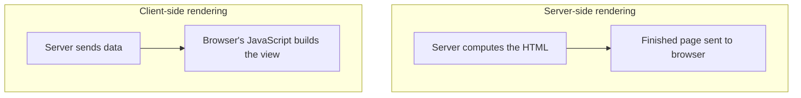
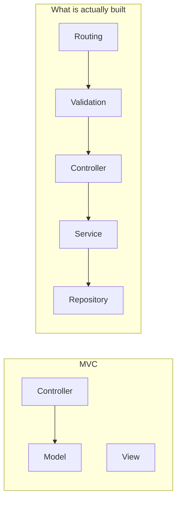

MVC distributes code by responsibility, which is the right instinct. The trouble is that it stops after three, and three is not enough. Real codebases do not implement MVC directly — they take the principle and go considerably further.

# The kitchen is not one person

Go back to the restaurant. We said the chef holds the business logic, full stop.

But a kitchen is not a chef. There are sous chefs. There are helpers. There are appliances that need maintaining. Someone sources the ingredients from the market. Someone cleans. A great deal is happening, and attributing all of it to one role is a simplification that stops being useful the moment you look closely.

> [!important] **MVC oversimplifies.** It describes three responsibilities where there are considerably more, and the consequence is direct: **one layer ends up doing several unrelated things.** Is the chef also responsible for buying ingredients? For maintaining the appliances? Under MVC, all of it lands in the model.

The same is true on the other side. We said the waiter takes the order and passes it on. But a customer asks whether a dish can be made without an ingredient, and the waiter answers — they know what the restaurant can and cannot do. **That is validation**, and it is a genuinely separate responsibility from carrying an order to the kitchen. MVC has nowhere to put it, so it goes in the controller alongside everything else.

Which quietly violates the very principle MVC was serving. Distributing code across three buckets is better than one file, but a bucket holding four unrelated responsibilities is still a bucket holding four unrelated responsibilities.

# The frontend does not live there any more

The second problem is bigger, and it is about the V.

MVC assumes the view is part of the same application as the controller and the model. That assumption made sense when pages were assembled on the server.

## Server-side rendering

> [!info] **Server-side rendering (SSR)** means the HTML you eventually see is computed on the server. Loading a profile page, the server works out the name, the image, the bio — assembles the HTML — and sends the finished page to the client.

Under SSR, bundling the view with the backend is natural. The server is producing the pages, so the templates belong beside the code producing them. That is precisely the world MVC was designed for.

## Client-side rendering

> [!info] **Client-side rendering (CSR)** moves the computation to the browser. Rather than fetching freshly built HTML for every interaction, the browser holds a single HTML document and JavaScript changes what is displayed.

Both have real advantages and real drawbacks, and modern applications frequently mix them. What matters here is the consequence:

> [!important] **Frontends are now their own codebases.** They are built with their own technologies — React, Next, Angular, Vue — carry a great deal of logic in their own right, and are frequently maintained as a separate service by a separate team. A modern frontend is not a folder inside the backend.

Previous generations of frontends were thin. Today's are not, and MVC has nothing to say about the split, because in MVC the view is simply one of the three parts.

## The framework noticed

Rails is a useful record of this happening. Older versions always generated a `views/` folder — you got it whether you wanted it or not, and deleting it was manual. Later versions let you omit it at creation time.

That change is the industry moving out from under the assumption, visible in a framework's own defaults.

# So what is actually done

Neither problem means MVC was wrong. Both mean it is a starting point rather than a destination.

What real codebases do is take the principle — distribute code by responsibility — and apply it **much more granularly**, with the frontend assumed to be elsewhere entirely.

Every one of those five is a responsibility that MVC folded into two. The frontend is not in the diagram at all, because it is a different codebase.

That is the arrangement worth learning, and it is what the rest of these notes describe.
