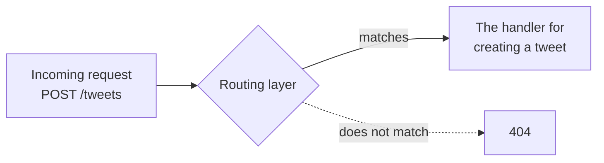
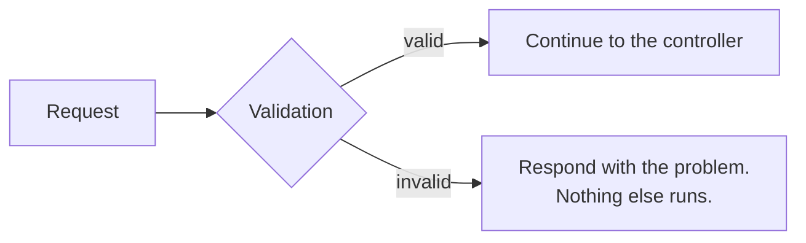
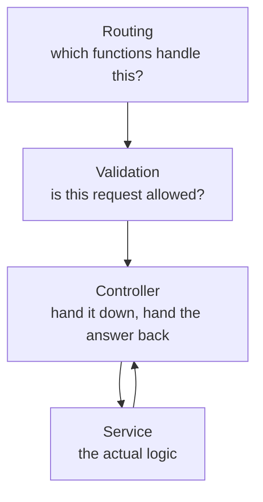

A request arrives at your server. Before a single line of business logic runs, it passes through three layers, each with one job. This note is those three.

> [!info] **A layer is just a folder with code in it.** Functions, classes, structs — whatever your language uses. There is nothing more exotic about the word than that.

# Routing

The first thing a request meets.

Every HTTP request carries a URL and a method — `GET /users`, `POST /tweets`. Something has to work out which code is supposed to deal with that particular combination.

> [!important] **The routing layer decides, from the shape of a request, which functions are responsible for handling it — and forwards the request to them.** That is its entire responsibility. It does no computation of its own.

Think of road signs. A signboard tells you to go left for one destination and right for another. It does not drive your car and it does not carry you anywhere; it directs. An information desk in a shopping centre does the same job — you ask where a shop is, they tell you third floor, and that is the end of their involvement.



In practice this is a folder — commonly `router/` or `routes/` — containing declarations that map a method and a path to a function. Every ecosystem has its own syntax and they all say the same thing:

```text
1  POST  /tweets       →  createTweetHandler
2  GET   /products/1   →  showProduct
3  POST  /signup       →  registerUser
```

Open the function on the right of any of those and you find it doing real work. Open the routing file and you find only the mapping.

# Validation

Once the request has been routed, the next question is whether it should be allowed to proceed at all.

> [!important] **The validation layer checks whether an incoming request is valid.** If it is, the request continues. If it is not, the layer stops it there and returns a response saying so — nothing further runs.

Concretely: someone submits an empty tweet. That should not be allowed. Someone on a free tier submits a tweet of a thousand characters when their limit is lower. Also not allowed. Neither of these is a business decision about hashtags or trending — they are questions about whether the request is well-formed and permitted.

This is the waiter's other job, made explicit. One part of the interaction is checking whether what the customer is asking for is something the restaurant can actually do. Under MVC that had nowhere to live; here it has its own layer.



> [!info] Validation is a common enough need that libraries exist purely for it. Zod is a well-known one in the TypeScript world — it lets you declare the expected shape of a request and have the checking generated from that, rather than hand-writing every condition.

# Controller, or handler

The third layer, and the one whose job is smallest.

> [!important] **A controller takes the request from the layers above, passes it to the layer below, takes the response back, and sends it up.** That is all it does. It runs no business logic and performs no validation.

Different codebases call this `controllers/` or `handlers/`; they are the same thing.

Compare this to MVC's controller and the difference is the point of the whole exercise. In MVC, the controller accepted requests, and everything unaddressed — routing, validation — informally accumulated there too. Here those have been lifted into their own layers, so what remains is genuinely one responsibility.



A controller that is doing anything more than that has absorbed a responsibility belonging elsewhere — and that is the thing to notice when reading unfamiliar code.

# What has not happened yet

Three layers in, and **no business logic has run.** Nothing has been computed, nothing has been decided, nothing has touched a database.

Which is exactly as intended. Routing, validation and the controller are all concerned with getting the request to the right place in an acceptable state. The work itself belongs further down.
