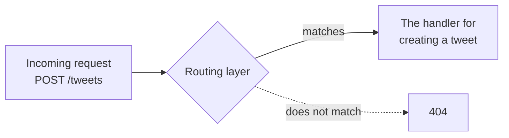
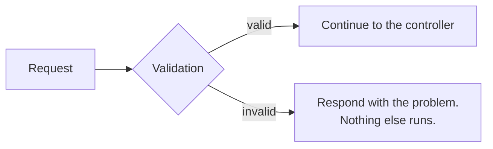
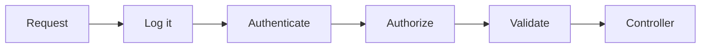
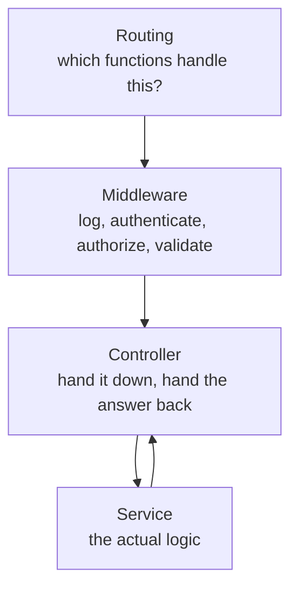

A request arrives at your server. Before a single line of business logic runs, it passes through three layers, each with one job. This note is those three.

> [!info] **A layer is just a folder with code in it.** Functions, classes, structs — whatever your language uses. There is nothing more exotic about the word than that.

# Routing

The first thing a request meets.

Every HTTP request carries a URL and a method — `GET /users`, `POST /tweets`. Something has to work out which code is supposed to deal with that particular combination.

> [!info] **The route is the part after the host.** In `https://example.com/api/v1/todos`, the route is `/api/v1/todos`. That, paired with the method, is what routing matches on.

> [!important] **The routing layer decides, from the shape of a request, which functions are responsible for handling it — and forwards the request to them.** That is its entire responsibility. It does no computation of its own.

Think of road signs. A signboard tells you to go left for one destination and right for another. It does not drive your car and it does not carry you anywhere; it directs. An information desk in a shopping centre does the same job — you ask where a shop is, they tell you third floor, and that is the end of their involvement.



In practice this is a folder — commonly `router/` or `routes/` — **containing declarations that map a method and a path to a function.** Every ecosystem has its own syntax and they all say the same thing:

```text
1  POST  /tweets       →  createTweetHandler
2  GET   /products/1   →  showProduct
3  POST  /signup       →  registerUser
```

Open the function on the right of any of those and you find it doing real work. Open the routing file and you find only the mapping.

## How much of this you write yourself depends on the framework

Routing is the layer frameworks most often take over, and how visible it is varies a great deal:

| Framework         | What handles routing                                                                                                                 |
| ----------------- | ------------------------------------------------------------------------------------------------------------------------------------ |
| **Spring Boot**   | **A built-in `DispatcherServlet`**. You declare routes as annotations on your controllers and **never write a routing layer at all** |
| **Express**       | The Express router — routing is essentially what the framework is                                                                    |
| **Ruby on Rails** | A router configured in its own file                                                                                                  |
| **Go**            | A routing library such as chi, depending on which you pick                                                                           |

> [!important] The **responsibility** always exists — something must decide which code handles a request. What varies is whether you write that decision yourself or declare it and let the framework act on it. Not finding a `routes/` folder in a Spring Boot project does not mean routing is absent; it means the framework owns it.

# Validation

Once the request has been routed, the next question is whether it should be allowed to proceed at all.

> [!important] **The validation layer checks whether an incoming request is valid.** If it is, the request continues. If it is not, the layer stops it there and returns a response saying so — nothing further runs.

Concretely: someone submits an empty tweet. That should not be allowed. Someone on a free tier submits a tweet of a thousand characters when their limit is lower. Also not allowed. Neither of these is a business decision about hashtags or trending — they are questions about whether the request is well-formed and permitted.

This is the waiter's other job, made explicit. One part of the interaction is checking whether what the customer is asking for is something the restaurant can actually do. Under MVC that had nowhere to live; here it has its own layer.



> [!info] Validation is a common enough need that libraries exist purely for it. Zod is a well-known one in the TypeScript world — it lets you declare the expected shape of a request and have the checking generated from that, rather than hand-writing every condition.

## Why bother, when the database would reject it anyway

A fair objection: if someone sends a malformed request, the database will refuse to store it. The request fails either way. So why check twice?

Because of what happens in between. Without validation, a request you already know is broken travels all the way down — through the controller, through the service, into the database — and only then fails. You have spent work on a request that was never going to succeed, and you have made your database do it too.

> [!important] **Fail fast.** When you can tell at the front door that a request cannot succeed, refuse it at the front door. Do not send it downstream to be refused later. The deeper a doomed request travels, the more it costs and the more systems it disturbs.

# Middleware

Validation is not really its own category. It is one instance of something more general.

Think about what else you might want to do to every incoming request, before any handler sees it:

- **Validate** it, as above
- **Log** it — this request arrived at this time, from here
- **Authenticate** — is this caller who they claim to be?
- **Authorize** — granted that we know who they are, are they allowed to do this?

All four share a shape: work that happens **before the controller**, that is not the controller's job.

> [!important] **Middleware is a set of actions performed before a request reaches the controller.** Validation is one kind of middleware. So is logging, so is authentication, so is authorization. You can have several, and a request passes through them in order.



Which is why some codebases have a `middlewares/` folder and no `validators/` folder — validation lives inside the general mechanism rather than beside it.

## Why middleware comes after routing, not before

This looks backwards at first. If a request is going to be rejected, why route it first? Why not authenticate at the very front and save the work?

Because **not every route needs the same treatment.**

Consider a question-and-answer site. You can read an answer without an account. You cannot post one. Same server, same application, two routes with completely different requirements.

> [!important] To decide whether a request needs authentication, you first have to know **which route it is for.** That is routing's job, and it has to happen first. Only once the route is known can the right middleware be applied — or skipped.

Authenticating everything up front would mean demanding credentials for requests that never needed them.

> [!info] This is a recommendation like everything else here. If your authentication is simple enough to apply uniformly, you can do it before routing. The ordering above is what fits most applications, not a rule.

# Controller, or handler

The third layer, and the one whose job is smallest.

> [!important] **A controller takes the request from the layers above, passes it to the layer below, takes the response back, and sends it up.** That is all it does. It runs no business logic and performs no validation.

Different codebases call this `controllers/` or `handlers/`; they are the same thing.

Compare this to MVC's controller and the difference is the point of the whole exercise. In MVC, the controller accepted requests, and everything unaddressed — routing, validation — informally accumulated there too. Here those have been lifted into their own layers, so what remains is genuinely one responsibility.



**A controller that is doing anything more than that has absorbed a responsibility belonging elsewhere** — and that is the thing to notice when reading unfamiliar code.

# Two arguments for splitting this finely

A reasonable reaction to five layers where MVC had two is that it looks like ceremony. Two answers, and neither is aesthetic.

## Testing

This is the strongest practical argument for single responsibility, and it is concrete.

Suppose validation lives inside the controller. Now write a test for the validation logic. You cannot reach it without going through the controller, so your validation test is also a controller test. It sets up things it does not care about, and it breaks when the controller changes for reasons unrelated to validation.

Now write a test for the controller. Same problem in reverse — you drag the validation logic in with it.

> [!important] **Tightly coupled code cannot be tested in isolation, and untestable-in-isolation means every test is bigger, slower and more brittle than it needs to be.** Separating the two lets each be tested on its own terms. That benefit is immediate and measurable, unlike most architectural arguments.

Note that this does not require classes or layers specifically. Even in a language where you would reach for plain functions, writing validation logic inline inside a handler is already the mistake — it should at minimum be its own function. Layers are that instinct applied at a larger scale.

## Ownership

The second argument is organisational, and it only becomes visible on a real team.

Teams own parts of a product. A live-streaming product might have one team on the streaming itself, another on metadata, another on backup. A cloud storage product might have one team on storage and another on disaster recovery.

> [!important] When code is segregated by layer, **layers can have owners.** A folder gets designated reviewers, and changes to it require their approval before merging. Review routes automatically, because the structure of the codebase mirrors the structure of the responsibilities.

Collapse those layers together and that stops working — every change touches everyone's area, and nobody can own anything.

> [!warning] **This is not an argument for maximum segregation.** Splitting code into layers that do not correspond to real, separate responsibilities adds structure without adding clarity, and you get the ceremony with none of the benefit. The number of layers should follow from the number of genuinely distinct responsibilities, which is why the list in these notes is a common shape rather than a fixed one.

For a newcomer, a project with many folders genuinely does look overwhelming. The argument for it only becomes obvious after a year or two of maintaining something that was not arranged this way — at which point the debugging, the maintenance and the cost of adding features all make the case on their own.

# What has not happened yet

Three layers in, and **no business logic has run.** Nothing has been computed, nothing has been decided, nothing has touched a database.

Which is exactly as intended. Routing, validation and the controller are all concerned with getting the request to the right place in an acceptable state. The work itself belongs further down.
