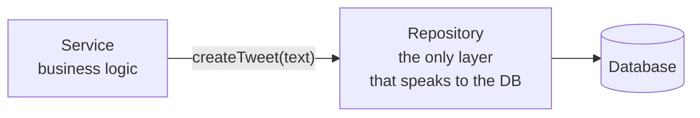

A request has been routed, validated and passed down by the controller. Nothing has actually been done with it yet. These two layers are where the work happens — and the boundary between them is the single most valuable idea in this arrangement.

# The service layer

> [!important] **The service layer holds the business logic** — the algorithmic and logical work the application exists to do.

Take a social media application. Someone posts:

```text
1  What a great match #CSK #RCB
```

Hashtags in that text need finding, because hashtags appearing across many posts are what make something trend. So some code has to take the string, extract every hashtag from it, and do something with the result. Some posts have none, some have one, some have several.

That extraction is an algorithm. Deciding what to do with the hashtags afterwards is a rule of the business. **Both belong in the service layer.**

A realistic service function for creating a post does several such things: parse the hashtags out of the text, create any hashtags that do not exist yet, create the post, associate the two, and return what was created. All of it is logic about what the application means by creating a post.

# The problem with letting it touch the database

Notice that the list above keeps saying create. Business logic almost always needs data — the chef needs ingredients from somewhere.

So suppose the service layer talks to the database directly. Everything works, and the service is full of lines like:

```sql
1  SELECT * FROM tweets WHERE user_id = ?
2  INSERT INTO tweets (text, user_id) VALUES (?, ?)
3  UPDATE tweets SET text = ? WHERE id = ?
```

Everyone is happy, until you have to change database. A security problem, a licensing change, a scaling decision — the reason does not matter. You are moving to a document database, where queries do not look like that at all:

```text
1  db.tweets.insertOne({ text: "...", userId: 42 })
```

> [!important] **Now every one of those queries has to change, and they are scattered throughout your business logic.** Every one needs rewriting, every one needs retesting, and if the migration is gradual you will have both styles sitting side by side in the same files.

Then ask the question that exposes what has gone wrong:

> [!important] **Did the business logic change?** Extracting hashtags from a post is identical regardless of where posts are stored. Deciding what trends is identical. **None of the business rules changed at all** — and yet the business logic files are the ones being edited.
>
> A storage decision is forcing changes to logic that has nothing to do with storage. That is a direct violation of the Single Responsibility Principle: this code now has two reasons to change.

# The repository layer

The fix is to stop the service layer talking to the database at all, and put a layer between them.

> [!important] **The repository layer is the only code that interacts with the database.** It holds the actual queries. Nothing above it knows what kind of database exists, or what its queries look like.



The service calls `createTweet(text)`. Inside that function is either the SQL or the document query — and the service neither knows nor cares which.

Migrate the database now and **only the repository changes.** The business logic is untouched, because it was never about storage in the first place.

> [!info] This arrangement is called the **repository pattern**. Some codebases call the layer **DAO** instead — Data Access Object. Same idea, different name.

# Seeing the swap actually work

This is easy to state and easy to doubt, so here it is in running code. A small Spring Boot todo application defines its repository as an interface:

```java
1  // src/main/java/com/example/demo/repositories/ITodoRepository.java
2  package com.example.demo.repositories;
3
4  import java.util.List;
5  import com.example.demo.schema.Todo;
6
7  public interface ITodoRepository {
8
9      List<Todo> findAll();
10
11     Todo save(Integer newTodoId, String todoContent);
12 }
```

Two things implement it. One keeps todos in a list:

```java
1  // src/main/java/com/example/demo/repositories/InMemoryTodoRepository.java
2  @Repository("inMemoryTodoRepository")
3  public class InMemoryTodoRepository implements ITodoRepository {
4      private List<Todo> todos = new ArrayList<>(Arrays.asList(
5          new Todo(1, "Buy groceries"),
6          new Todo(2, "Buy groceries"),
7          new Todo(3, "Buy groceries")
8      ));
9
10     public List<Todo> findAll() {
11         return todos;
12     }
13
14     public Todo save(Integer newTodoId, String todoContent) {
15         Todo newTodo = new Todo(newTodoId, todoContent);
16         todos.add(newTodo);
17         return newTodo;
18     }
19 }
```

The other keeps them in a map:

```java
1  // src/main/java/com/example/demo/repositories/InMemoryMapTodoRepository.java
2  @Repository("inMemoryMapTodoRepository")
3  public class InMemoryMapTodoRepository implements ITodoRepository {
4
5      private Map<String, Todo> todos = new HashMap<>();
6
7      public List<Todo> findAll() {
8          return new ArrayList<Todo>(todos.values());
9      }
10
11     public Todo save(Integer newTodoId, String todoContent) {
12         Todo newTodo = new Todo(newTodoId, todoContent);
13         todos.put(newTodo.getId().toString(), newTodo);
14         return newTodo;
15     }
16 }
```

And the service depends on the **interface**, naming which implementation it wants:

```java
1  // src/main/java/com/example/demo/services/TodoService.java
2  @Service
3  public class TodoService {
4
5      private ITodoRepository todoRepository;
6
7      public TodoService(@Qualifier("inMemoryTodoRepository") ITodoRepository _todoRepository) {
8          this.todoRepository = _todoRepository;
9      }
10
11     public List<Todo> getAllTodos() {
12         return todoRepository.findAll();
13     }
14
15     public Todo createNewTodo(CreateTodoDTO createTodoDTO) {
16         Integer newTodoId = 1;
17         List<Todo> todos = todoRepository.findAll();
18         if(!todos.isEmpty()) {
19             Todo lastTodo = todos.get(todos.size() - 1);
20             newTodoId = lastTodo.getId() + 1;
21         }
22         Todo newTodo = todoRepository.save(newTodoId, createTodoDTO.getContent());
23         return newTodo;
24     }
25 }
```

Look at lines 11 to 24. `findAll` and `save` — nothing about lists, nothing about maps, nothing about SQL. That is business logic that does not know how anything is stored.

Now change **one string** on line 7, from `inMemoryTodoRepository` to `inMemoryMapTodoRepository`, rebuild, and hit the same API:

| Request | With the list implementation | With the map implementation |
|---|---|---|
| `GET /api/v1/todos` | `[{"id":1,...},{"id":2,...},{"id":3,...}]` | `[]` |
| `POST /api/v1/todos` | `{"id":4,"content":"..."}` | `{"id":1,"content":"..."}` |

> [!info] **Verified by running it.** Both responses are real. The storage genuinely changed — the map implementation starts empty, so the first created todo gets id 1 instead of id 4. **The controller did not change, the service did not change, and the API did not change.** One string did.

That table is the repository pattern's entire argument, demonstrated rather than asserted.

# Why the interface matters

The reason the swap costs one string is that the service depends on `ITodoRepository`, not on either concrete class.

> [!important] Depending on an interface means the service is written against **what a repository can do** — find things, save things — rather than against **how any particular repository does it.** Any implementation honouring that interface can be dropped in.

Which is what makes swapping a database a contained change rather than a project-wide edit.

# The division, stated plainly

| Layer | Knows about | Does not know about |
|---|---|---|
| **Service** | The rules of the business | Where anything is stored |
| **Repository** | The database and its query language | Why any of it is being asked for |

Each has one responsibility, and one reason to change. The service changes when the business rules change. The repository changes when the storage changes. Those two events are unrelated, and this arrangement is what keeps them that way.
