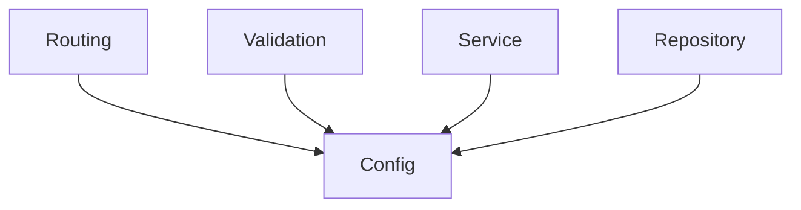
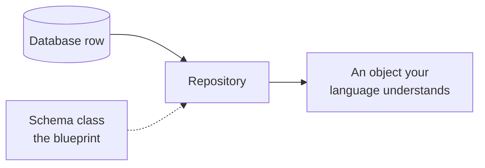
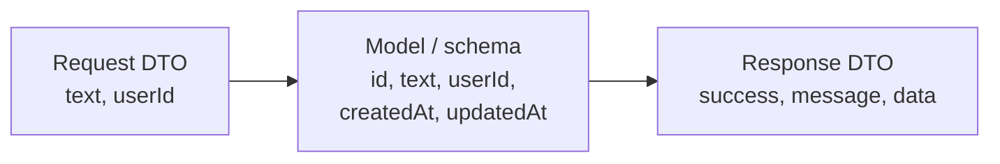
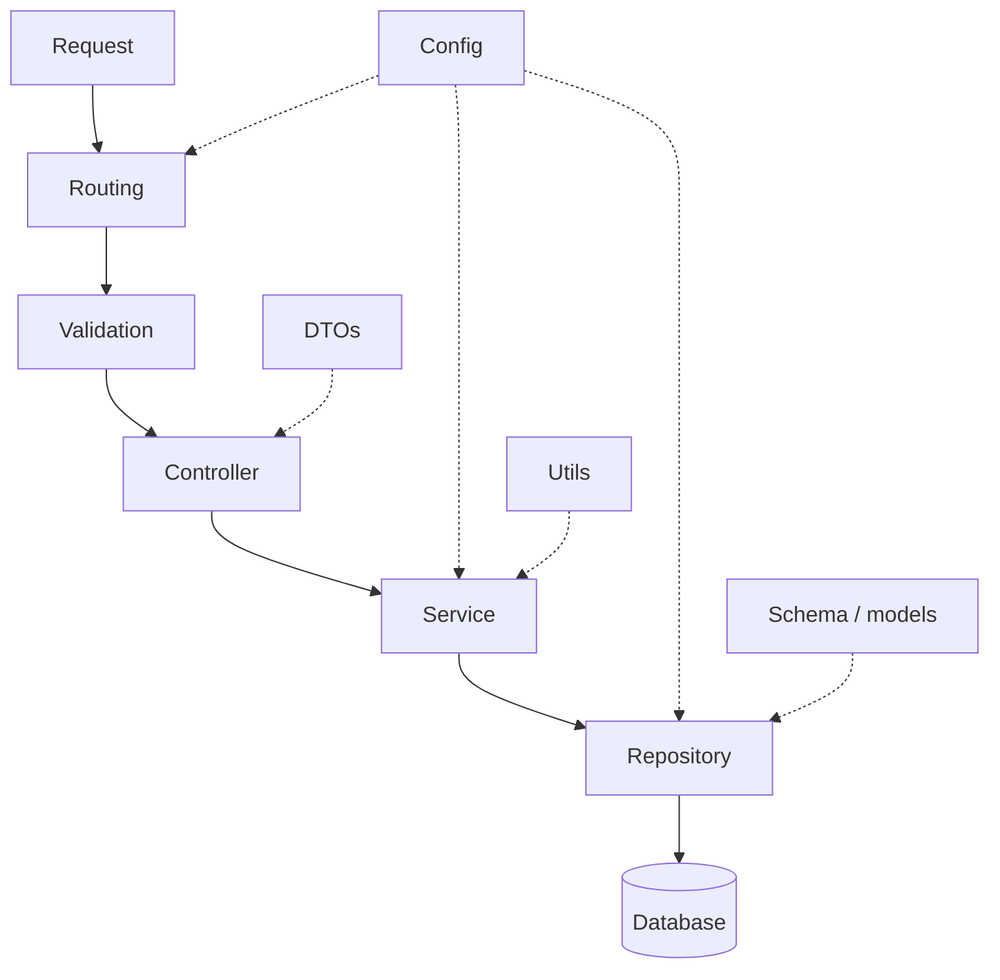

Routing, validation, controller, service and repository are the path a request travels. Alongside them sit several more layers that the path depends on rather than passes through. None is complicated; one of them is routinely misunderstood.

# Config

Every project has values that are configurable — things that could reasonably be different tomorrow.

The database server's address. The port your process listens on. Credentials. **These are not logic; they are settings, and they change without any code changing.**


> [!important] **The config layer holds configurable values.** And unlike the request path, **many layers depend on it at once** — routing, validation, the repository, all of them may need something from config.



# Schema, or models

How your data is shaped in the database. What columns a table has, or what fields a document has.

That description is accurate but does not explain why the layer has to exist. The real reason is more mechanical.

## Your language does not understand database rows

Suppose a todo is stored with these columns:

```text
1  id
2  content
3  is_done
4  created_at
5  updated_at
```

The repository asks the database for a todo, and the database hands back a **row**. Not an object — a row, in whatever representation that database uses.

> [!important] **Java has no idea what a MySQL row is.** Neither does Python, or Go. Your language understands its own objects and nothing else. So something has to convert what came back into an object your code can actually work with.
>
> To create an object you need a class. **That class is what the schema layer holds** — a blueprint, in your language, of a table in your database.



Which is why the repository layer depends on the schema layer. It cannot hand anything useful upward without it.

> [!info] The same need exists in every language, only the shape differs. In Java it is a class, in Ruby a Ruby class, in a loosely typed language the conversion still happens even where nothing forces you to declare it.

> [!warning] **The word models now means something different.** In MVC, the model held all the business logic and all the data access — it was the biggest part of the design. Here, `models/` (or `schema/`, the names are used interchangeably) holds **only the shape of your stored data**. The business logic moved to the service layer and the data access moved to the repository layer.
>
> Meeting a `models/` folder in unfamiliar code, check which of the two meanings applies before assuming.

> [!info] A schema class is not necessarily a plain data holder. It can carry **relationships** between tables, and **fetching strategy** — whether related data is loaded immediately or only when asked for, commonly called eager and lazy loading. That extra capability is part of why it stays a separate layer rather than being merged with the DTOs below.

# Migrations

> A folder **recording the changes made to your database structure over time**.

## Version control, for your schema

You already version your code. You make a change, commit it, and if it turns out badly you can go back — or work from an earlier point while someone else works from a later one.

Database structure needs exactly the same thing.

Say the todo table gains a `pending_by` column, recording when a todo is due. That is a change to the schema. If it turns out to be a mistake, you want to go back to the structure that had no such column — reliably, not by remembering what you did and undoing it by hand.

> [!important] **Migrations are versions of your database schema.** Each change is recorded as a step that can be applied going forward or reversed going back. It is the same reasoning as version control for source code, applied to the shape of your data.

## Why this is a relational concern

Document databases are generally **schemaless** — there is no declared structure that every record must match, which is one of the things they are chosen for. **Nothing to version means nothing to migrate.**

Relational databases do have a declared schema, and it changes over time. So migrations appear alongside relational databases and generally not alongside document ones.

# Utils

Helper functions with nowhere more specific to live.

A function converting a timestamp into a particular format. A string-matching helper that pulls hashtags out of text. Small, reusable, not tied to one piece of business logic.

> [!info] Note what that second example implies. The service layer decides that hashtags should be extracted and what to do with them; the mechanical string matching can sit in `utils/` and be called from there. The rule stays intact — the decision is business logic, the mechanism is a helper.

The clearest signal that something belongs here is **reuse across layers**. If extracting hashtags uses a string-search algorithm, that algorithm is not about hashtags at all — you may want it in several unrelated places. It belongs to no layer in particular, which is exactly what `utils/` is for.

# DTO

The one worth spending real time on.

**DTO** stands for **Data Transfer Object**, and the name is unusually honest: it is the definition of an object that gets transferred over the network.

## The same problem the schema layer solves

**The schema layer exists because your language cannot hold a database row.** DTOs exist for the identical reason, one step further out.

A payment provider responds to you with JSON:

```json
1  {
2    "success": true,
3    "message": "Payment captured"
4  }
```

> [!important] **Java cannot hold JSON.** It is not a native type. Neither is it native to most languages that will be receiving it. So to work with that response at all, you need a class representing its shape — exactly as you needed one for a database row.

And the same is true going the other way. To **send** a request to that provider, which expects something like this:

```json
1  {
2    "paymentMode": "UPI",
3    "amount": 240
4  }
```

— you need a class in your own language that can be converted into that JSON.

## It applies in both directions

This is the part that is easy to get half-right.

> [!important] **A DTO covers any data crossing your server's boundary, inbound or outbound.**
>
> **Into your server:** a request from your client, and a response from a third-party service you called.
> **Out of your server:** a request you send to a third party, and the response you send back to your client.
>
> Transfer does not mean outbound. It means crossing the boundary at all.

So the response your server returns to a client is a DTO too, not something separate.

## Three different shapes

Storing a post, you might keep all of this:

```text
1  id           a unique identifier
2  text         the content
3  userId       who wrote it
4  createdAt    when it was created
5  updatedAt    when it was last edited
```

But when a client creates a post, **it does not send all of that.**

- **Not the id.** How identifiers are generated is your logic, not the client's business.
- **Not `createdAt` or `updatedAt`.** You do not accept timestamps from clients — a client can change the clock on their own machine and send you whatever they like.

So what actually arrives is much smaller:

```json
1  {
2    "text": "What a great match",
3    "userId": 42
4  }
```

And what goes back is different again — typically wrapped, with the payload nested inside:

```json
1  {
2    "success": true,
3    "message": "Created tweet",
4    "data": {
5      "id": 1071,
6      "text": "What a great match",
7      "userId": 42,
8      "createdAt": "2026-08-27T10:14:00Z",
9      "updatedAt": "2026-08-27T10:14:00Z"
10   }
11 }
```



> [!important] **Three shapes, three purposes.** What the client sends, what you store, and what you return are all different — and DTOs are the definitions of the two that cross the network. A DTO is **not** the same as a model or schema, and conflating them is the mistake this layer exists to prevent.

The same applies outward. When your server calls a third-party service, that service expects a particular object, which will not match what you hold internally either.

A real request DTO is therefore small:

```java
1  // src/main/java/com/example/demo/dtos/CreateTodoDTO.java
2  package com.example.demo.dtos;
3
4  import lombok.AllArgsConstructor;
5  import lombok.Getter;
6  import lombok.Setter;
7
8  @Getter
9  @Setter
10 @AllArgsConstructor
11 public class CreateTodoDTO {
12     private String content;
13 }
```

One field — the only thing the client is trusted to supply. The stored object has an id as well, generated on the server.

> [!info] **DTOs are most visible in strictly typed languages.** In Java, Go or TypeScript the shape has to be declared, so the layer is explicit. In loosely typed languages the objects still cross the network in exactly the same three shapes, but nothing forces you to write the definitions down — which is why the pattern can look unfamiliar coming from that direction.

## Who creates one, and where it lives

A common confusion, worth stating precisely because the answer is not symmetrical.

> [!important] **The DTO layer holds the class. The service layer creates the object.**
>
> The service runs its logic, then builds a DTO to hand back to the controller, which returns it upward. So the service **uses** the class — it does not **contain** it.

The same is true one layer down: the repository layer holds its own classes, and the service uses them without holding them. Definitions live in their layer; instances get created wherever they are needed.

## Schema or DTO?

They look similar — both are classes describing the shape of some data — so the distinction is worth being exact about.

|              | **Schema / model**                                                      | **DTO**                                             |
| ------------ | ----------------------------------------------------------------------- | --------------------------------------------------- |
| Describes    | **Your database structure**                                             | Data crossing your server's boundary                |
| Typically    | Carries relationships, fetching strategy such as eager and lazy loading | A plain data holder, nothing more                   |
| Changes when | Your storage changes                                                    | Your API contract or a third-party contract changes |

> [!important] A schema is **not** just a plain data class, which is precisely why it does not double as a DTO. It can express how tables relate to one another and how related data should be loaded. A DTO needs none of that — it describes a message, not a stored structure.

And they change for different reasons, which is the SRP test applied: your database gaining a column has nothing to do with what your API returns to a client.

# There are always more

Several others worth knowing by name:

- **Seeders.** Code that inserts sample data into your database, so there is something to develop and test against.
- **Producers and consumers.** When work is handled asynchronously rather than during the request, the code that puts jobs onto a queue and the code that takes them off get their own layers.
- **Templates.** If your application sends emails, the email templates live together rather than inside whatever logic happens to send them.
- **Configuration for a specific library.** Wiring up a cache or a message queue is configuration, and it goes in the config layer — one of the many things MVC has nothing to say about.

> [!important] The list is not fixed and is not meant to be. What is fixed is the principle underneath every entry on it: **one part of the code, one responsibility, one reason to change.** New layers appear when a genuinely separate responsibility shows up, and the right number is however many that turns out to be.

> [!info] **The names are yours to choose.** Nothing enforces `services/` or `dtos/` or `repositories/`. Call a layer whatever you like — what matters is that a layer exists for each distinct responsibility, not what the folder is called. Putting a template in your service layer will not break anything either; it will just make the project harder to maintain and extend, which is the only thing any of this is protecting against.

# The whole arrangement



Solid arrows are the path a request takes. Dotted lines are the layers it depends on along the way.

Set that against MVC's three boxes and the difference is not that this is more complicated for its own sake. It is that each box now holds one thing, which was what MVC was trying to achieve in the first place.
