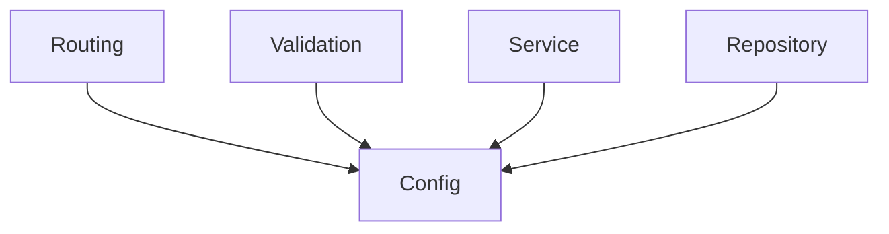
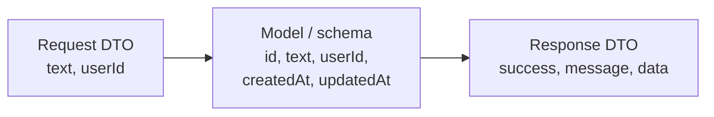
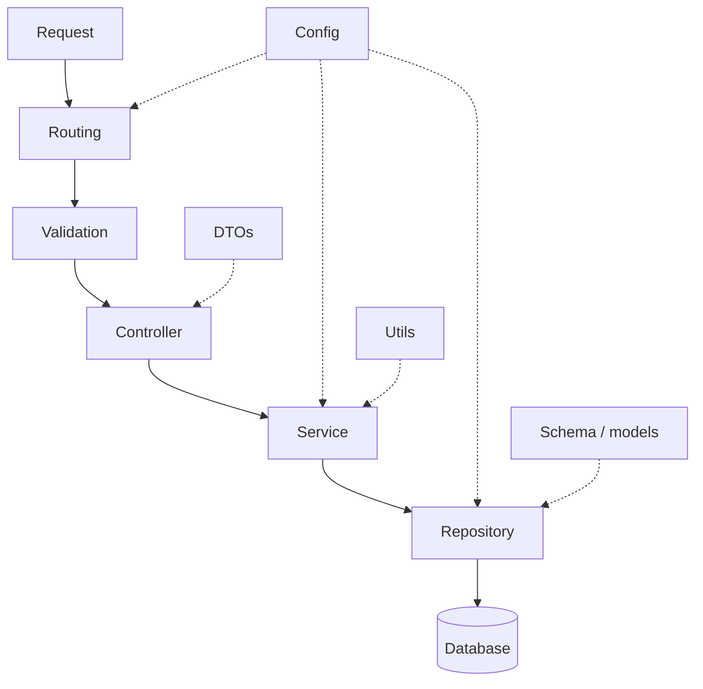

Routing, validation, controller, service and repository are the path a request travels. Alongside them sit several more layers that the path depends on rather than passes through. None is complicated; one of them is routinely misunderstood.

# Config

Every project has values that are configurable — things that could reasonably be different tomorrow.

The database server's address. The port your process listens on. Credentials. These are not logic; they are settings, and they change without any code changing.

> [!important] **The config layer holds configurable values.** And unlike the request path, **many layers depend on it at once** — routing, validation, the repository, all of them may need something from config.



# Schema, or models

How your data is shaped in the database. What columns a table has, or what fields a document has.

> [!warning] **The word models now means something different.** In MVC, the model held all the business logic and all the data access — it was the biggest part of the design. Here, `models/` (or `schema/`, the names are used interchangeably) holds **only the shape of your stored data**. The business logic moved to the service layer and the data access moved to the repository layer.
>
> Meeting a `models/` folder in unfamiliar code, check which of the two meanings applies before assuming.

# Migrations

A folder recording the changes made to your database structure over time.

> [!info] **This is versioning for your database.** As tables gain columns or change shape, each change is recorded as a step, so the structure can be rebuilt or moved forward reliably rather than being edited by hand and hoped about.

Migrations are a relational-database concern; you generally will not see this folder alongside a document database.

# Utils

Helper functions with nowhere more specific to live.

A function converting a timestamp into a particular format. A string-matching helper that pulls hashtags out of text. Small, reusable, not tied to one piece of business logic.

> [!info] Note what that second example implies. The service layer decides that hashtags should be extracted and what to do with them; the mechanical string matching can sit in `utils/` and be called from there. The rule stays intact — the decision is business logic, the mechanism is a helper.

# DTO

The one worth spending real time on.

**DTO** stands for **Data Transfer Object**, and the name is unusually honest: it is the definition of an object that gets transferred over the network.

## Three different shapes

Storing a post, you might keep all of this:

```text
1  id           a unique identifier
2  text         the content
3  userId       who wrote it
4  createdAt    when it was created
5  updatedAt    when it was last edited
```

But when a client creates a post, **it does not send all of that.**

- **Not the id.** How identifiers are generated is your logic, not the client's business.
- **Not `createdAt` or `updatedAt`.** You do not accept timestamps from clients — a client can change the clock on their own machine and send you whatever they like.

So what actually arrives is much smaller:

```json
1  {
2    "text": "What a great match",
3    "userId": 42
4  }
```

And what goes back is different again — typically wrapped, with the payload nested inside:

```json
1  {
2    "success": true,
3    "message": "Created tweet",
4    "data": {
5      "id": 1071,
6      "text": "What a great match",
7      "userId": 42,
8      "createdAt": "2026-08-27T10:14:00Z",
9      "updatedAt": "2026-08-27T10:14:00Z"
10   }
11 }
```



> [!important] **Three shapes, three purposes.** What the client sends, what you store, and what you return are all different — and DTOs are the definitions of the two that cross the network. A DTO is **not** the same as a model or schema, and conflating them is the mistake this layer exists to prevent.

The same applies outward. When your server calls a third-party service, that service expects a particular object, which will not match what you hold internally either.

A real request DTO is therefore small:

```java
1  // src/main/java/com/example/demo/dtos/CreateTodoDTO.java
2  package com.example.demo.dtos;
3
4  import lombok.AllArgsConstructor;
5  import lombok.Getter;
6  import lombok.Setter;
7
8  @Getter
9  @Setter
10 @AllArgsConstructor
11 public class CreateTodoDTO {
12     private String content;
13 }
```

One field — the only thing the client is trusted to supply. The stored object has an id as well, generated on the server.

> [!info] **DTOs are most visible in strictly typed languages.** In Java, Go or TypeScript the shape has to be declared, so the layer is explicit. In loosely typed languages the objects still cross the network in exactly the same three shapes, but nothing forces you to write the definitions down — which is why the pattern can look unfamiliar coming from that direction.

# There are always more

Two others worth knowing by name:

- **Adapters, or API clients.** When your server talks to a third-party service — a payment gateway, say — that service's connection details and call mechanics go in their own layer rather than being scattered through your business logic. Same reasoning as the repository: an external dependency changing should not force edits to your rules.
- **Seeders.** Code that inserts sample data into your database, so there is something to develop and test against.

> [!important] The list is not fixed and is not meant to be. What is fixed is the principle underneath every entry on it: **one part of the code, one responsibility, one reason to change.** New layers appear when a genuinely separate responsibility shows up, and the right number is however many that turns out to be.

# The whole arrangement



Solid arrows are the path a request takes. Dotted lines are the layers it depends on along the way.

Set that against MVC's three boxes and the difference is not that this is more complicated for its own sake. It is that each box now holds one thing, which was what MVC was trying to achieve in the first place.
