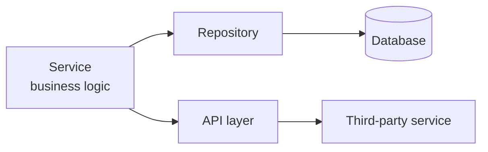
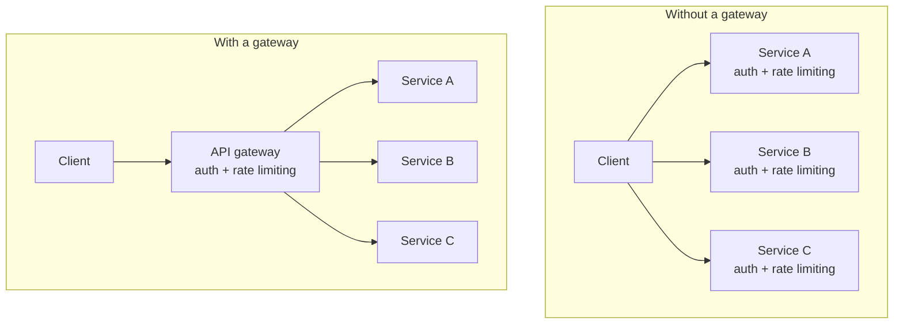

The repository layer exists so that business logic never has to know how data is stored. There is a second external dependency with exactly the same problem — third-party services — and it gets the same treatment. It also has a name collision that confuses people badly, which is worth clearing up in the same place.

# The API layer

Your service layer frequently needs something it cannot produce itself. A payment has to be taken. A location has to be resolved from coordinates. A notification has to be sent. Each means calling a service you do not own.

Every one of those calls involves mechanics: an address, credentials, a request format, a response format, error handling, retries. None of that is business logic.

> [!important] **The API layer holds the code that talks to third-party services.** Your service layer calls a function on it and receives something usable back, exactly as it does with a repository.

The reasoning is identical to the repository argument. A payment provider changing its request format, or being swapped for a different provider entirely, is not a change to your business rules. Keeping those calls in their own layer means such a change stays contained.

> [!info] **Names vary and none of them is official.** This layer is called the API layer, the gateway layer, the external API layer, adapters, or clients, depending on the codebase. Pick one and be consistent — the segregation is what matters, not the label.

# API gateway is a different thing entirely

Because one common name for that layer is gateway, it gets confused with something unrelated.

> [!warning] **A gateway layer inside your application is not an API gateway.** They share a word and nothing else.
>
> The layer above is a folder in your project holding outbound call code. An API gateway is a **separate piece of infrastructure that sits in front of your application** and handles inbound concerns.

An API gateway typically handles:

- **Rate limiting** — capping how many requests a caller may make
- **Authentication** — establishing who is calling before anything else runs

Both are things you have already met as concerns that apply to every incoming request.

## Where those responsibilities actually sit

This depends on how your system is built, and the contrast explains why API gateways exist at all.

**In a single application**, there is no separate gateway. Those responsibilities are distributed across the first few layers you already have — routing, middleware and the controller between them do authentication, rate limiting and the rest. It works, and for one application it is entirely reasonable.

**Across many services**, it stops working.

> [!important] Without a gateway, **every service reimplements authentication and rate limiting.** The same logic, duplicated as many times as you have services, each copy able to drift from the others. Extracting it into one service in front of them all means it is written once and applied uniformly.

That extraction is the API gateway, and it is why the pattern exists.

> [!info] How authentication works across services behind a gateway is a substantial topic of its own, and it sits with microservices rather than here. What matters at this point is only the distinction: **a gateway layer is a folder in your project for outbound calls; an API gateway is infrastructure in front of your project handling inbound traffic.**
