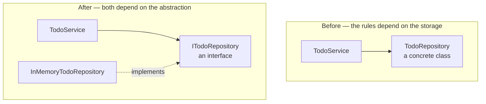

Layering a project puts the service in one folder and the repository in another, and has the service call the repository. That leaves a question nobody asked yet: when the service runs, where does its repository actually come from? Answering it properly means starting with no framework at all.

# Two ordinary classes

Strip everything back. No Spring, no framework — a plain Java project with two classes.

```java
1  // TodoService.java
2  public class TodoService {
3
4      private TodoRepository todoRepository;
5
6      public List<Todo> getAllTodos() {
7          return todoRepository.findAll();
8      }
9  }
```

```java
1  // TodoRepository.java
2  public class TodoRepository {
3
4      private List<Todo> todos = new ArrayList<>();
5
6      public List<Todo> findAll() {
7          return todos;
8      }
9  }
```

Nothing unusual. The service holds a repository and calls `findAll()` on it.

# Running it fails

Now a main method that uses the service:

```java
1  // Main.java
2  public class Main {
3      public static void main(String[] args) {
4          TodoService ts = new TodoService();
5          ts.getAllTodos();
6      }
7  }
```

Line 4 calls the **default constructor** — the one Java provides because no constructor was written. Line 5 then fails at runtime.

Trace why, because the reasoning is the whole point.

`getAllTodos()` calls `todoRepository.findAll()`. So what is `todoRepository`?

> [!important] **Nothing ever created it.** `new TodoRepository()` appears nowhere — not in `main`, not in `TodoService`, nowhere at all. Its constructor was never called, so no object exists. The field is a reference with nothing to refer to, so Java leaves it **null**, and calling a method on null fails.

The class compiles perfectly. It fails the moment it runs.

# Creating the object is not enough

The obvious fix is to make one. `TodoService` depends on `TodoRepository`, so the repository has to exist first:

```java
1  // Main.java
2  public static void main(String[] args) {
3      TodoRepository r = new TodoRepository();
4      TodoService ts = new TodoService();
5      ts.getAllTodos();
6  }
```

This still fails, for a reason worth being precise about.

> [!warning] An object now exists, but it exists **as a local variable in `main`**. Nothing connected it to the service's field. `TodoService.todoRepository` is still null — the object over in `main` has no relationship to it.

Creating a dependency and supplying a dependency are two different steps.

# Supplying it

The missing step is getting `r` into the service's field, and a constructor is the natural way:

```java
1  // TodoService.java
2  public class TodoService {
3
4      private TodoRepository todoRepository;
5
6      public TodoService(TodoRepository r) {
7          this.todoRepository = r;
8      }
9
10     public List<Todo> getAllTodos() {
11         return todoRepository.findAll();
12     }
13 }
```

```java
1  // Main.java
2  public static void main(String[] args) {
3      TodoRepository r = new TodoRepository();
4      TodoService ts = new TodoService(r);
5      ts.getAllTodos();
6  }
```

Line 4 passes the object in. Line 7 of the service stores it. Now it runs.

# What that was


> [!important] **Dependency injection is supplying an object its dependencies from outside, rather than having it create them itself.**
>
> `TodoService` depends on `TodoRepository`. Rather than the service constructing its own, the object is built elsewhere and handed in. That handing-in is the injection.

And because it arrived through a constructor, this is specifically **constructor-based injection**.

Note what has not happened: the service never calls `new TodoRepository()`. It states what it needs and receives it. That separation is the whole idea, and it is what makes swapping the implementation possible later.

# The class it depends on is the wrong class to depend on

It runs now, and the design still has a problem serious enough to have a name.

Look at what `TodoService` says about itself. Its field is a `TodoRepository`, its constructor takes a `TodoRepository`, and the type is written into the class three times. The service has committed, in its own source code, to one specific way of storing todos.

> [!important] That is a violation of the **Dependency Inversion Principle** — the D in SOLID. It says a high-level module should not depend on a low-level one; both should depend on an abstraction.

In this pair, the service is the high-level module: it holds the rules about what happens to todos. The repository is the low-level one: it knows where the bytes go. Right now the rules name the storage.

**Break it and the cost is obvious.** The list lives in memory today; tomorrow it lives in MySQL. That is entirely a storage decision, and nothing about the rules for todos has changed. But `TodoService` names `TodoRepository`, so a new storage class means editing the service — a class that does not care where data is kept and should never have had to be opened.

The fix is to have the service depend on a description of what it needs rather than on the thing that provides it.

```java
1  // ITodoRepository.java
2  public interface ITodoRepository {
3
4      List<Todo> findAll();
5  }
```

```java
1  // InMemoryTodoRepository.java
2  public class InMemoryTodoRepository implements ITodoRepository {
3
4      private List<Todo> todos = new ArrayList<>();
5
6      @Override
7      public List<Todo> findAll() {
8          return todos;
9      }
10 }
```

```java
1  // TodoService.java
2  public class TodoService {
3
4      private ITodoRepository todoRepository;
5
6      public TodoService(ITodoRepository r) {
7          this.todoRepository = r;
8      }
9
10     public List<Todo> getAllTodos() {
11         return todoRepository.findAll();
12     }
13 }
```

**The rename is doing real work and is easy to skim past.** The old name, `TodoRepository`, claimed to be the repository for todos, as though there could only be one. `InMemoryTodoRepository` says which kind it is, which leaves room for `MySqlTodoRepository` to exist beside it rather than replace it.

> [!info] The `I` prefix on an interface is a .NET convention that some Java codebases borrow. It is not universal and the Spring ecosystem generally does not use it; it appears here only to make the interface obvious at a glance.

Nothing about the wiring changes. `main` still creates the object and still passes it in — it just names the concrete class in the one place that is allowed to know it:

```java
1  // Main.java
2  public static void main(String[] args) {
3      ITodoRepository r = new InMemoryTodoRepository();
4      TodoService ts = new TodoService(r);
5      ts.getAllTodos();
6  }
```

What moved is the direction of the dependency.



> [!important] **Swapping storage is now an edit to `main` and a new class.** `TodoService` does not change, does not recompile against a different type, and does not need re-reading. That is the whole return on the interface, and it is why the type appears as `ITodoRepository` from here on.

And it creates a question that did not exist a moment ago. An interface cannot be instantiated, so once something else is doing the wiring, that something has to decide **which** implementation to hand over.

# The observation that motivates everything else

Now go back and look at a Spring Boot project doing the same job.

```java
1  // src/main/java/com/example/demo/services/TodoService.java
2  @Service
3  public class TodoService {
4
5      private ITodoRepository todoRepository;
6
7      public TodoService(ITodoRepository _todoRepository) {
8          this.todoRepository = _todoRepository;
9      }
10     // ...
11 }
```

There is a constructor, so injection is clearly happening. But search the entire project and:

- Nobody writes `new TodoService()`
- Nobody writes `new TodoRepository()`
- Nobody writes `new TodoController()`

> [!important] **`new` does not appear anywhere.** Yet the application runs, so the objects plainly exist and are plainly being wired together.

Something is creating them and supplying their dependencies without being asked. What that something is, and how it knows what to build, is the next thing to work out.
