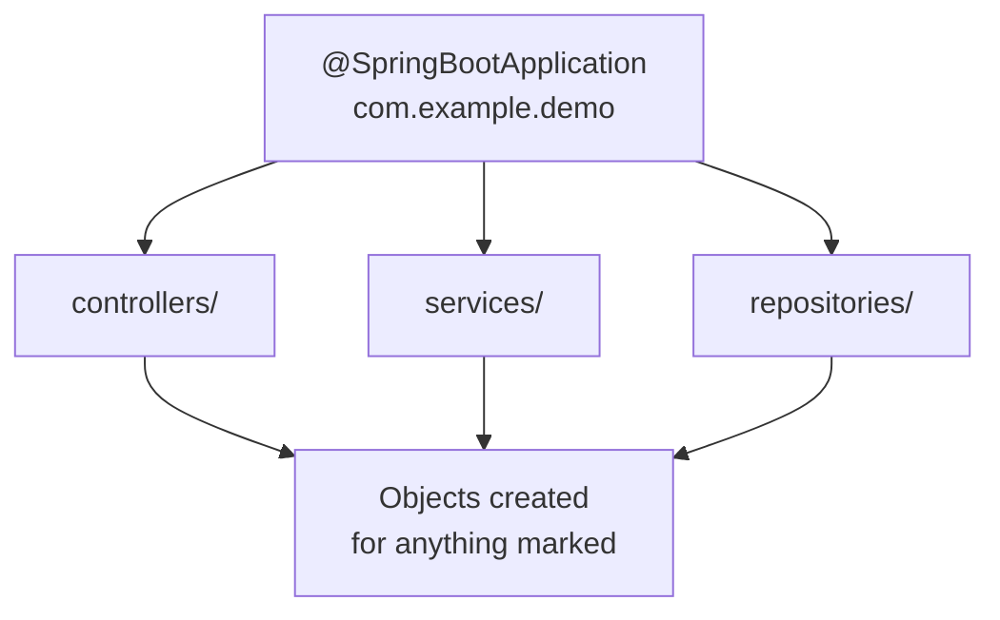
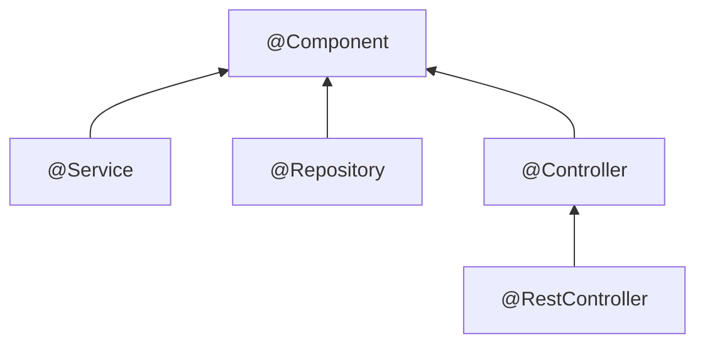
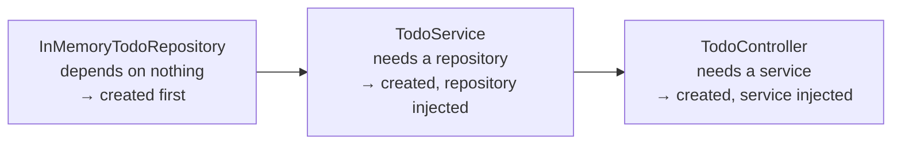

A Spring Boot project contains no `new` and yet its objects exist and are wired together. The mechanism responsible has a name, and understanding it explains most of what the annotations scattered through a project are for.

# Component scan

> [!important] **Component scan is Spring crawling your project, finding classes marked with particular annotations, and creating their objects automatically.**

> At startup it **reads the bytecode of every class in your package** and every package beneath it, looks for the marks, and instantiates what it finds.

## Where the crawl starts

From the application class:

```java
1  // src/main/java/com/example/demo/TodoAppApplication.java
2  @SpringBootApplication
3  public class TodoAppApplication {
4
5      public static void main(String[] args) {
6          SpringApplication.run(TodoAppApplication.class, args);
7      }
8  }
```

`@SpringBootApplication` sets the **starting package**. Because this file sits in `com.example.demo`, everything under `com.example.demo` gets crawled — `controllers`, `services`, `repositories`, and anything else you add.

> [!info] You do not enable this. `@SpringBootApplication` already contains `@ComponentScan`, which is what performs the crawl. It is one of several annotations bundled inside it.



# What counts as marked

The classes that get picked up carry annotations like these:

```java
1  @RestController   // on TodoController
2  @Service          // on TodoService
3  @Repository       // on InMemoryTodoRepository
```

Which raises a question: what do those three have in common that makes Spring notice them?

## They all descend from `@Component`

Open any of them and you find the answer:

| Annotation | Is itself annotated with |
|---|---|
| `@Service` | `@Component` |
| `@Repository` | `@Component` |
| `@RestController` | `@Controller`, which is annotated `@Component` |

> [!important] **`@Component` is the mark component scan actually looks for.** Everything else is a more specific annotation that carries `@Component` in its ancestry. Anything with it anywhere up the chain gets an object created.



## So are they actually different?

A fair question, and the answer is instructive.

**Swap `@Service` and `@Repository` around and the application still works.** Mark everything `@Component` directly and it still works. As far as object creation goes they are equivalent, because they reduce to the same thing.

> [!warning] **That does not make it a good idea.** The specific annotations communicate intent to anyone reading the code, and more practically, **third-party libraries key off them.** A library may look specifically for `@Repository`, or generate code based on what it finds. Mislabelling works right up until something in your dependency tree cares, and then it breaks in a way that is hard to trace.
>
> This is the general hazard of opinionated frameworks: their recommendations are usually safe to ignore, until one is not.

## Not everything annotated is Spring's

Worth separating, because a real project mixes them freely:

```java
1  @Getter              // Lombok
2  @Setter              // Lombok
3  @AllArgsConstructor  // Lombok
4  @Service             // Spring
5  @Repository          // Spring
6  @RequestMapping      // Spring
7  @GetMapping          // Spring
```

**Lombok annotations have nothing to do with component scan.** Lombok is a third-party library that generates boilerplate — getters, setters, constructors — at compile time. **Spring neither knows nor cares about them.** **Only the Spring annotations participate in the crawl.**

# Spring injects as well as creates

Creating objects solves half the problem. The other half is that some of those objects need each other.

Spring handles this too, and it can because of what the scan gives it:

> [!important] Having crawled everything, Spring **knows the entire dependency graph** — which class needs which other class. So it can work out the order to build things in, and supply each object what it needs.

For the todo project that means:



It injects through the constructor — the same constructor-based injection you would write by hand.

## Which means a constructor has to exist

Spring needs one to inject through. **You can write it yourself, or let Lombok generate it:**

```java
1  // these two are equivalent
2  @AllArgsConstructor
3  public class TodoService {
4      private ITodoRepository todoRepository;
5  }
```

```java
1  public class TodoService {
2      private ITodoRepository todoRepository;
3
4      public TodoService(ITodoRepository todoRepository) {
5          this.todoRepository = todoRepository;
6      }
7  }
```

`@AllArgsConstructor` generates a **constructor taking every field**. Spring then uses it. Nothing about the injection changes — only who typed the constructor.

# Two names for later

Both get proper treatment elsewhere, but they appear constantly and are worth recognising now.

> [!info] **Bean.** The objects Spring creates and manages are called beans. Wherever you see the word in a Spring error message or discussion, read it as object.
>
> **Application context.** The place those beans live. Spring builds it at startup and pulls from it whenever something needs a dependency.

> [!info] **`@Bean`.** Occasionally Spring cannot construct something on its own — a class from a third-party library, or one whose creation is not straightforward. In those cases you supply a method that builds it, and Spring calls that method when it needs one. Reckon on not needing this for the large majority of your own classes.

# What this bought

Dependency injection is real work, and it is the same work every time: create the dependency, create the dependent, hand one to the other, in the right order. Doing it by hand across a real project means a long and fragile assembly sequence.

> [!important] Spring's contribution is not the **idea** of dependency injection — that exists with or without a framework. It is that **you declare what depends on what, and the assembly happens for you.**

Which is the same bargain Spring Boot makes everywhere: opinionated defaults handling the repetitive part, with the option to take over when you need to.
