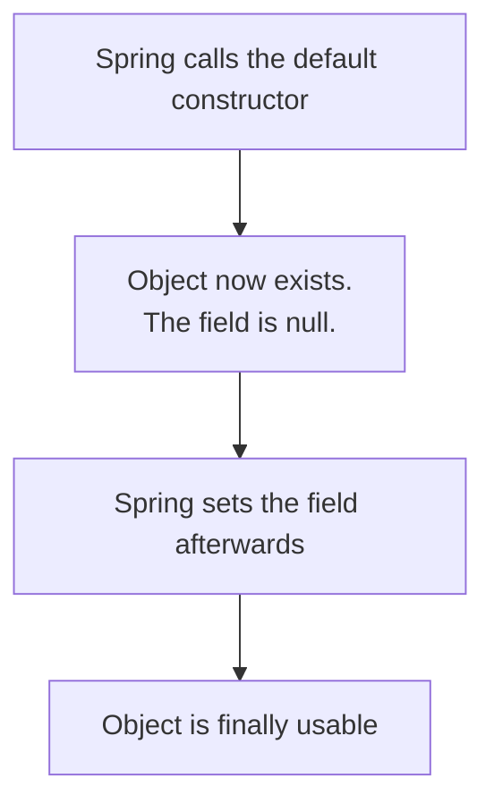

Spring can inject a dependency through a constructor. It can also inject it directly into a field, with no constructor involved at all. Both work. One of them is officially discouraged, and the reason is worth understanding rather than memorising.

# Field injection

Remove the constructor entirely and annotate the field:

```java
1  // src/main/java/com/example/demo/services/TodoService.java
2  @Service
3  public class TodoService {
4
5      @Autowired
6      private ITodoRepository todoRepository;
7
8      public List<Todo> getAllTodos() {
9          return todoRepository.findAll();
10     }
11 }
```

No constructor. No `@AllArgsConstructor`. Just `@Autowired` on the field — and the application runs, the endpoint responds, everything works.

This is **field-based injection**, and `@Autowired` is what makes it happen.

# How it works, and why that matters

The mechanism explains every drawback that follows.



> [!important] With no constructor to inject through, Spring **creates the object first and populates the field afterwards.** There is a window — brief, but real — in which the object exists with a null dependency.

Contrast constructor injection, where the dependency arrives **as part of** construction. There is no moment at which a constructed object lacks what it needs.

# The consequence

That ordering has a direct cost, and it is not stylistic.

```java
1  @Autowired
2  private final ITodoRepository todoRepository;   // will not work
```

> [!warning] **You cannot make the field `final`.** A `final` field must be assigned during construction and can never be reassigned. But field injection assigns **after** construction — so the two are incompatible.

And not being able to mark it `final` is the actual problem:

> [!important] A non-final field can be reassigned by anything, at any time. Somewhere else in the codebase, `todoRepository = null` compiles, and every call afterwards fails. The compiler cannot stop it, because you were not allowed to ask it to.
>
> With constructor injection, the field **is** `final`, and that whole category of bug is impossible.

## It also complicates testing

The same ordering makes tests harder. **An object built by a test starts with null dependencies that must be supplied separately, rather than arriving through the constructor as ordinary arguments.** Substituting a fake implementation — mocking — becomes more work than it needs to be.

Which is the argument from the layering material showing up again: code that is awkward to construct in isolation is awkward to test in isolation.

# The recommendation

> [!warning] **Recent Spring Boot versions officially discourage field injection.** Prefer constructor injection.

```java
1  // src/main/java/com/example/demo/services/TodoService.java
2  @Service
3  public class TodoService {
4
5      private final ITodoRepository todoRepository;
6
7      public TodoService(ITodoRepository todoRepository) {
8          this.todoRepository = todoRepository;
9      }
10 }
```

Or the same thing with Lombok generating the constructor:

```java
1  @Service
2  @AllArgsConstructor
3  public class TodoService {
4      private final ITodoRepository todoRepository;
5  }
```

# Side by side

|                             | **Constructor injection**              | **Field injection**         |
| --------------------------- | -------------------------------------- | --------------------------- |
| How                         | Dependency passed to the constructor   | `@Autowired` on the field   |
| When the dependency arrives | **During construction**                | **After construction**      |
| Can the field be `final`?   | **Yes**                                | No                          |
| Can it be reassigned later? | No                                     | Yes, by anything            |
| Testing                     | Dependencies are constructor arguments | Must be supplied separately |
| Current guidance            | **Preferred**                          | Discouraged                 |

> [!info] This is not unique to Spring. Constructor injection has been the default in large codebases with their own injection frameworks for a long time, for the same reasons — a dependency that arrives at construction time and cannot change afterwards is simply harder to get wrong.
