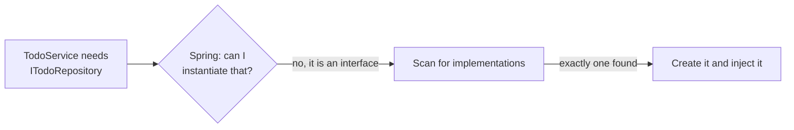

Inverting the dependency solved one problem and created another: an interface cannot be instantiated. Something has to decide which implementation gets injected — and when there is more than one candidate, Spring will not guess.

# Spring resolves an interface on its own

Start from the state where the service depends on an interface:

```java
1  // src/main/java/com/example/demo/repositories/ITodoRepository.java
2  public interface ITodoRepository {
3
4      List<Todo> findAll();
5
6      Todo save(Integer newTodoId, String todoContent);
7  }
```

```java
1  // src/main/java/com/example/demo/services/TodoService.java
2  @Service
3  public class TodoService {
4
5      private ITodoRepository todoRepository;
6
7      public TodoService(ITodoRepository _todoRepository) {
8          this.todoRepository = _todoRepository;
9      }
10 }
```

Spring cannot create an `ITodoRepository` — nothing can, it is an interface. So it does the sensible thing: it looks for classes implementing it, finds one, creates that, and injects it.



With one implementation, this is invisible. It just works.

# Add a second and it stops working

Now there are two:

```java
1  @Repository
2  public class InMemoryTodoRepository implements ITodoRepository { /* list-backed */ }
```

```java
1  @Repository
2  public class InMemoryMapTodoRepository implements ITodoRepository { /* map-backed */ }
```

Both are marked, so both become beans. Spring reaches the service, needs one `ITodoRepository`, finds two, and refuses to choose:

```text
1  ***************************
2  APPLICATION FAILED TO START
3  ***************************
4
5  Description:
6
7  Parameter 0 of constructor in com.example.demo.services.TodoService required a single bean, but 2 were found:
8  	- inMemoryMapTodoRepository: defined in file [.../InMemoryMapTodoRepository.class]
9  	- inMemoryTodoRepository: defined in file [.../InMemoryTodoRepository.class]
10
11 Action:
12
13 Consider marking one of the beans as @Primary, updating the consumer to accept multiple beans, or using @Qualifier to identify the bean that should be consumed
```

> [!info] **Verified** by removing the qualifier from a working project and starting it. That is the real message, with the file paths shortened.

Two things worth noticing. **Line 7** names the exact constructor parameter that could not be satisfied. And **lines 11 to 13** tell you the available fixes — Spring's failure messages are unusually good at this, and reading them properly is faster than searching.

# `@Primary` — pick a default

The simplest resolution. Mark one implementation as the one to prefer:

```java
1  // src/main/java/com/example/demo/repositories/InMemoryTodoRepository.java
2  @Repository
3  @Primary
4  public class InMemoryTodoRepository implements ITodoRepository { /* ... */ }
```

Now the conflict is gone — wherever an `ITodoRepository` is needed and nothing more specific is said, this one is used.

Move `@Primary` to the other class and the behaviour changes accordingly. With the list-backed implementation you get its seeded todos; with the map-backed one, which starts empty, you get `[]`. Same API, different bean.

> [!info] `@Primary` sets one default for the whole application. It cannot express wanting different implementations in different places.

# `@Qualifier` — name them and choose

More precise. Give each implementation a name:

```java
1  @Repository("inMemoryTodoRepository")
2  public class InMemoryTodoRepository implements ITodoRepository { /* ... */ }
```

```java
1  @Repository("inMemoryMapTodoRepository")
2  public class InMemoryMapTodoRepository implements ITodoRepository { /* ... */ }
```

Then name the one you want where you inject it:

```java
1  // src/main/java/com/example/demo/services/TodoService.java
2  @Service
3  public class TodoService {
4
5      private ITodoRepository todoRepository;
6
7      public TodoService(@Qualifier("inMemoryTodoRepository") ITodoRepository _todoRepository) {
8          this.todoRepository = _todoRepository;
9      }
10 }
```

The name can go on `@Component` or any of its more specific forms. Unlike `@Primary`, this is decided **per injection site**, so two different places can ask for two different implementations.

> [!warning] **`@Qualifier` and `@AllArgsConstructor` do not cooperate by default.** Lombok generates the constructor but does not copy the annotation onto the generated parameter, so the qualifier is silently lost and the conflict returns.
>
> The fix is to tell Lombok to carry it across, via `lombok.copyableAnnotations` in a `lombok.config` file. Worth knowing before you spend time on a conflict error that looks like it should already be solved.

# `@Profile` — decide which beans exist at all

The previous two both assume every implementation exists and you are choosing between them. Sometimes that is not the situation.

## The case that motivates it

You have a payment interface. In development you want a **mock** implementation that pretends to take payments. In production you want the **real** one that actually does.

This is not really a choice between two available beans — it is that in development, the real implementation should not be in play at all.

```java
1  @Repository
2  @Profile("dev")
3  public class InMemoryTodoRepository implements ITodoRepository { /* ... */ }
```

```java
1  @Repository
2  @Profile("prod")
3  public class InMemoryMapTodoRepository implements ITodoRepository { /* ... */ }
```

Then the active profile decides:

```yaml
1  # src/main/resources/application.yml
2  spring:
3    profiles:
4      active: ${PROFILE:dev}
5    application:
6      name: TodoApp
7
8  server:
9    port: ${PORT:8081}
```

Line 4 reads the profile from an environment variable, falling back to `dev` — the same externalised-configuration pattern used for the port. Set `PROFILE=prod` in `.env` and the other implementation becomes the live one, with no code change and no rebuild.

## The distinction

> [!important] **`@Qualifier` chooses between beans that all exist in the same environment. `@Profile` decides which beans exist at all, based on where the application is running.**
>
> They answer different questions, and mixing them by accident causes confusion — a leftover `@Qualifier` naming a bean that the active profile excluded produces a no-qualifying-bean failure that looks unrelated to profiles.

# Which to reach for

| | Use when |
|---|---|
| **`@Primary`** | One implementation is the obvious default everywhere |
| **`@Qualifier`** | Different injection sites need different implementations in the same environment |
| **`@Profile`** | The right implementation depends on the environment — mock versus real, dev versus prod |

In practice `@Profile` covers the most common reason for having several implementations at all. `@Primary` and `@Qualifier` come up more often around deprecating an old implementation while a replacement is phased in.

# One loose end in the published code

The repository this material is built on carries two artefacts of the working session that are worth recognising:

- **`@Profile` is imported in both repository classes and used in neither.** The profile experiment was reverted before the code was pushed, leaving dead imports behind.
- **`TodoService` carries the comment `// Todo: try to fetch the string value from env variable`** beside its `@Qualifier`. That is an open exercise: the qualifier name is hardcoded, so changing it needs a rebuild, and the question is whether it can be read from the environment instead — the way the port and profile already are.
