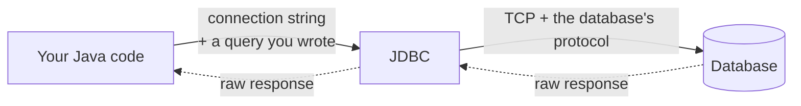

Every language provides something that turns a connection string into a usable database connection. In Java that something is JDBC, and it is worth knowing precisely because everything built on top of it is a response to what it does not do.

# What it is

**JDBC** stands for **Java Database Connectivity**. It is the foundational library Java provides for connecting to databases.

Give it a **connection string** and it will:

1. Open a network connection to the database server — in practice **a TCP connection**
2. Speak **whatever protocol that database publishes**
3. Take a query **you wrote, send it, and hand back the response**

> [!important] **That is the entire scope.** JDBC establishes the connection and ferries queries and responses. It does not write queries, interpret results, or optimise anything.

# What that leaves you

Everything else.

- **You write the queries**, in the exact dialect that database speaks.
- **You parse the responses.** What comes back is a result set to be stepped through row by row, pulling fields out by name and assembling objects yourself.
- **You do any optimisation**, because nothing is applied for you.
- **You open the connection, and you close it.**

That last one is not housekeeping.

> [!warning] **A connection you fail to close is a real problem.** Databases cap how many connections may be open at once, so an idle open connection occupies a slot nothing is using. It also holds memory on your side for an object doing nothing. Enough of them and you have exhausted the limit or leaked your way into a performance problem.

# The trade

> [!important] **JDBC gives you very high control and very high responsibility, and they are the same fact.** Almost nothing happens automatically, which is exactly why you can make almost anything happen — arbitrarily complex queries, hand-tuned, executed precisely when you choose.

Nothing about this is wrong. It is simply low-level, and low-level has a cost that shows up as your application grows.

# The four problems

**Repetitive code.** Handling one `SELECT` looks much like handling another — run it, step the result set, pull the fields, build the object. Written again for every query.

**Repeated optimisation.** The sensible things everyone does end up done separately in every place, or forgotten in some of them.

**A bloated application layer.** All of that code lives in your codebase, mixed among the logic that is actually about your business.

**Manual connection lifecycle.** Every open needs its matching close, and every missed close is the problem above.

# The same shape everywhere

This is not a Java complaint. Every ecosystem provides an equivalent low-level library and every one leaves you the same work:

| Language | The equivalent |
|---|---|
| Java | JDBC |
| Go | `database/sql` |
| Python | A connector library such as `mysql-connector` |

Open a connection, prepare a statement, execute it, step the result, parse it by hand. The syntax changes; the shape does not.

> [!info] **Why a JDBC URL looks like `jdbc:mysql://...`** rather than just `mysql://...`. The extra prefix is JDBC announcing itself — it is a Java-ecosystem layer sitting above the raw protocol, and it needs to know which driver to load before it can speak to anything. A GUI client connecting directly to MongoDB just says `mongodb://`, with no such prefix, because nothing is layered on top.

# Where this goes

Everyone connecting a Java application to a database needs the same boilerplate, written the same way, again and again. That is precisely the shape of problem that gets abstracted away — and the next few notes are the layers built to do it.

Worth holding onto, though: **every one of those layers still uses JDBC underneath.** None of them replace it. They write the queries and parse the responses so you do not have to, and then hand the result to JDBC to actually execute.
