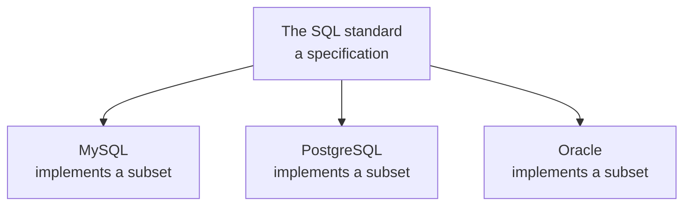

Before anything can abstract away raw queries, it is worth being exact about what SQL is — because the common answers are wrong in a way that matters practically, not pedantically.

# Two wrong answers

Ask what SQL is and you will get one of these.

**SQL is a database that stores data in tables.** Wrong. MySQL is a database. PostgreSQL is a database. SQL is not a database at all.

**SQL is a query language.** Closer, and still not right. It is not itself the language you write.

# What it actually is

> [!important] **SQL is a standard.** It is a long document of recommendations that a query language for relational databases should follow.

It is a **specification**, in the same sense as the **REST** **conventions** or the **JPA** **contract** met later. It defines what such a language ought to look like — and then each database decides how much of it to adopt.

Which is why every relational database has its **own dialect**. They overlap heavily, so the same query often works in several — but the overlap is not total, and the gaps are where trouble lives.

# The gap, concretely

Joins make the point sharply. MySQL supports:

| Join type | MySQL |
|---|---|
| `INNER JOIN` | Yes |
| `LEFT JOIN` | Yes |
| `RIGHT JOIN` | Yes |
| `CROSS JOIN` | Yes |
| **`FULL OUTER JOIN`** | **No** |

`FULL OUTER JOIN` is defined in the SQL standard. Oracle implements it. Microsoft SQL Server implements it. **MySQL does not.**

> [!warning] This catches people constantly. You search for how to write a full outer join, find a perfectly correct example, run it against MySQL, and it fails. The query was not wrong — it was written for a dialect that supports something yours does not.

# The consequence

> [!important] **Migrating from one relational database to another does not just work.** Not because relational databases are fundamentally different, but because each implemented its own portion of the standard, and your queries were written against one portion.

Simple queries survive. `SELECT * FROM users` is `SELECT * FROM users` everywhere. It is complex queries — joins, window functions, anything less common — where the dialects diverge, and those are exactly the queries you least want to rewrite and retest.

So a decision that sounds infrastructural, replacing one database with another, reaches into your application code and demands changes to logic that has not conceptually changed at all.

That is a familiar shape by now. It is what the repository layer was introduced to contain — and it is a large part of what makes the next abstraction worth having.
