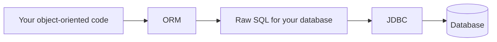
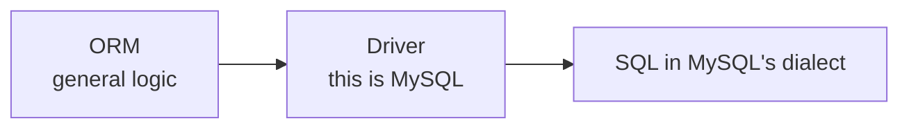

JDBC leaves you **writing raw queries and parsing raw responses**. **Dialects differ, so those queries are tied to one database.** Both problems have the same answer, and it is an old one.

# One trend, repeated

Look at how programming has changed and there is a single direction to it.

| Era | What you stopped doing yourself |
|---|---|
| Assembly | Nothing — you did all of it |
| C and C++ | Much of the machine detail, but memory was still yours to manage |
| Java, Python, JavaScript | Garbage collection, pointer arithmetic |
| Today | Increasingly, writing the code at all |

> [!important] **The trend is always the same: take something complex and common, and abstract it into something simpler.** Every step trades some control for a large gain in how quickly you can build. Improving developer productivity is the one continuous thread.

Raw queries are a low-level activity that has not yet been abstracted. And there is a second reason they feel out of place.

## They do not match how you write everything else

In an object-oriented language you spend the day working with objects:

```java
1  users.findAll();
```

Then you drop into a completely different idiom to talk to the database:

```sql
1  SELECT * FROM users;
```

Not harder, but a different way of thinking, switched into and out of constantly.

# ORMs

> [!important] **An ORM — Object Relational Mapper — takes object-oriented code as input and produces raw queries as output.** You write in the idiom you were already in; it generates the SQL.



The name says what it does: it **maps** between the **object** world and the **relational** world.

> [!info] **ODM** — Object Document Mapper — is the same idea for document databases. Everything below applies to both; ORM is the term used here because relational is the common case.

There is one for every ecosystem:

| Ecosystem | ORMs |
|---|---|
| Java | Hibernate, MyBatis, jOOQ |
| Ruby | Active Record |
| Node | Sequelize, TypeORM, Prisma, Mongoose |
| Go | GORM |

# The driver

An ORM has to produce SQL for **your** database — and dialects differ. So how does it know which to generate?

It does not, on its own. You tell it, by including a **driver**.

> [!info] **The old hardware analogy is exact.** A PC was assembled from parts by different manufacturers — a monitor from one, a keyboard from another, a sound card from a third. The operating system could not possibly know how to talk to each. So each manufacturer shipped a **driver**: a small piece of software teaching the system to speak to that specific device.
>
> A database driver does the same job. The ORM holds the general logic; the driver supplies the database-specific part.



> Swap the driver and the **same ORM code produces queries for a different database.** That is what makes an ORM's promise deliverable rather than aspirational.

# Building one would need JDBC

A useful exercise: suppose you set out to write an ORM for Java yourself. What would you need?

1. **Logic to convert object-oriented code into query strings.** Your algorithms.
2. **A driver**, so you know which dialect to produce.
3. **A way to actually run those queries** — open a connection, send the SQL, get the response back.

That third item is JDBC.

> [!important] **ORMs do not replace JDBC. They sit on top of it.** The ORM generates the query and interprets the result; JDBC still carries it to the database. Your code never touches JDBC, but it is running underneath the whole time.

The same is true elsewhere — a Go ORM builds on Go's `database/sql` for exactly the same reason. Every ecosystem provides the low-level connectivity, and the ORMs of that ecosystem use it.

# The escape hatch

**ORMs are good at ordinary queries and less good at extraordinary ones.** Joining ten tables with grouping and several conditions can be genuinely awkward to express as method calls — and real systems contain SQL queries running to hundreds of lines.

> [!important] So **most ORMs let you write raw queries too.** When the object-oriented form stops being an improvement, you drop to SQL for that one query and keep the abstraction everywhere else.

Which is the right shape for an abstraction: helpful by default, and not a cage.

# What is still missing

An ORM solves the raw-query problem. It creates a new one.

Every ORM makes its own choices — its own way of expressing queries, its own configuration, its own conventions. **Moving between two of them means learning the second one properly, and code written against one does not transfer.**

That is the problem the next layer exists to solve.
