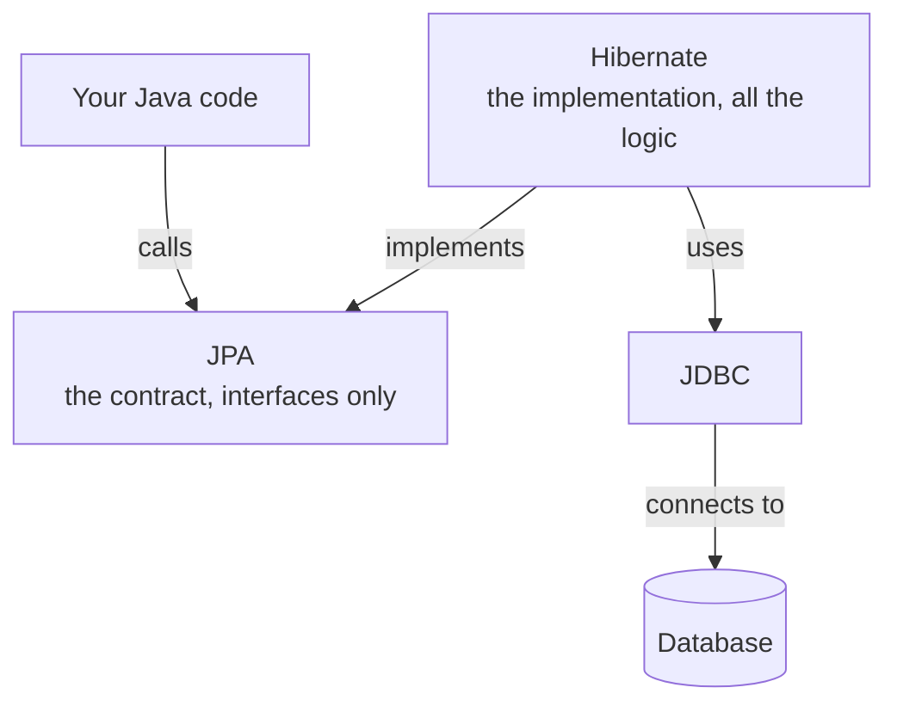
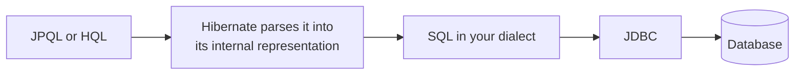
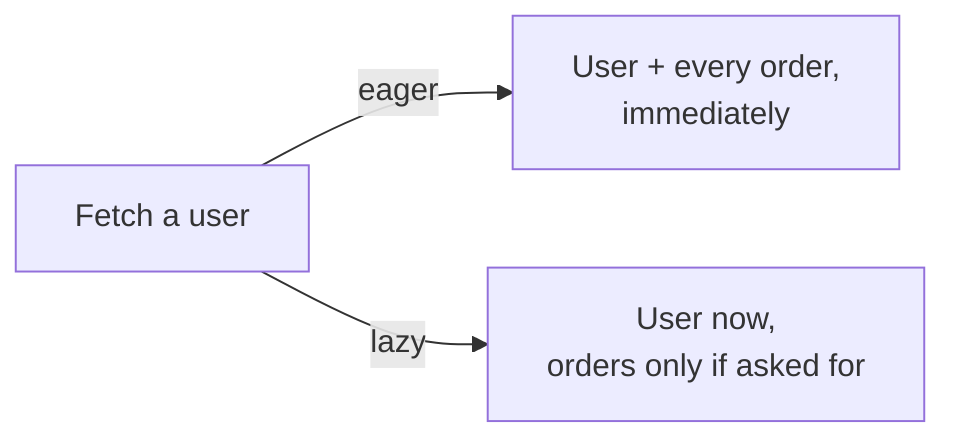

Java has several ORMs, and each one having its own way of doing things is a problem in itself. The response was to define a contract they could all implement — which is worth understanding because JPA is routinely mistaken for something that does work.

# The problem with several ORMs

Left alone, every ORM invents its own everything: its own way of expressing a query, its own configuration, its own annotations, its own conventions.

The consequences are all the same shape. Code written against one ORM does not move to another. Choosing a different one means learning it from scratch. And nothing in your codebase can be written against ORMs in general, only against the specific one you picked.

Which is a dependency problem you have already met — depending on a concrete implementation rather than an abstraction.

# JPA is a contract

> [!important] **JPA — Java Persistence API — is a specification. It contains no logic and does no work.** It is a set of interfaces, annotations and conventions describing what an ORM should offer. That is all it is.

Saying an application uses JPA is imprecise. An application uses an ORM that **implements** JPA.

## What is actually in the specification

Three kinds of thing:

- **Interfaces** — `EntityManager`, `EntityTransaction`, and others
- **Annotations** — `@Entity`, `@Id`, `@GeneratedValue`, `@Column`
- **JPQL** — a query language

> [!important] **JPQL is a component of the standard, not the standard itself.** The standard is JPA; JPQL is the query language defined inside it. Getting this the wrong way round is common and makes the rest hard to place.

**JPQL** — the **Java Persistence Query Language** — reads much like SQL, but operates on your Java entities rather than directly on tables.

## Who has to implement it

Only an ORM choosing to be a **JPA provider**. It is not an obligation on ORMs in general — it is the price of that label, and taking it on means implementing all three of the above, JPQL included.

| Tool | JPA provider? |
|---|---|
| **Hibernate** | Yes — must support JPQL |
| **EclipseLink** | Yes |
| **jOOQ** | No — a Java data-access tool, deliberately not JPA |
| **MyBatis** | No — Java, and not a JPA implementation |
| ORMs in other languages | Not applicable — **JPA is a Java specification** |

The last row is worth pausing on. An ORM in another ecosystem has no relationship to JPA whatsoever, because JPA does not exist outside Java.

# Hibernate implements it

**Hibernate** is the most widely used Java ORM, and it implements the JPA specification.

The arrow from Hibernate points **up** into JPA, and that direction is the point: an implementation depends on the contract, never the other way round. Your code calls the contract; Hibernate satisfies it.

Read that stack carefully, because each layer's role is distinct:

| Layer | What it is |
|---|---|
| **JPA** | The contract. No logic |
| **Hibernate** | The ORM. All the logic |
| **JDBC** | The connection and transport |

> [!important] Because JPA is an interface and Hibernate is an implementation, your code can depend on the **contract** rather than on Hibernate specifically. That is dependency inversion, and it is why swapping ORMs is even conceivable.

# What Hibernate adds

Implementing the contract is the baseline. Beyond it, an ORM competes on features — which is the answer to why you would choose one over another when they all satisfy the same specification.

**Caching.** Avoiding a database round trip when the answer is already known.

**Its own query language**, HQL, alongside JPQL and raw SQL — and the relationship between those two is worth being exact about.

> [!important] **HQL is a superset of JPQL.** Valid JPQL is already valid HQL, so there is no translation step between them. Hibernate has one query engine that accepts both.

Which makes the path from a query to the database shorter than it might appear:

The dialect at step three is where the driver earns its place — it is what tells Hibernate whether to generate MySQL's flavour of SQL or another. You can see the decision in the startup log, which reports the dialect it selected.

> [!info] Historically this is the right way round too. **Hibernate predates JPA**, and HQL predates JPQL. JPA was standardised later and drew heavily on Hibernate, which is why JPQL looks like a subset of a language that already existed.

**Loading strategy**, which deserves proper attention.

## Eager and lazy loading

A pattern that appears far beyond databases.

> [!info] Open a web page with images and you often see grey placeholders that fill in a moment later. The images are heavy, most are below the fold, and you will not reach them immediately — so they load **lazily**, after the content that matters. The alternative, fetching everything before showing anything, is **eager**.

The same choice exists whenever data has related data hanging off it.

**Eager** costs more up front and means everything is there. **Lazy** returns faster and pays later, if you ever actually need the rest.

Neither is correct in general — it depends on whether you were going to use the related data. Hibernate lets you specify which, per relationship.

> [!info] If you have met lazy propagation in a segment tree or Fenwick tree, it is the same instinct: do not compute what has not been asked for yet.

# Choosing an ORM

Given they implement the same contract, the differences that decide it:

**Features.** Caching quality, type safety, performance, tooling. Some ORMs became popular on a single strong feature — type safety out of the box, **or supporting relational and document databases through one interface.**

**Adoption.** Underrated, and often decisive.

> [!important] **A large community is a feature.** When you get stuck, someone has been stuck there before. Languages and libraries with small ecosystems can be excellent and still cost you more, because every problem is one you solve alone.

Hibernate wins on both for Java, which is why it is the default assumption in most projects.

# And there is still too much code

Even with an ORM, a query is not free. Selecting employees earning over 50,000 in engineering means constructing a query object, adding predicates for each condition, combining them, and executing — several lines for something you could describe in one sentence.

Better than raw SQL, and still boilerplate. Which is the gap the last layer closes.
