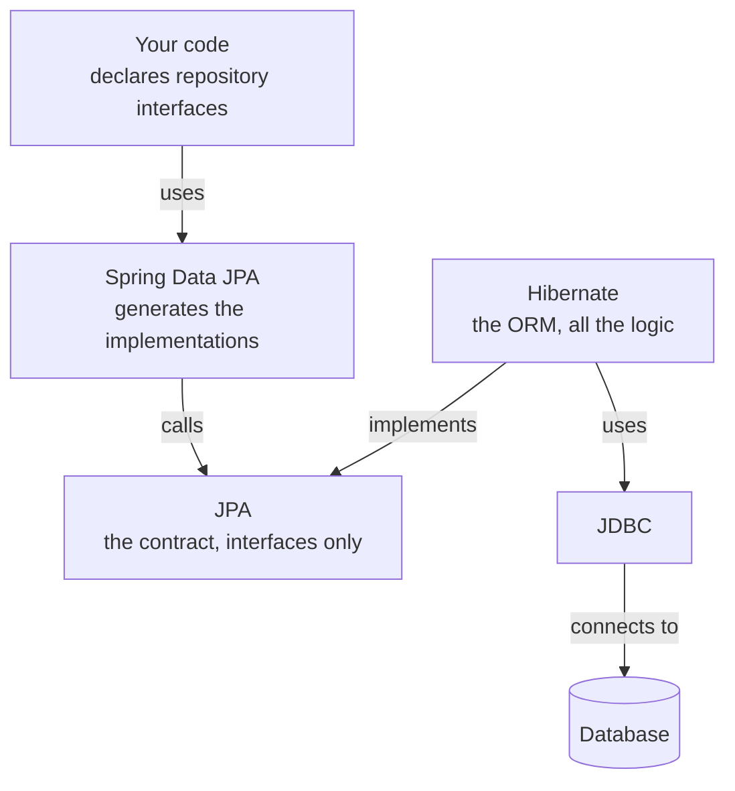

An ORM removes raw SQL and still leaves you assembling queries by hand. Spring Data JPA removes that too — by combining an ORM with the repository pattern and generating the code you would have written.

# What it is

> [!important] **Spring Data JPA takes an ORM and the repository pattern, and generates the implementation for you.** You declare an interface describing what you want. It writes the class that does it.



Read the arrow directions carefully, because the relationships are not all the same kind.

**Hibernate implements JPA** — the arrow points **up** into the contract, because an implementation depends on the specification, never the reverse. **Spring Data JPA calls JPA**, it does not implement it; it is a consumer of that API just as your own code would be if you used `EntityManager` directly. And what Spring Data JPA implements is not JPA at all — it is **your** repository interfaces.

> [!warning] A common misreading is that Spring Data JPA implements JPA, or that Hibernate somehow derives from Spring Data JPA. Neither is true. Hibernate is the JPA implementation and sits **below** Spring Data JPA, and it long predates it.

At runtime the call travels down: your code calls a generated repository method, Spring Data JPA calls the JPA API, the configured provider — Hibernate — does the work, and JDBC carries the query. Every layer is still present; Spring Data JPA is one more level on top, not a replacement for any of them.

# You write interfaces

```java
1  // src/main/java/com/example/demo/repositories/StudentRepository.java
2  @Repository
3  public interface StudentRepository extends JpaRepository<Student, Long> {
4
5      List<Student> findByMajorAndAgeGreaterThan(String major, Integer age);
6  }
```

An interface. A method signature. **No body, and no implementation anywhere in your project.**

`JpaRepository<Student, Long>` names the entity and the type of its primary key. Extending it supplies the ordinary operations — save, find by id, find all, delete — without you declaring any of them.

> [!important] Spring Data JPA generates a concrete class implementing this interface at startup and registers it as a bean. So you inject `StudentRepository` and use it, even though nothing in your codebase implements it.

The generated implementation does everything: builds the query, obtains a connection, executes it, parses the result, and returns it in the type your signature promised.

# Queries derived from method names

Line 5 above has no query attached, and it works — because the **method name is the query**.

| Method name                                         | Generated query                                     |
| --------------------------------------------------- | --------------------------------------------------- |
| `findAll()`                                         | `SELECT * FROM student`                             |
| `findByCategory(String c)`                          | `SELECT * FROM student WHERE category = ?`          |
| `findByMajorAndAgeGreaterThan(String m, Integer a)` | `SELECT * FROM student WHERE major = ? AND age > ?` |

Spring Data JPA parses the name — `findBy`, then field names, then conditions like `GreaterThan`, joined by `And` or `Or` — and builds the query from it.

> [!info] Which makes the method name close to readable English, and is why these repositories are usually short: most of what you need is expressible as a signature.

# When that is not enough

Method names stop scaling before complex queries do. Ten tables and several conditions will not fit in a name, and should not be attempted.

So both lower layers stay available:

```java
1  @Query("SELECT s FROM Student s WHERE s.email LIKE %:domain%")
2  List<Student> findByEmailDomain(@Param("domain") String domain);
```

That is **JPQL** — note it selects from `Student`, the entity, not from a table. You can also drop to a genuine raw SQL query when you need to.

> [!important] The layering is what makes this comfortable. Derive from the method name when you can, write JPQL when you cannot, drop to raw SQL when you must — without leaving the framework or restructuring anything.

# It is not only for relational databases

Spring Data is a family. Each member does for its store what Spring Data JPA does for relational databases:

| Project | For |
|---|---|
| Spring Data JPA | Relational databases, via an ORM implementing JPA |
| Spring Data MongoDB | MongoDB |
| Spring Data Redis | Redis |
| Spring Data Elasticsearch | Elasticsearch |
| Spring Data Couchbase | Couchbase |
| Spring Data Neo4j | Neo4j, a graph database |

> [!info] **They are separate projects, not one library with switches.** Spring Data JPA does not talk to MongoDB — Spring Data MongoDB does. But the shape is deliberately identical: you extend a repository interface, declare methods, and get implementations. Having learned one, the others cost very little.

# What you get from the repository pattern

Because Spring Data JPA is built on repositories, the properties come along automatically.

Your service depends on a **repository** **interface**, so it does not know what is behind it, and dependency inversion holds without any effort on your part. The whole layering argument from earlier is satisfied by using the framework as intended.

> [!info] **Pagination** is provided too — returning results in pages rather than all at once, the way a search results page or a product listing works. There are two broad approaches and they behave quite differently at scale; worth its own treatment later.

# The stack, in one view

| Layer               | Responsibility                                           |
| ------------------- | -------------------------------------------------------- |
| **Spring Data JPA** | Generates **repository implementations from interfaces** |
| **JPA**             | The contract those implementations are written against   |
| **Hibernate**       | The ORM doing the actual mapping                         |
| **JDBC**            | Connection and transport                                 |
| **Driver**          | Which SQL dialect to speak                               |

Five layers between your method call and the database, each solving one problem the one below it left behind. Worth being able to name them — when something breaks, the error usually tells you which layer it came from, and that is only useful if you know what the layers are.
