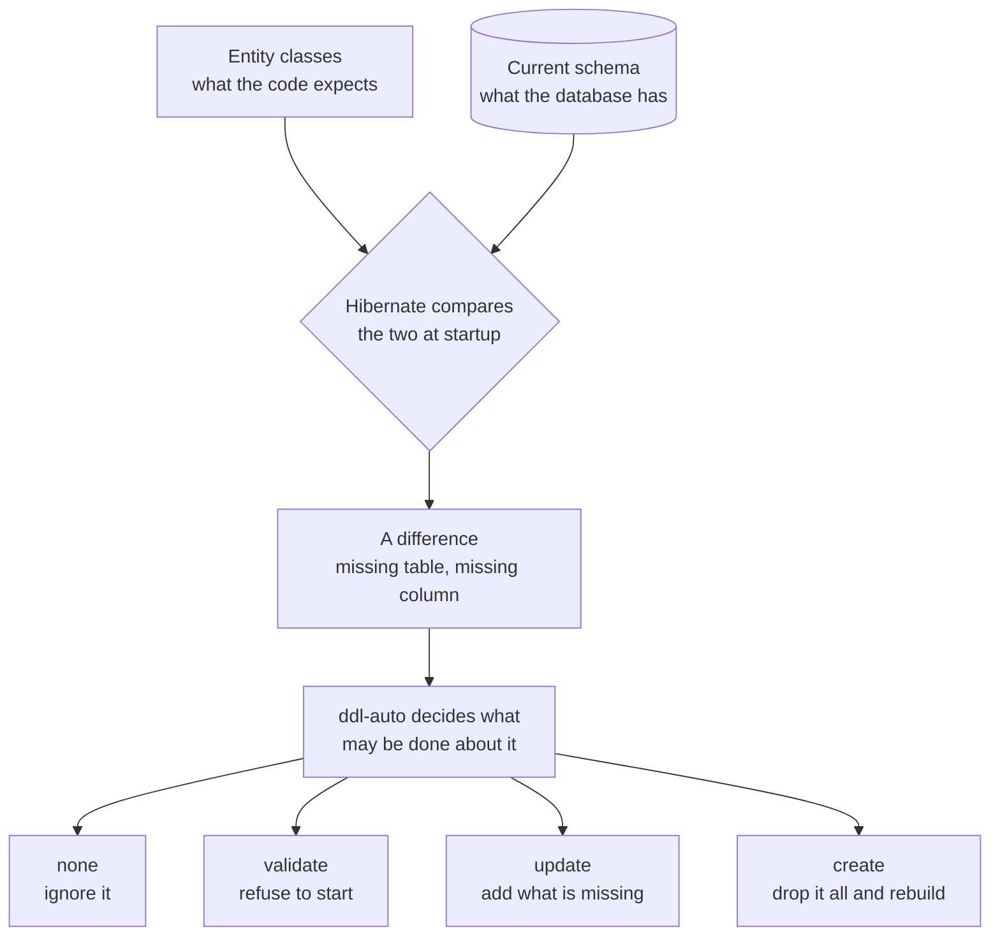
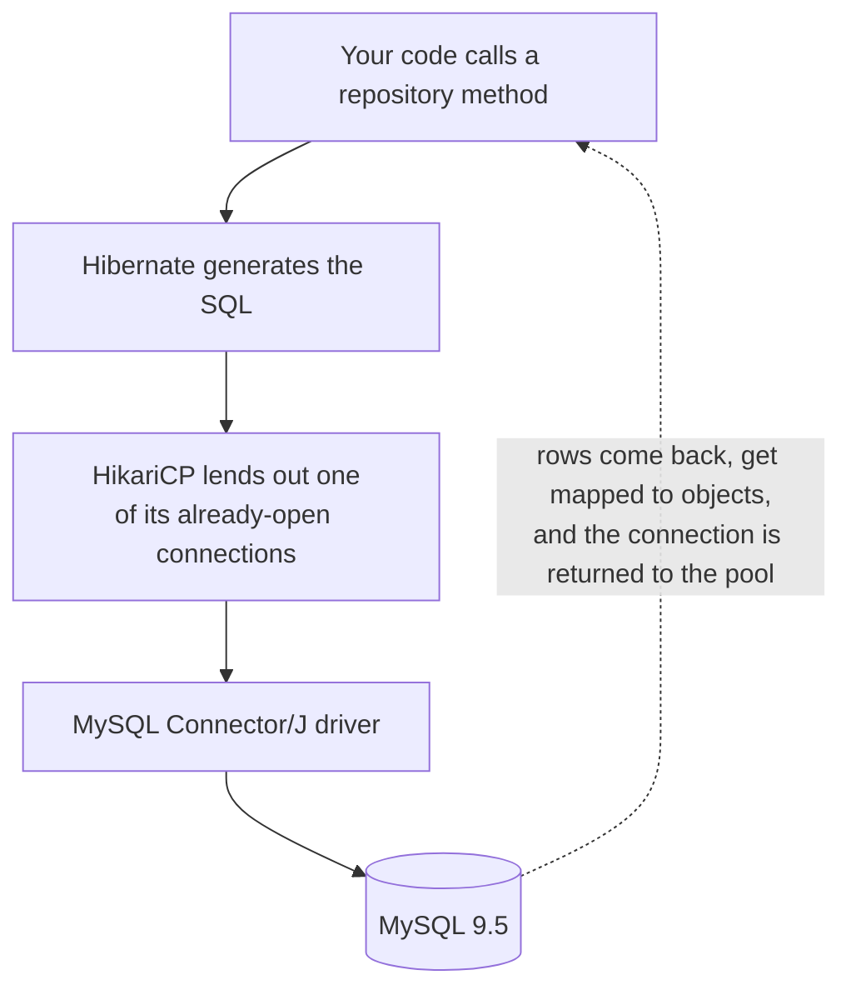

Spring Data JPA sits on Hibernate, which sits on JDBC — and JDBC still needs a connection string, credentials and a driver. Those have to come from somewhere. This note is that configuration, and what each setting actually does when you run it.

# The dependencies

Two, from the project generator:

```groovy
1  // build.gradle
2  dependencies {
3  	implementation 'org.springframework.boot:spring-boot-starter-data-jpa'
4  	runtimeOnly 'com.mysql:mysql-connector-j'
5  }
```

Line 3 brings Spring Data JPA, and Hibernate with it. Line 4 is the **driver** — the piece that tells the ORM which dialect to generate.

> [!info] The generator offers a Spring Data project per store — MongoDB, Redis, Elasticsearch, Couchbase, Neo4j — and a driver per database. You pick one of each.

## Two things about those two lines

**Neither carries a version number, and that is not an omission.**

> [!important] The Spring dependency-management plugin holds a set of library versions **known to work together** for your Spring Boot version. Declaring a Spring dependency without a version is what opts into that set.

Pinning one yourself opts that single module out of it, and the result is not a clean failure:

```groovy
1  implementation 'org.springframework.boot:spring-boot-starter-data-jpa'
2  implementation 'org.springframework:spring-jdbc:6.0.8'   // do not do this
```

```text
1  java.lang.IllegalStateException: Error processing condition on
2      ...PersistenceExceptionTranslationAutoConfiguration.persistenceExceptionTranslationPostProcessor
3  Caused by: java.lang.NoClassDefFoundError: org/springframework/jdbc/core/simple/JdbcClient
4  Caused by: java.lang.ClassNotFoundException: org.springframework.jdbc.core.simple.JdbcClient
```

> [!warning] **The error names a class you never wrote, in a module you did not think you were configuring.** Line 2 above forced `spring-jdbc` to an old version while the rest of the framework stayed current, and `JdbcClient` — added in Spring Framework 6.1 — does not exist in the older jar. Auto-configuration references it, the classloader cannot find it, and startup dies before a single bean of yours is built.
>
> The tell is in the stack trace: every other frame reports a much newer version. **A missing class in a Spring package almost always means version skew, not a missing dependency.** The fix is to delete the version, not to add another library.

**And `runtimeOnly` on line 4 is deliberate.** Your code never imports the driver — it is named as a string in configuration and loaded by reflection. `runtimeOnly` puts it on the runtime classpath and keeps it off the compile classpath, so nothing can accidentally import a MySQL class and quietly tie your code to one database.

> [!warning] Omit the driver entirely and the application starts, builds the web context, and fails much later while constructing the connection pool:
>
> ```text
> 1  org.springframework.beans.factory.BeanCreationException: Error creating bean with name
> 2      'entityManagerFactory' defined in class path resource [HibernateJpaConfiguration.class]:
> 3      Failed to initialize dependency 'dataSourceScriptDatabaseInitializer' of
> 4      LoadTimeWeaverAware bean 'entityManagerFactory':
> 5  Error creating bean with name 'dataSourceScriptDatabaseInitializer' ...
> 6      Unsatisfied dependency expressed through method 'dataSourceScriptDatabaseInitializer'
> 7      parameter 0:
> 8  Error creating bean with name 'dataSource' defined in class path resource
> 9      [DataSourceConfiguration$Hikari.class]:
> 10     Failed to instantiate [com.zaxxer.hikari.HikariDataSource]:
> 11     Factory method 'dataSource' threw exception with message:
> 12     Cannot load driver class: com.mysql.cj.jdbc.Driver
> ```
>
> **The exception type is `BeanCreationException`, and the useful line is the last one.** Everything above it is Spring reporting the chain of beans that could not be built because the one underneath them failed — `entityManagerFactory` needed `dataSourceScriptDatabaseInitializer`, which needed `dataSource`, which could not be constructed. Line 12 is the actual cause.
>
> `driver-class-name` in the configuration names a class; that class has to be on the classpath for something to load. **How far into startup a failure appears is a useful signal** — this one gets as far as the pool, meaning everything above it wired up correctly.

> [!important] **Read a `BeanCreationException` from the bottom up.** Spring reports the failure at every level as it unwinds, so the first bean named is the outermost victim and the last `Caused by` is what actually went wrong. Reading top-down sends you to investigate `entityManagerFactory`, which is working perfectly.

Three failures, three exception types, three places in startup:

| Missing or wrong | Exception | Fails during |
|---|---|---|
| A pinned Spring version causing skew | `IllegalStateException`, wrapping `NoClassDefFoundError` then `ClassNotFoundException` | Condition evaluation, before any of your beans exist |
| The driver dependency | `BeanCreationException`, ending in `Cannot load driver class` | Connection pool construction |
| The database itself | `SQLSyntaxErrorException: Unknown database` | The pool's first connection attempt |

> [!info] The third row is the next one you meet, and it is worth knowing that **Spring will not create the database for you.** The URL names one that has to already exist; `ddl-auto` creates tables inside a database, never the database itself.

# The configuration

```yaml
1  # src/main/resources/application.yml
2  spring:
3    application:
4      name: FakeCommerce
5    datasource:
6      url: jdbc:mysql://localhost:3306/fakecommerce
7      username: root
8      password:
9      driver-class-name: com.mysql.cj.jdbc.Driver
10   jpa:
11     show-sql: true
12     hibernate:
13       ddl-auto: update
```

Two groups, and the split matters.

**`datasource`** **is the connection itself** — the JDBC URL on line 6 carrying protocol, host, port and database name, then the credentials, then the driver class.

**`jpa`** is how Hibernate should behave once connected.

> [!info] Line 8 is empty because this local server has no password set. On anything shared it would be present — and would come from an environment variable rather than sitting in the file.

## `show-sql`

```yaml
1  show-sql: true
```

Logs every SQL statement Hibernate generates. Since the whole point of an ORM is that you no longer write SQL, this is how you see what your object-oriented code actually produced — worth having on in development.

# `ddl-auto`, and what it really does

The setting with the most consequence, so first the vocabulary.

| Category | Stands for | Examples |
|---|---|---|
| **DQL** | Data Query Language | `SELECT` |
| **DML** | Data Manipulation Language | `INSERT`, `UPDATE`, `DELETE` |
| **DDL** | Data Definition Language | `CREATE TABLE`, `ALTER TABLE`, `DROP TABLE` |

DML changes **data**. DDL changes **structure**.

> [!important] Hibernate can read your entity classes, compare them against the database, and work out the DDL needed to reconcile the two. **`ddl-auto` decides how much of that it is allowed to actually do.**



## The options

| Value         | Behaviour                                                                       |
| ------------- | ------------------------------------------------------------------------------- |
| `none`        | Do nothing. Structure is entirely your responsibility                           |
| `validate`    | Check that the tables match your classes. Change nothing. Fail if they disagree |
| `update`      | Add what is missing — new tables, new columns                                   |
| `create`      | **Drop everything and recreate it** on startup                                  |
| `create-drop` | Like `create`, and also drop on shutdown                                        |

## What each actually did

The following is from running it against a real MySQL 9.5.0 server, with this entity:

```java
1  // src/main/java/com/example/demo/schema/Product.java
2  @Entity
3  public class Product {
4
5      @Id
6      @GeneratedValue(strategy = GenerationType.IDENTITY)
7      private Long id;
8
9      private String name;
10     private String category;
11     private Double price;
12 }
```

### `update` created the table

With an empty database and `ddl-auto: update`, the log showed:

```text
1  Hibernate: create table product (id bigint not null auto_increment, category                                        varchar(255),
2             name varchar(255), price float(53), primary key (id)) engine=InnoDB
```

And the database agreed:

```text
1  Field      Type          Null   Key   Extra
2  id         bigint        NO     PRI   auto_increment
3  category   varchar(255)  YES
4  name       varchar(255)  YES
5  price      double        YES
```

> [!info] **Verified.** Note the type mapping done for you — `Long` became `bigint`, `String` became `varchar(255)`, `Double` became `double`, and `@GeneratedValue` became `auto_increment`.

### `validate` refused to start, and changed nothing

Dropping the `category` column by hand and restarting with `ddl-auto: validate`:

```text
1  SchemaManagementException: Schema validation: missing column [category] in table [product]
```

The application did not start. **And the table was left exactly as it was** — the column was still missing afterwards.

> [!important] That is the property that makes `validate` the right production setting: it tells you your classes and your database have diverged, and it refuses to paper over it by changing your schema underneath you.

### `create` destroyed data

A row was inserted, then the application restarted with `ddl-auto: create`:

```text
1  Hibernate: drop table if exists product
2  Hibernate: create table product (price float(53), id bigint not null auto_increment, ...)
```

Row count afterwards: **0**.

> [!danger] **`create` and `create-drop` drop your tables.** Not metaphorically — the log line is `drop table if exists`, and everything in those tables is gone. They are fine on a scratch database you can lose. Pointed at anything you care about, they will destroy it on the next restart.

## Which to use

| Environment | Setting | Why |
|---|---|---|
| Local development | `update`, or `create` on a throwaway database | Change a class, restart, the schema follows |
| Production | `validate`, or `none` | Never let the framework alter a live schema |

> [!important] The mature arrangement is **`validate` plus schema migrations** — migrations make the structural changes deliberately and in a versioned, reviewable way, and `validate` confirms the code and the database agree before serving a request.

That arrangement is set up in [[08-Flyway]] and shown catching real drift in [[09-Validate-Catches-Drift]].

# When the connection is wrong

Point the URL at a database that does not exist and it fails clearly:

```text
1  Unknown database 'fakecommerce_does_not_exist'
2  Caused by: java.sql.SQLSyntaxErrorException: Unknown database 'fakecommerce_does_not_exist'
```

> [!info] **Verified.** Serious configuration problems stop the application at startup rather than surfacing later on the first query — which is the behaviour you want.

# What startup tells you

A successful start prints more than it appears to:

```text
1  HikariPool-1 - Starting...
2  HikariPool-1 - Added connection com.mysql.cj.jdbc.ConnectionImpl@7354e0c5
3  HikariPool-1 - Start completed.
4  Database JDBC URL [jdbc:mysql://localhost:3306/fakecommerce]
5  Database driver: MySQL Connector/J
6  Database dialect: MySQLDialect
7  Database version: 9.5
```

Two things worth reading there.

**Lines 5 and 6** are the driver argument made visible — the driver was detected, and from it Hibernate selected `MySQLDialect`, which is how it knows what SQL to generate.

**Lines 1 to 3** are **HikariCP**, **a connection pool**, configured automatically.

> [!info] **A connection pool holds a set of open connections and lends them out**, rather than opening and closing one per query. Since opening a connection is expensive and databases limit how many may exist, this addresses the manual lifecycle problem JDBC leaves you with — handled for you, with defaults, unless you configure pool size and timeouts yourself.



Which closes the loop the whole folder opened. **JDBC gave you a connection and made its management your problem.** Five layers up, the connection is pooled, the query is generated, the result is mapped, and the dialect is chosen — and the configuration for all of it is the dozen lines at the top of this note.
