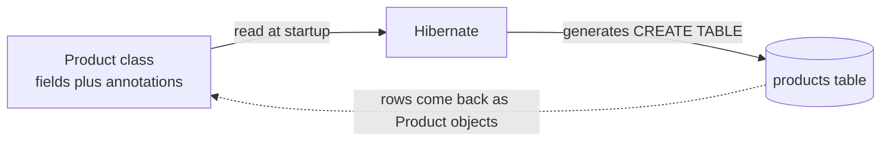
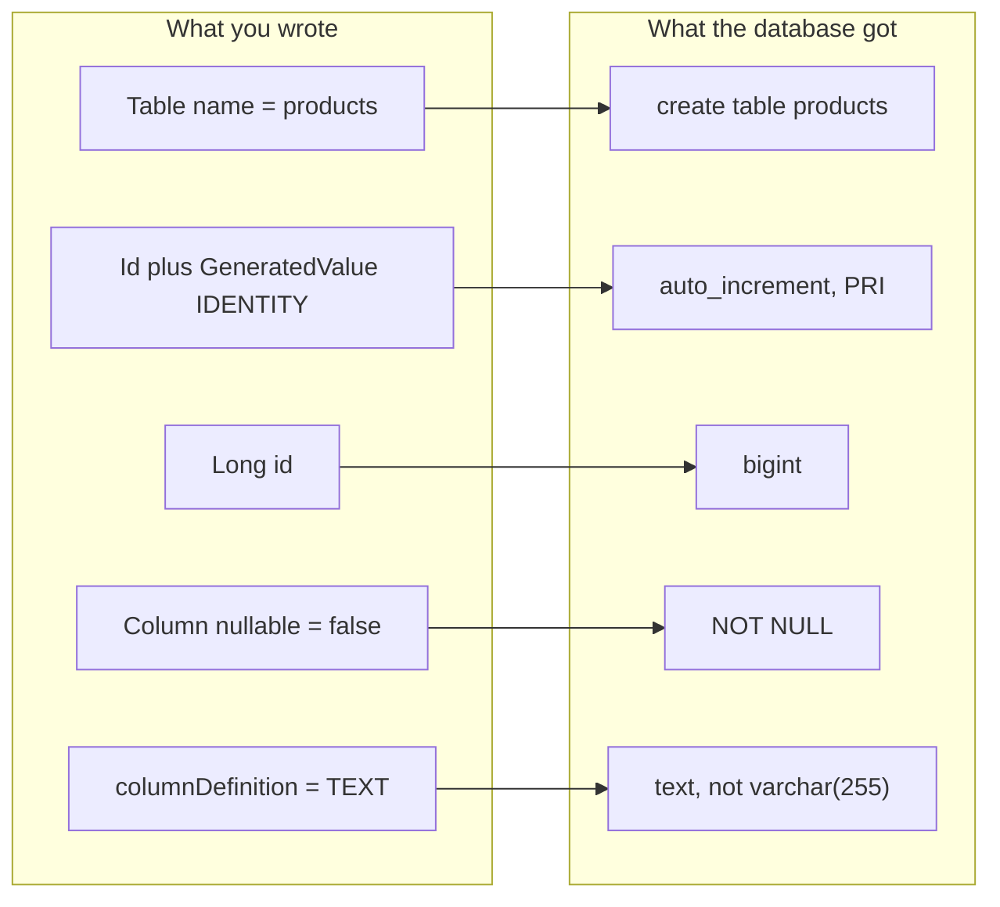

The connection is configured and the application starts. Now something has to exist for it to read and write — a table. You can create one by hand in the database, or you can describe it as a Java class and let the framework build it. This note is the second route, which is worth doing carefully because every annotation earns its place.

# Start from the API you want

Before any of it, decide what you are building. To add a product:

```text
1  POST /api/v1/products
2
3  {
4    "title":       "Apple iPhone 17",
5    "description": "Brand new Apple iPhone 17",
6    "image":       "",
7    "price":       80000,
8    "category":    "electronics",
9    "rating":      "4.8"
10 }
```

A resource-oriented URL, a `POST` because it creates, and a body carrying the fields. `image` is a string because the file lives elsewhere and this is a reference to it.

To store that, a `products` table has to exist.

# The schema layer, and why

You could open a database client and write `CREATE TABLE` by hand. It would work.

But the reason the schema layer exists points at a better route. **Your language cannot hold a database row** — a product coming back from MySQL has to become a Java object, and creating an object requires a class. So you need that class regardless.

> [!important] Given the class must exist anyway, and it already describes exactly the same shape as the table, **let the framework generate the table from the class.** One definition instead of two that must be kept in step.



The class is the single definition. The table is derived from it, and the rows it returns are turned back into instances of the same class.

# Building it up

```java
1  // src/main/java/com/example/FakeCommerce/schema/Product.java
2  public class Product {
3
4      private Long id;
5      private String title;
6      private String description;
7      private BigDecimal price;
8      private String image;
9      private String category;
10     private String rating;
11 }
```

Plain fields. Now the annotations, each solving one problem.

## Lombok first

```java
1  @Data
2  @AllArgsConstructor
3  @NoArgsConstructor
4  @Builder
```

Getters, setters, both constructors, and a builder.

> [!info] `@Builder` generates a builder class, giving you the builder pattern without writing it. `@NoArgsConstructor` matters more than it looks — frameworks that construct objects reflectively need a no-argument constructor to work with.

## `@Entity` — this class is a table

```java
1  @Entity
2  @Table(name = "products")
```

> [!important] **`@Entity` is what marks a class for replication as a table.** It comes from `jakarta.persistence` — it is **not** a Lombok annotation, and mixing up which library an annotation comes from is a common source of confusion in a file that uses both.

`@Table(name = "products")` names the table. Without it you get the class name.

## The first failure

Run it now and the application will not start:

```text
1  Every class must declare at least one ID
```

A table needs a primary key, and nothing has said which field that is.

```java
1  @Id
2  private Long id;
```

## `@GeneratedValue` — who assigns the id

`@Id` says which column is the key. It does not say who fills it in. You could set ids yourself; you almost certainly do not want to.

```java
1  @Id
2  @GeneratedValue(strategy = GenerationType.IDENTITY)
3  private Long id;
```

| Strategy   | What it uses                                 | Typical for                      |
| ---------- | -------------------------------------------- | -------------------------------- |
| `IDENTITY` | The database's auto-increment column         | **MySQL**                        |
| `SEQUENCE` | A database sequence object                   | Oracle, PostgreSQL               |
| `AUTO`     | Lets the provider pick, based on the dialect | When you would rather not decide |

> [!info] Several interchangeable approaches behind one selection point is the strategy pattern, and it is a fair label for what this annotation is.

# `Long`, not `long`

Worth stopping on, because it bites twice.

> [!warning] **Use the wrapper type, not the primitive.** Two independent reasons:
>
> **A primitive cannot be null.** `long` defaults to `0`, so an unassigned id is indistinguishable from an id of zero, and a query for a null id is not expressible at all.
>
> **Generics do not accept primitives.** The repository is declared `JpaRepository<Product, Long>`, and `JpaRepository<Product, long>` will not compile.

The same trap reappears later with `int` versus `Integer` on an optional request parameter — the value is absent, the framework tries to pass null, and a primitive cannot receive it.

# `@Column` — controlling the column

```java
1  @Column(nullable = false)
2  private String title;
3
4  @Column(columnDefinition = "TEXT")
5  private String description;
6
7  @Column(nullable = false)
8  private BigDecimal price;
```

| Property                    | Effect                                                                         |
| --------------------------- | ------------------------------------------------------------------------------ |
| `nullable = false`          | `NOT NULL`                                                                     |
| `columnDefinition = "TEXT"` | **Overrides the inferred type** — here for descriptions too long for `varchar` |
| `name = "..."`              | A column name different from the field name                                    |

> [!info] There are many properties and no reason to memorise them. When you have a specific need, look it up. What matters is knowing that this is where column-level control lives.

# The finished class

```java
1  // src/main/java/com/example/FakeCommerce/schema/Product.java
2  package com.example.FakeCommerce.schema;
3
4  import java.math.BigDecimal;
5
6  import jakarta.persistence.Column;
7  import jakarta.persistence.Entity;
8  import jakarta.persistence.GeneratedValue;
9  import jakarta.persistence.GenerationType;
10 import jakarta.persistence.Id;
11 import jakarta.persistence.Table;
12 import lombok.AllArgsConstructor;
13 import lombok.Builder;
14 import lombok.Data;
15 import lombok.NoArgsConstructor;
16
17 @Data
18 @AllArgsConstructor
19 @NoArgsConstructor
20 @Builder
21 @Entity
22 @Table(name = "products")
23 public class Product {
24
25     @Id  // auto-increment , specially for MySQL
26     @GeneratedValue(strategy = GenerationType.IDENTITY) 
27     private Long id; // primary key
28
29     @Column(nullable = false)
30     private String title;
31
32     @Column(columnDefinition = "TEXT")
33     private String description;
34
35     @Column(nullable = false)
36     private BigDecimal price;
37
38     private String image;
39
40     private String category;
41
42     private String rating;
43 }
```

# What it produces

With `show-sql` on, startup logs the generated DDL:

```text
1  Hibernate: drop table if exists products
2  Hibernate: create table products (price decimal(38,2) not null, id bigint not null auto_increment,
3             category varchar(255), description TEXT, image varchar(255), rating varchar(255),
4             title varchar(255) not null, primary key (id)) engine=InnoDB
```

And the database agrees:

```text
1  Field        Type            Null   Key   Extra
2  price        decimal(38,2)   NO
3  id           bigint          NO     PRI   auto_increment
4  category     varchar(255)    YES
5  description  text            YES
6  image        varchar(255)    YES
7  rating       varchar(255)    YES
8  title        varchar(255)    NO
```

> [!info] **Verified** against MySQL 9.5.0. Trace each annotation to its effect — `Long` became `bigint`, `@GeneratedValue` became `auto_increment`, `@Id` became `PRI`, both `nullable = false` columns are `NO`, `BigDecimal` became `decimal`, and `columnDefinition = "TEXT"` overrode what would otherwise have been `varchar(255)`.



Line 1 is `ddl-auto: create` doing what it says — dropping before recreating. Fine here, catastrophic anywhere with data in it.

No SQL was written. The class was the only definition, and the table was derived from it.
