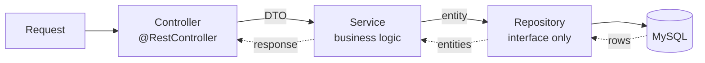

A table exists and a class describes it. Now the three layers have to be wired together so a request can reach the database and come back. This is the layering material running against something real.

# The repository

```java
1  // src/main/java/com/example/FakeCommerce/repositories/ProductRepository.java
2  @Repository
3  public interface ProductRepository extends JpaRepository<Product, Long> {
4  }
```

An interface. Nothing else. `JpaRepository<Product, Long>` names the entity and the type of its primary key — which is where the earlier point about `Long` rather than `long` becomes load-bearing, since generics will not take a primitive.

That empty interface already provides:

| Method | Does |
|---|---|
| `findAll()` | Every row |
| `findById(id)` | One row, wrapped in `Optional` |
| `save(entity)` | Insert or update |
| `saveAll(entities)` | Many at once |
| `deleteById(id)` | Remove one |
| `delete`, `deleteAll` | Remove |
| `count()`, `existsById(id)` | Aggregate checks |

> [!important] **`findAll()` is the equivalent of `SELECT * FROM products`** — and you did not write it, or implement the interface, or reference an implementation anywhere. Spring Data JPA generates the class at startup and registers it as a bean, which is why `@Repository` is enough for injection to find something.

# The service

```java
1  // src/main/java/com/example/FakeCommerce/services/ProductService.java
2  @Service
3  @RequiredArgsConstructor
4  public class ProductService {
5
6      private final ProductRepository productRepository;
7
8      public List<Product> getAllProducts() {
9          return productRepository.findAll();
10     }
11
12     public Product getProductById(Long id) {
13         return productRepository.findById(id)
14             .orElseThrow(() -> new RuntimeException("Product not found"));
15     }
16 }
```

Line 6 declares a dependency on a type **no class in the project implements**. It resolves because Spring Data JPA supplied one.

Line 13 is worth noting: `findById` returns an `Optional`, because the row may not exist. `orElseThrow` turns absence into an exception rather than a null.

## `@RequiredArgsConstructor`, and why this one

There is no constructor in that class, yet constructor injection is happening. Lombok generated one — and which Lombok annotation you pick matters more than it appears.

Three exist, differing only in which fields they include:

| Annotation | Includes |
|---|---|
| `@NoArgsConstructor` | Nothing — zero parameters |
| `@AllArgsConstructor` | Every field |
| `@RequiredArgsConstructor` | Only **required** fields |

> [!important] **Required** means specifically: `final` fields with no initialiser, plus anything marked `@NonNull`. A field already assigned where it is declared is not required, because it has its value.

The service has one field — `final`, **uninitialised** — so exactly one parameter. Inspecting the compiled class confirms it:

```text
1  public class com.example.FakeCommerce.services.ProductService {
2    private final com.example.FakeCommerce.repositories.ProductRepository productRepository;
3    ...
4    public com.example.FakeCommerce.services.ProductService(
5        com.example.FakeCommerce.repositories.ProductRepository);
6  }
```
### It is what lets the field be `final`

This connects straight back to constructor versus field injection. With `@Autowired` on a field, the object is constructed first and the field assigned afterwards — so it **cannot** be `final`, because a `final` field must be set during construction.

Constructor injection has no such gap, so the field can be `final` — and `final` means **nothing can reassign it later**. The entire class of bug where some distant code nulls out your repository stops being expressible.

`@RequiredArgsConstructor` is what makes that cheap. You get the `final` field and its guarantee without writing the constructor.

### Why not `@AllArgsConstructor`

Here they would behave identically, because there is only one field. The difference shows up the moment there is a second.

```java
1  private final ProductRepository productRepository;
2  private int requestCount = 0;
```

`@AllArgsConstructor` puts **both** in the constructor — so Spring looks for a bean to inject for `requestCount`, finds none, and startup fails. `@RequiredArgsConstructor` includes only the `final` one, keeping the constructor exactly the list of things Spring is supposed to supply.

> [!important] **The rule of thumb:** `@RequiredArgsConstructor` on Spring components — services, controllers, anything with injected dependencies. `@AllArgsConstructor` on data holders — entities and DTOs, where every field genuinely should be settable at construction.
>
> Which is precisely the split in this project: `Product` and `CreateProductRequestDto` use `@AllArgsConstructor`, while `ProductService` and `ProductController` use `@RequiredArgsConstructor`. Worth noticing rather than treating as arbitrary.

# The controller

```java
1  // src/main/java/com/example/FakeCommerce/controllers/ProductController.java
2  @RestController
3  @RequestMapping("/api/v1/products")
4  @RequiredArgsConstructor
5  public class ProductController {
6
7      private final ProductService productService;
8
9      @GetMapping
10     public List<Product> getAllProducts() {
11         return productService.getAllProducts();
12     }
13 }
```

Takes the request, calls the service, returns the result. Nothing else, which is the whole job.

# Creating a product

The `POST` needs the body turned into an object, which needs a class — a DTO.

```java
1  // src/main/java/com/example/FakeCommerce/dtos/CreateProductRequestDto.java
2  @Data
3  @AllArgsConstructor
4  @NoArgsConstructor
5  @Builder
6  public class CreateProductRequestDto {
7
8      private String title;
9      private String description;
10     private String image;
11     private BigDecimal price;
12     private String category;
13     private String rating;
14 }
```

Notice what is absent: **no `id`.** The client does not supply it; the database generates it. That is the request shape differing from the stored shape, which is the reason DTOs exist as a separate layer.

```java
1  @PostMapping
2  public Product createProduct(@RequestBody CreateProductRequestDto requestDto) {
3      return productService.createProduct(requestDto);
4  }
```

`@RequestBody` binds the JSON body to the parameter — Jackson deserialises it into a `CreateProductRequestDto`, and the method receives an object.

Then the service converts DTO to entity and saves:

```java
1  public Product createProduct(CreateProductRequestDto requestDto) {
2
3      Product newProduct = Product.builder()
4          .title(requestDto.getTitle())
5          .description(requestDto.getDescription())
6          .image(requestDto.getImage())
7          .price(requestDto.getPrice())
8          .category(requestDto.getCategory())
9          .rating(requestDto.getRating())
10         .build();
11
12     return productRepository.save(newProduct); // this will save the product to the database
13 }
```

Lines 3 to 10 are Lombok's `@Builder` from the entity. Line 12 is the only line that touches the database — everything above it builds an ordinary Java object that happens to be an entity.

> [!important] **Building the object and persisting it are separate steps.** Until `save` is called, `newProduct` is just an object. The `id` is null at that point; it comes back populated because the database assigned it.

# Deleting

```java
1  @DeleteMapping("/{id}")
2  public void deleteProduct(@PathVariable Long id) {
3      productService.deleteProduct(id);
4  }
```

`{id}` in the path is a **path variable** — the varying part of the route — and `@PathVariable` binds it to the parameter, converting the text to `Long` on the way.

The service does one thing:

```java
1  public void deleteProduct(Long id) {
2      productRepository.deleteById(id);
3  }
```

# Running it

```text
1  POST /api/v1/products   {"title":"Apple iPhone 17","price":80000,"category":"electronics",...}

2  → {"id":1,"title":"Apple iPhone 17","price":80000.00,"category":"electronics","rating":"4.8"}

3

4  POST /api/v1/products   {"title":"Super premium plates","price":12000,"category":"kitchenware",...}

5  → {"id":2,...}
6
7  GET /api/v1/products

8  → [{"id":1,...},{"id":2,...}]
9
10 DELETE /api/v1/products/1   → HTTP 200
11
12 GET /api/v1/products

13 → [{"id":2,...}]
```

> [!info] **Verified** end to end against MySQL. Note line 2 — the response carries `id: 1`, which the request never sent. The database generated it and it came back through `save`.

And the SQL those calls produced:

```text
1  Hibernate: insert into products (category,description,image,price,rating,title) values (?,?,?,?,?,?)
2  Hibernate: select p1_0.id,p1_0.category,p1_0.description,p1_0.image,p1_0.price,p1_0.rating,p1_0.title from products p1_0
3  Hibernate: select p1_0.id,... from products p1_0 where p1_0.id=?
4  Hibernate: delete from products where id=?
```

Four statements nobody wrote. Line 1 came from `save`, line 2 from `findAll`, line 3 from `findById`, line 4 from `deleteById`.

# One restart-shaped trap

With `ddl-auto: create`, restarting the application produced this:

```text
1  Hibernate: drop table if exists products
```

Both products, gone. `GET` returns `[]`.

Switching to `update` and restarting:

```text
1  drop statements: 0
2  GET /api/v1/products → [{"id":2,"title":"Super premium plates",...}]
```

> [!important] **Verified.** `update` applies schema changes without dropping, so data survives a restart. `create` rebuilds from scratch every time.
>
> While iterating on an entity this is easy to misread as your code being broken — the data disappearing on every restart is `ddl-auto`, not a bug in your API.

# What the flow actually is



Exactly the layering described earlier, with one addition worth noticing: **the repository layer is now an interface with no implementation you wrote.** The pattern is unchanged; the implementation is generated.
