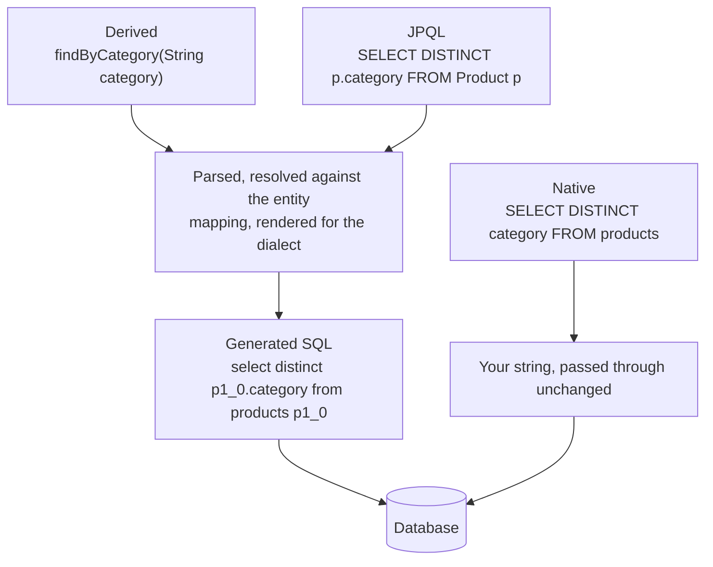
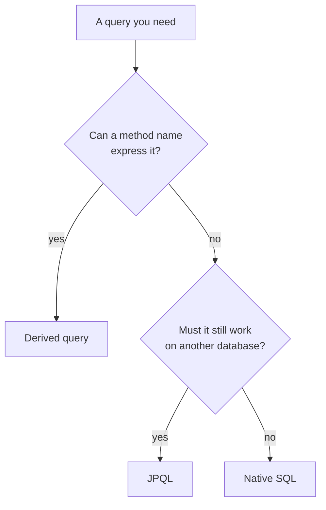

`JpaRepository` provides the obvious operations. Anything else you have to ask for — and there are two ways to do that, with a clear boundary between when each stops being the right choice.

# Derived queries

Fetching products of one category is not among the free methods. Adding it takes a signature:

```java
1  // src/main/java/com/example/FakeCommerce/repositories/ProductRepository.java
2  @Repository
3  public interface ProductRepository extends JpaRepository<Product, Long> {
4
5      List<Product> findByCategory(String category);
6  }
```

That is the entire change. No body, no `@Query`, no SQL.

> [!important] **The method name is the query.** Spring Data JPA parses `findByCategory` — `findBy`, then a field name — and generates `SELECT * FROM products WHERE category = ?`, taking the parameter as the value.

Wire it through the layers and it works:

```java
1  // service
2  public List<Product> getProductsByCategory(String category) {
3      return productRepository.findByCategory(category);
4  }
```

```text
1  GET /api/v1/products/search?categoryName=electronics
2  → [{"id":1,"title":"Apple iPhone 17","category":"electronics",...}]
3
4  GET /api/v1/products/search?categoryName=petcare
5  → []
```

The generated SQL:

```text
1  Hibernate: select p1_0.id,p1_0.category,p1_0.description,p1_0.image,p1_0.price,p1_0.rating,p1_0.title
2             from products p1_0 where p1_0.category=?
```

Notice `p1_0` — Hibernate assigned a table alias and listed every column explicitly rather than using `SELECT *`. That is generated SQL, not something transcribed from your method name.

## Why this is worth having

Writing `SELECT * FROM products WHERE category = ?` is not difficult. The point is not difficulty.

> [!important] It is that you would write it **again and again**, in slightly different forms, across every query in the application — along with the code to run it and map the result. Removing repetition of something easy is exactly what developer productivity means in practice.

# Native queries

Method names stop working before your requirements do. Getting the distinct categories is not expressible as `findBy` anything.

```java
1  @Query(nativeQuery = true, value = "SELECT DISTINCT category FROM products")
2  List<String> findAllCategories();
```

>`nativeQuery = true` **means the string is real SQL**, passed through as written. **The return type tells Spring Data JPA what to map the result into** — here a list of strings rather than entities.

```text
1  GET /api/v1/products/categories
2  → ["electronics","kitchenware"]
```

And the SQL:

```text
1  Hibernate: SELECT DISTINCT category FROM products
```

> [!important] **Compare that against the derived query above.** The derived one produced aliased, fully-expanded SQL generated by Hibernate. The native one appears **verbatim** — every character exactly as written, because nothing was generating anything.

# The trade-off

Because a native query is real SQL, it is **written in your database's dialect** — which is the portability the ORM was providing, given up for that one query.

| | **Derived** | **Native** |
|---|---|---|
| You write | A method name | SQL |
| Generated for | Whatever dialect is configured | Nothing — passed through |
| Portable across databases | Yes | No |
| Handles complex queries | Poorly | Fully |

> [!important] Which is the right shape for an escape hatch: it exists, it costs something specific and knowable, and using it for one method does not affect any other.

# The middle option: JPQL

There is a third way, and it sits between the two columns above.

The same distinct-categories query, written as JPQL:

```java
1  @Query("SELECT DISTINCT p.category FROM Product p")
2  List<String> findAllCategoriesJpql();
```

Two differences from the native version, and both matter.

**No `nativeQuery = true`.** Its absence is what makes this JPQL rather than SQL.

**`FROM Product p`, not `FROM products`.** `Product` is the **entity class**, capital P, and `p.category` is the **field** on it. At no point does the query name a table or a column. If `@Table(name = "products")` were changed tomorrow, this query would keep working.

## What each produces

Both endpoints return the same thing:

```text
1  GET /api/v1/products/categories        → ["electronics","kitchenware"]
2  GET /api/v1/products/categories-jpql   → ["electronics","kitchenware"]
```

But the SQL they generate is not the same:

```text
1  Hibernate: SELECT DISTINCT category FROM products              ← native
2  Hibernate: select distinct p1_0.category from products p1_0    ← JPQL
```

> [!info] **Verified** by running both against MySQL in the same application.
>
> **Line 1 is your string, unchanged** — same capitalisation, same words, passed straight through.
>
> **Line 2 was generated.** Lowercased, with the `p1_0` alias Hibernate assigns and the column qualified against it. The JPQL was parsed, resolved against the entity mapping, and rendered as SQL for the configured dialect — which is exactly the step a native query skips.



Two routes into the same database, and the only difference is whether anything stood in the middle. That single difference is the whole trade. Line 2 would come out differently against a different database, because it is produced rather than provided. Line 1 would come out identically, and would break wherever that SQL is not valid.

## All three, side by side

| | **Derived** | **JPQL** | **Native** |
|---|---|---|---|
| You write | A method name | A query over entities | SQL |
| Refers to | Fields | **Entities and fields** | **Tables and columns** |
| Generated for the dialect | Yes | **Yes** | No — passed through |
| Portable across databases | Yes | **Yes** | No |
| Handles complex queries | Poorly | Moderately | Fully |

> [!important] JPQL buys you expressiveness that a method name cannot reach — joins, aggregates, projections — **without** giving up the database independence that a native query costs you. It is the right first move when `findBy...` runs out, and native SQL is what you reach for only when JPQL runs out too.

Renaming the table makes the point concrete. Change `@Table(name = "products")` and the derived queries and the JPQL both keep working, because neither ever mentioned the table. The native query breaks, because it names `products` in a string nothing checks.

# Choosing



Reach for a **derived query** when the method name can express it — most simple filters and lookups.

Reach for **JPQL** when the name cannot, but portability still matters.

Reach for a **native query** when you need something specific to your database, or when a query is complex enough that expressing it any other way obscures it. A join across many tables with grouping and window functions is clearer as SQL, and pretending otherwise helps nobody.

> [!info] The escape hatch is per method, not per project. One native query in a repository leaves every other method exactly as portable as it was.
