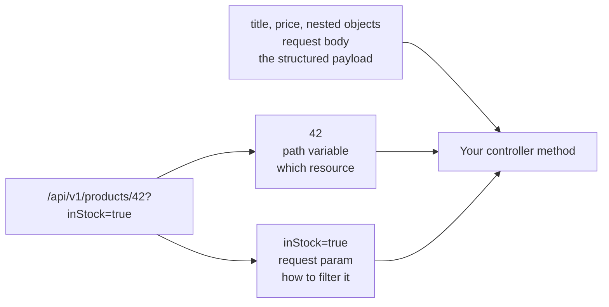

A client has to get information to your endpoint, and HTTP offers three places to put it. They are not interchangeable, and choosing the wrong one produces an API that works but reads badly and stops scaling.

# The three channels

```text
1  POST /api/v1/products                      body: {"title": "...", "price": 80000}
2  DELETE /api/v1/products/1                  the 1 is in the path
3  GET /api/v1/products/search?categoryName=electronics    after the question mark
```

| Channel | Where it lives | Annotation |
|---|---|---|
| **Request body** | The body of the request | `@RequestBody` |
| **Path variable** | Embedded in the path | `@PathVariable` |
| **Request param** | Key-value pairs after `?` | `@RequestParam` |



The URL carries the two flat channels. Anything with shape has to travel separately, in the body.

# Path variables

```java
1  @DeleteMapping("/{id}")
2  public void deleteProduct(@PathVariable Long id) {
3      productService.deleteProduct(id);
4  }
```

The braces mark `{id}` as a varying part of the route, so `/api/v1/products/1` and `/api/v1/products/47` both match. `@PathVariable` binds it, converting the text to `Long`.

> [!important] **A path variable identifies a resource.** In practice that means a primary key — which specific product, which specific order. It is part of the address of a thing.

Which is also its limit: **it is positional and singular.** Expressing two or three **optional filters** this way gets awkward immediately.

# Request params

```java
1  @GetMapping("/search")
2  public List<Product> getProductsByCategory(@RequestParam("categoryName") String category) {
3      return productService.getProductsByCategory(category);
4  }
```

```text
1  GET /api/v1/products/search?categoryName=electronics
```

The `("categoryName")` sets the key in the URL, which can differ from the parameter name in your code.

> [!important] **Request params carry filtration criteria.** Because they are key-value pairs, you can have several, and they combine freely:
>
> ```text
> /api/v1/products/search?categoryName=electronics&price=2000&inStock=true
> ```

That flexibility is the reason to prefer them for filtering. A path variable cannot express three optional, independent conditions; a query string does it naturally.

## Optional params, and a trap

```java
1  @RequestParam(name = "page", required = false) Integer page
```

`required = false` makes it optional, which is usually right for filters — a caller supplying some and not others should not be an error.

> [!warning] **It must be a wrapper type.** With `int page`, omitting the parameter fails: the framework has nothing to pass, tries null, and a primitive cannot hold it. `Integer` can.
>
> This is the same `Long` versus `long` problem from the entity, in a different place. **Anything that might be absent needs a type that can be null.**

# Request body

For anything structured:

```java
1  @PostMapping
2  public Product createProduct(@RequestBody CreateProductRequestDto requestDto) {
3      return productService.createProduct(requestDto);
4  }
```

> [!important] **A body is the only channel that can carry nested structure.** A URL is flat text — you cannot put an object containing another object containing a list into a query string in any reasonable way. Once the data has shape, it goes in the body.

# Choosing

| Use               | When                         | Because                                |
| ----------------- | ---------------------------- | -------------------------------------- |
| **Path variable** | Identifying **one resource** | It is part of the address              |
| **Request param** | Filtering, searching, paging | Several optional keys, combined freely |
| **Request body**  | Creating or updating         | Structure and nesting                  |

> [!info] A common mistake is filtering through the path — `/products/category/electronics`. It works, and you will see it. But it treats a filter as though it were an address, and adding a second filter has nowhere to go. `/products/search?categoryName=electronics` extends to a second and third criterion without redesign.

# Why this matters beyond tidiness

Each channel has a hard ceiling, and hitting it means changing the API rather than adding to it:

- A **path variable** runs out at more than one or two values.
- A **request param** runs out at nesting.
- A **request body** is not available on `GET` in any conventional design, which is precisely why filtering uses query strings.

> [!important] Choosing correctly at the start is cheap. Changing later is not, because the URL shape is part of your published contract — and consumers have already written code against it.
