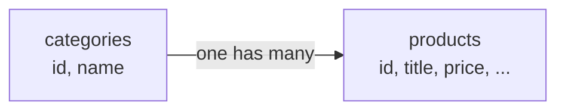

The product table has a `category` column holding a string — "electronics", "kitchenware". It works, the API returns the right things, and it is the wrong design. Seeing why is worth more than the fix, because the reasoning applies well beyond this one column.

# Two requirements that break it

**Run a sale on a category.** Thirty percent off all electronics. With category as a string on each product, the only way to find those products is to scan every product and compare its string. There is nothing to attach a sale to, because the category is not a thing — it is a repeated label.

**Discontinue a category.** Every product in it should go too. Same problem: no category exists to discontinue. You would walk the products, check each string, and act on the matches.

> [!important] Both failures have one cause. **A category has properties of its own** — whether it is on sale, whether it is active — and a string cannot carry properties. The moment a concept needs attributes, it needs to be an entity with a table.

There is a second, quieter problem. The string is repeated on every product, so a rename means updating every row, and a typo creates a category that silently exists.

# The design question underneath

This is worth stating generally, because it recurs on every project.

> [!important] **Database design is not a one-off step at the start.** Requirements evolve, and the structure that was right for the first version stops being right. A design has to be revisited as the product changes, and the cost of not revisiting it is exactly the situation above — a workaround for something the schema cannot express.

When you do design one, two questions dominate.

## What kind of database is it

The design changes with the technology. A relational database, a key-value store like Redis, a document store — each rewards a different shape. The same data modelled for one will be wrong for another.

## How will the data be queried

> [!important] **The query pattern decides the design.** Proposing a schema without knowing how it will be read is a serious mistake, however elegant the schema looks. How you intend to retrieve the data is the constraint that determines whether a design works.

Which is exactly what went wrong above: the schema was fine for storing a product, and impossible for the query **give me everything in this category**.

Other questions matter and come later — which fields are read together, which are read often, how deletion should behave, what needs backing up. The two above come first.

# The relationship

Category becomes its own table. The relationship between the two is **one-to-many**:

> **One category has many products. One product belongs to one category.**

Electronics holds a laptop, a phone, headphones. Kitchenware holds a pan, a cooker, plates. Each product sits in exactly one.



> [!info] **Real e-commerce is often messier.** A product may legitimately belong to several categories at once — you will find the same item under two headings on most large shopping apps. That is a many-to-many relationship and it is modelled differently. One-to-many is the right starting point, and the right choice depends on the product you are building.

# What the category table needs

Very little to begin with:

| Column | Purpose |
|---|---|
| `id` | Primary key |
| `name` | The category name |

That is enough to establish the relationship. Sale flags, active status and the rest arrive when the requirements that need them do — which is the same evolving-design point as above, applied forward instead of backward.

```java
1  // src/main/java/com/example/FakeCommerce/schema/Category.java
2  @Data
3  @AllArgsConstructor
4  @NoArgsConstructor
5  @Builder
6  @Entity
7  @Table(name = "categories")
8  public class Category {
9
10     private String name;
11 }
```

The same annotations as any entity — Lombok for the boilerplate, `@Entity` to make it a table, `@Table` to name it.

Which leaves one thing conspicuously missing from that class: **the id.** Every entity needs one, and by now `Product` has one too — written out identically. That duplication is the next thing to deal with.
