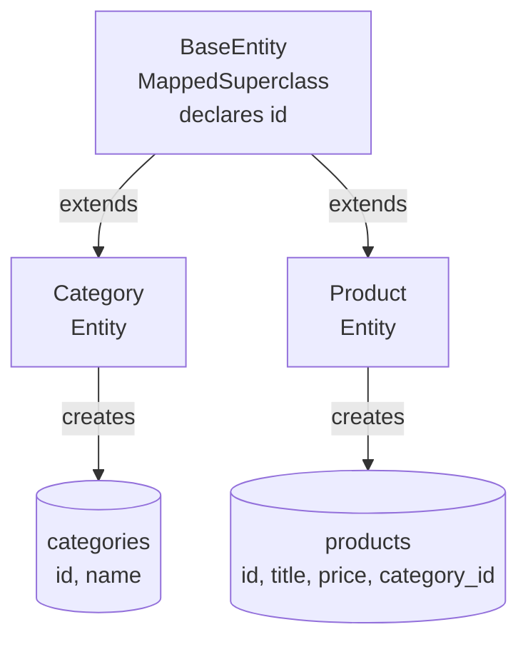

Two entities now, and both need an id declared exactly the same way. Three entities and it will be three copies. The obvious fix is a parent class — and the obvious fix does not work, for reasons worth understanding.

# The duplication

Both classes carry this:

```java
1  @Id
2  @GeneratedValue(strategy = GenerationType.IDENTITY)
3  private Long id;
```

Identical, and it will be identical in every entity you ever add. In ordinary Java the answer is inheritance: put it in a parent, extend it.

```java
1  public class BaseEntity {
2
3      @Id
4      @GeneratedValue(strategy = GenerationType.IDENTITY)
5      private Long id;
6  }
```

```java
1  @Entity
2  @Table(name = "categories")
3  public class Category extends BaseEntity {
4
5      private String name;
6  }
```

Run it and it fails.

# Failure one

```text
1  entity Category has no identifier
```

Category extends a class that plainly declares `@Id`, and Hibernate cannot see it.

> [!important] **The annotations only mean something on a class Hibernate is looking at.** `BaseEntity` is an ordinary Java class as far as the framework is concerned — not part of the mapping at all — so the `@Id` inside it is just an annotation on a field nobody is reading.

# Failure two

The natural next thought: mark the parent as an entity too, so the framework does look at it.

```java
1  @Entity
2  public class BaseEntity { ... }
```

Which fails differently:

```text
1  Category is a subclass in a single table hierarchy and cannot be annotated with @Table
```

> [!important] **`@Entity` means table.** Marking `BaseEntity` as one told Hibernate you want it stored — and then it had to decide how a parent table and two child tables relate, chose a strategy, and that strategy conflicts with `Category` naming its own table.

That is a real feature, and sometimes what you want.

> [!info] **Inheritance has a genuine meaning in the database, not only in Java.** Consider a `user` who may be a `customer` or a `seller` — shared properties, plus properties specific to each, and both still users. Expressing that faithfully is what the inheritance strategies are for, and JPA offers several: everything in one table, or a table per subclass joined to the parent. Which to use is a design decision with real trade-offs.

But that is not the situation here. **There is no base entity in the business domain.** Nothing is a BaseEntity. It exists only to avoid typing the same three lines repeatedly.

# `@MappedSuperclass`

Which is exactly what the annotation is for.

```java
1  // src/main/java/com/example/FakeCommerce/schema/BaseEntity.java
2  package com.example.FakeCommerce.schema;
3
4  import jakarta.persistence.GeneratedValue;
5  import jakarta.persistence.GenerationType;
6  import jakarta.persistence.Id;
7  import jakarta.persistence.MappedSuperclass;
8  import lombok.Data;
9
10 @Data
11 @MappedSuperclass
12 public class BaseEntity {
13
14     @Id
15     @GeneratedValue(strategy = GenerationType.IDENTITY) 
16     private Long id;
17 }
```

> [!important] **`@MappedSuperclass` declares a class that is not itself an entity, but whose mappings are inherited by the entities extending it.**
>
> Not an entity means **no table**. Mappings inherited means the `@Id` and `@GeneratedValue` are picked up by every subclass as though written there.



Both child tables carry an `id` that neither child class declares. The parent has no box of its own on the database side, because it was never meant to be stored.

Exactly the distinction the two failures were groping at. `@Entity` says store this. `@MappedSuperclass` says do not store this, **but do read the annotations inside it.**

# Proof

Running it against MySQL produces:

```text
1  Tables_in_fakecommerce_scratch
2  categories
3  products
```

**Two tables. No `base_entity`.** And each carries the inherited id:

```text
1  Hibernate: create table categories (id bigint not null auto_increment, name varchar(255),
2             primary key (id)) engine=InnoDB
3  Hibernate: create table products (price decimal(38,2) not null, category_id bigint not null,
4             id bigint not null auto_increment, description TEXT, image varchar(255),
5             rating varchar(255), title varchar(255) not null, primary key (id)) engine=InnoDB
```

> [!info] **Verified.** The `id bigint not null auto_increment, primary key (id)` on both tables comes from a field neither class declares. That is the mapping being inherited without the parent existing as a table.

# The resulting classes

```java
1  // src/main/java/com/example/FakeCommerce/schema/Category.java
2  @Data
3  @AllArgsConstructor
4  @NoArgsConstructor
5  @Builder
6  @Entity
7  @Table(name = "categories")
8  public class Category extends BaseEntity {
9
10     private String name;
11 }
```

Two lines of substance. The id, its generation strategy and its primary-key status all arrive from the parent.

> [!info] `@MappedSuperclass` is the right tool when the parent is a **convenience for developers** rather than a concept in the domain. When the parent is a real thing — a user that is sometimes a customer and sometimes a seller — you want one of the actual inheritance strategies instead, and a table to go with it.

This also scales in a way that matters later. Fields almost every table wants — created and updated timestamps, a soft-delete flag — go on `BaseEntity` once and appear everywhere.
