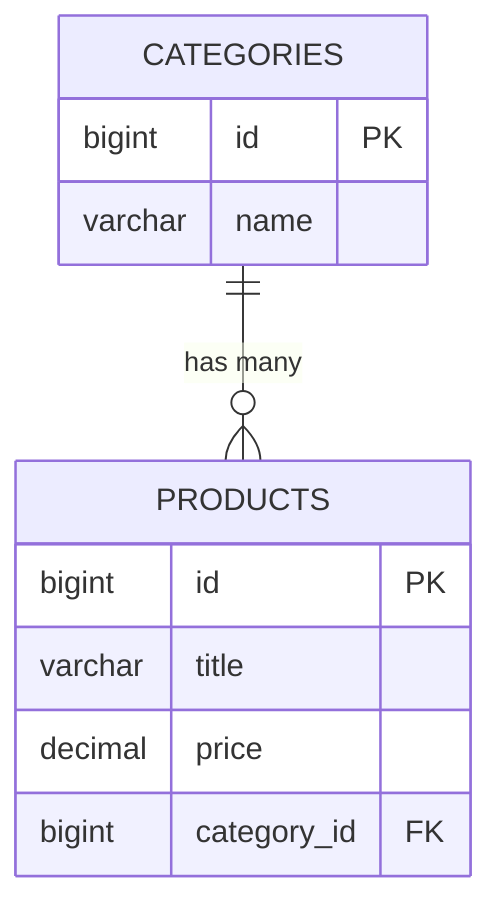
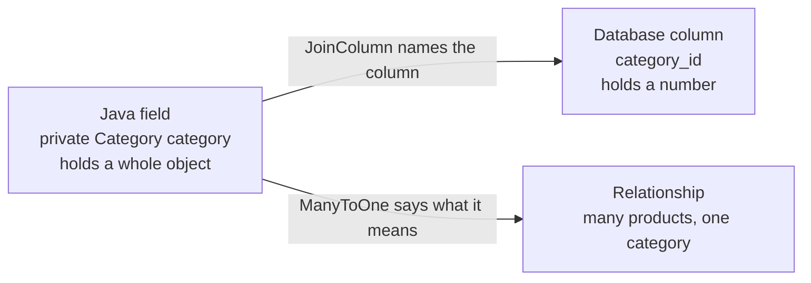

Now Category is an entity with its own table. Product still holds a string. Connecting them is worth doing in the database first, because the annotations that follow are only a way of expressing something relational databases have always done.

# In the database, before any Java

Two tables:

```text
1  categories                products
2  ----------                --------
3  id (PK)                   id (PK)
4  name                      title, description, price, image, rating
```

The relationship: **one category has many products, one product belongs to one category.**

Where does the link live? It cannot sensibly live on the category — a category has many products, and a column cannot hold many values. So it lives on the **many** side.

> [!important] **The table on the many side holds a foreign key.** A foreign key is a column whose values are the primary key of another table. Here, `products` gains `category_id`, holding the `id` of a row in `categories`.



Read the crow's foot on the right-hand end: the many side is `products`, and that is the side carrying `category_id`.

Worked through with actual rows:

```text
1  categories
2  id | name
3  1  | electronics
4  2  | kitchenware
5  3  | stationery
6
7  products
8  id | title          | price  | category_id
9  1  | iPhone 17      | 80000  | 1
10 2  | iPhone 17 Pro  | 130000 | 1
11 3  | Plates         | 12000  | 2
```

Products 1 and 2 both carry `category_id = 1`, so both are electronics — that is **one category, many products**. Each product has exactly one value in that column, so **one product, one category**.

> [!info] The same shape appears constantly. An author has many books and a book has one author, so the **book** table carries `author_id`. Whenever you meet a one-to-many, ask which side is the many — that is where the foreign key goes.

# Expressing it in Java

The string goes, and a reference to the entity replaces it:

```java
1  private Category category;
```

**But a Java field is not a column**. Two annotations are needed to say what it means in the database.

## `@JoinColumn` — name the column

```java
1  @JoinColumn(name = "category_id", nullable = false)
2  private Category category;
```

The field is called `category` and holds a whole `Category`. The **column** should be called `category_id` and hold a number. `@JoinColumn` bridges that difference.



Two different jobs. One annotation says where the value is stored, the other says what the value signifies.

`nullable = false` says a product must have a category — there is no such thing as an uncategorised product.

That alone is not enough:

```text
1  missing mapping annotation
```

## `@ManyToOne` — say what kind of relationship

```java
1  @ManyToOne
2  @JoinColumn(name = "category_id", nullable = false)
3  private Category category;
```

`@JoinColumn` **describes the column**. `@ManyToOne` **describes the** **relationship**, and without it the **framework knows where to put the key but not what it signifies.**

> [!important] **Read the annotation left to right as a sentence about this class: many products can have one category.** That is also how you decide which class it belongs on. It goes on `Product`, because products are the many. Put it on `Category` and the sentence reads backwards.

The finished entity:

```java
1  // src/main/java/com/example/FakeCommerce/schema/Product.java
2  @Data
3  @AllArgsConstructor
4  @NoArgsConstructor
5  @Builder
6  @Entity
7  @Table(name = "products")
8  public class Product extends BaseEntity {
9
10     @Column(nullable = false)
11     private String title;
12
13     @Column(columnDefinition = "TEXT")
14     private String description;
15
16     @Column(nullable = false)
17     private BigDecimal price;
18
19     @ManyToOne // ManyToOne can be read as Many Products can have One Category
20     @JoinColumn(name = "category_id", nullable = false)
21     private Category category;
22
23     private String image;
24
25     private String rating;
26 }
```

# What it generates

```text
Hibernate: create table products (price decimal(38,2) not null, category_id bigint not null,id bigint not null auto_increment, description TEXT, image varchar(255),
rating varchar(255), title varchar(255) not null, primary key (id)) engine=InnoDB

Hibernate: alter table products add constraint FKog2rp4qthbtt2lfyhfo32lsw9
foreign key (category_id) references categories (id)
```

> [!info] **Verified.** Line 1 shows `category_id bigint not null` — the column named by `@JoinColumn`, non-null as specified, typed to match the primary key it references. Lines 4 and 5 add the actual **foreign key constraint**, which is the database enforcing that every `category_id` corresponds to a real category.

# A failure you will hit

**Adding this to a table that already has rows fails:**

```text
1  Cannot add or update a child row: a foreign key constraint fails
```

The reasoning is worth following. `ddl-auto: update` **altered the existing** `products` table to add `category_id` as `NOT NULL`. Existing rows needed a value, and got the default: **0**. Then the foreign key constraint was applied — and there is no category with id 0.

> [!warning] **Existing data and a new non-null foreign key do not mix.** The framework cannot invent a sensible category for rows written before categories existed.

The fix used here is to drop the database and recreate it, which is fine on a development machine and unthinkable anywhere else.

> [!important] This is the clearest argument yet for **database migrations**. A migration is a deliberate, ordered, reviewable script — it can add the column as nullable, backfill sensible values, then apply the constraint. `ddl-auto` cannot, because it only compares the current classes against the current schema and has no idea what the intermediate steps should be.

That argument is taken up properly in [[01-Database-Migrations]].

# The DTO changes too

The client used to send a category name. Now it sends an id:

```java
1  // src/main/java/com/example/FakeCommerce/dtos/CreateProductRequestDto.java
2  private Long categoryId;
```

And that creates a subtlety when building the entity. You cannot assign an id where an entity is expected:

```java
1  .category(requestDto.getCategoryId())   // will not compile
```

The field holds a `Category`, not a number. So the category has to be **fetched first**, then attached:

```java
1  Category category = categoryService.getCategoryById(requestDto.getCategoryId());
2
3  Product newProduct = Product.builder()
4      .title(requestDto.getTitle())
5      .category(category)
6      .build();
```

> [!info] That extra fetch is visible in the logs — creating a product runs `select c1_0.id, c1_0.name from categories c1_0 where c1_0.id=?` before the insert. Which is the first hint that associations cost queries, and that is about to become the main event.
