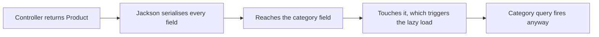

The association works. Fetching products now also fetches their categories — which you did not ask for, and which turns out to be caused by something other than the association itself.

# Fetching a product fetches its category

`GET /api/v1/products` returns the products, and each one arrives with its full category nested inside. The logs explain why:

```text
1  Hibernate: select p1_0.id,p1_0.category_id,... from products p1_0
2  Hibernate: select c1_0.id,c1_0.name from categories c1_0 where c1_0.id=?
3  Hibernate: select c1_0.id,c1_0.name from categories c1_0 where c1_0.id=?
```

**Three products, two distinct categories — one product query and two category queries.**

> [!info] **Verified.** The count follows the distinct categories, not the products. Three products sharing two categories produced exactly two extra queries.

Nothing asked for this. It happens because of a default.

# Eager and lazy

```java
1  @ManyToOne(fetch = FetchType.EAGER)   // the default
```

> [!important] **Eager means load the association immediately, along with the thing that owns it.** Fetch a product, get its category too, whether or not you wanted it.
>
> **Lazy means do not load it until something asks.** Fetch a product, get only the product; the category is retrieved if and when you touch it.

Eager is the default for `@ManyToOne`, which is why the extra queries appeared without anyone requesting them.

So the fix looks obvious:

```java
1  @ManyToOne(fetch = FetchType.LAZY)
2  @JoinColumn(name = "category_id", nullable = false)
3  private Category category;
```

# It does not work

Restart, hit the endpoint, and the queries are still there. Worse, the response contains something new:

```json
1  {
2    "title": "iPhone 17",
3    "price": 80000.00,
4    "category": { "name": "electronics", "hibernateLazyInitializer": {}, "id": 1 },
5    "image": "",
6    "rating": "4.8",
7    "id": 1
8  }
```

> [!info] **Verified.** That `"hibernateLazyInitializer": {}` on line 4 is real output. It is Hibernate's internal machinery — the proxy standing in for the not-yet-loaded category — leaking into your API response.

`LAZY` was set correctly. The category was loaded anyway. Why?

# Because the controller returns the entity

```java
1  @GetMapping
2  public List<Product> getAllProducts() {
3      return productService.getAllProducts();
4  }
```

That returns `Product` objects. Spring hands them to **Jackson** to turn into JSON — and Jackson serialises everything it finds.



> [!important] **Lazy loading means load it when something asks. Jackson asked.** By walking the object to build JSON, it accessed the category — and access is exactly the trigger. The setting worked perfectly; the serialiser defeated the purpose of it.

Which exposes the real problem. It is not the fetch type.

> [!important] **The problem is returning your entity from a controller at all.** An entity is your internal representation of a database row, complete with lazy proxies, framework annotations and every column. It is not a response contract, and handing it to a serialiser makes all of that someone else's business.

# Response DTOs

The answer is the layer already used for incoming data, applied to outgoing:

```java
1  // src/main/java/com/example/FakeCommerce/dtos/GetProductResponseDto.java
2  @Data
3  @AllArgsConstructor
4  @NoArgsConstructor
5  @Builder
6  public class GetProductResponseDto {
7
8      private Long id;
9      private String title;
10     private BigDecimal price;
11     private String image;
12     private String rating;
13 }
```

**No category field.** So nothing ever touches the association, nothing triggers a lazy load, and no proxy internals can leak.

Mapping the entity to it, in the service:

```java
1  public List<GetProductResponseDto> getAllProducts() {
2      return productRepository.findAll()
3          .stream()
4          .map(product -> GetProductResponseDto.builder()
5              .id(product.getId())
6              .title(product.getTitle())
7              .price(product.getPrice())
8              .image(product.getImage())
9              .rating(product.getRating())
10             .build())
11         .collect(Collectors.toList());
12 }
```

> [!info] An ordinary loop building a list does the same job. Streams are shorter; neither is more correct.

## The result

```text
1  Hibernate: select p1_0.id,p1_0.category_id,p1_0.description,p1_0.image,p1_0.price,
2             p1_0.rating,p1_0.title from products p1_0
```

> [!info] **Verified.** One query. No category queries at all, and no `hibernateLazyInitializer` in the response — because nothing ever reached the category.

# `@SuperBuilder`

A detail that bites as soon as DTOs start inheriting from one another.

A detailed response DTO extending the basic one:

```java
1  public class GetProductWithDetailsResponseDto extends GetProductResponseDto {
2      private String category;
3  }
```

With `@Builder` on both, the build fails — Lombok's ordinary builder does not handle inheritance, because the generated builder for the child knows nothing about the parent's fields.

```java
1  @SuperBuilder   // from lombok.experimental
```

> [!important] **`@SuperBuilder` is the inheritance-aware version, and it must be on every class in the chain** — parent and child both. Put it on one and it still fails.

# The rule worth keeping

> [!important] **Return DTOs, not entities.** Three separate reasons, all visible above:
>
> **It controls what is exposed.** The response contains what you chose, not every column plus whatever the framework attached.
>
> **It controls what is loaded.** No accidental lazy loads, because the serialiser never reaches an association.
>
> **It decouples your API from your schema.** Renaming a column changes the entity, not the contract your clients depend on.

Which also means the fetch type is doing its job now — but only because nothing forces it. Lazy loading is fragile in exactly this way: it works until something touches the field, and a serialiser touches everything.
