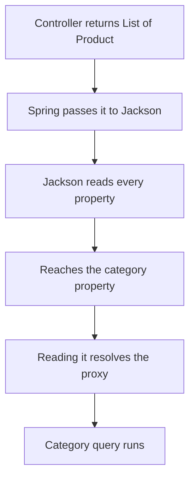

The association works. Fetching products now also fetches their categories — which you did not ask for, and which turns out to be caused by something other than the association itself.

# The code as it stands

Three pieces, and the behaviour below follows from them.

**The entity**, with the association added in the previous note:

```java
1  // src/main/java/com/example/FakeCommerce/schema/Product.java
2  @Entity
3  @Table(name = "products")
4  public class Product extends BaseEntity {
5
6      private String title;
7      private BigDecimal price;
8
9      @ManyToOne
10     @JoinColumn(name = "category_id", nullable = false)
11     private Category category;
12 }
```

**The service**, returning what the repository gives it:

```java
1  // src/main/java/com/example/FakeCommerce/services/ProductService.java
2  public List<Product> getAllProducts() {
3      return productRepository.findAll();
4  }
```

**The controller**, returning that straight out:

```java
1  // src/main/java/com/example/FakeCommerce/controllers/ProductController.java
2  @GetMapping
3  public List<Product> getAllProducts() {
4      return productService.getAllProducts();
5  }
```

Nothing here mentions categories. `findAll()` on line 3 of the service is a `SELECT` from `products` and nothing else.

# But fetching products fetches categories

With three products in the database — two of them electronics, one kitchenware — calling the endpoint gives you this:

```json
 [
   { "id": 1, "title": "iPhone 17",     "category": { "id": 1, "name": 
   "electronics" } },

  { "id": 2, "title": "iPhone 17 Pro", "category": { "id": 1, "name": 
  "electronics" } },
  
   { "id": 3, "title": "Plates",        "category": { "id": 2, "name": 
   "kitchenware" } }
   
  ]
```

Every product arrives with its **full category nested inside**, which nothing in the three files above asked for.

And the log shows what it cost:

```text
Hibernate: select p1_0.id,p1_0.category_id,p1_0.description,p1_0.image,p1_0.price,
           p1_0.rating,p1_0.title from products p1_0
           
Hibernate: select c1_0.id,c1_0.name from categories c1_0 where c1_0.id=?

Hibernate: select c1_0.id,c1_0.name from categories c1_0 where c1_0.id=?
```

**Three queries for one endpoint call.** Line 1 is the `findAll()` you wrote. Lines 3 and 4 are extra — one per **distinct** category.

> [!info] **Verified.** The count follows the distinct categories, not the products. Three products sharing two categories produced exactly two extra queries — not three.

So the question is where those two queries came from, given that no code requested them. The answer is a default.

# Eager and lazy

```java
1  @ManyToOne(fetch = FetchType.EAGER)   // the default
```

> [!important] **Eager means load the association immediately, along with the thing that owns it.** Fetch a product, get its category too, whether or not you wanted it.

> [!important] **Lazy means do not load it until something asks.** Fetch a product, get only the product; the category is retrieved if and when you touch it.

Eager is the default for `@ManyToOne`, which is why the extra queries appeared without anyone requesting them.

So the fix looks obvious:

```java
1  @ManyToOne(fetch = FetchType.LAZY)
2  @JoinColumn(name = "category_id", nullable = false)
3  private Category category;
```

# It does not work

Restart, hit the endpoint, and the queries are still there. Worse, the response contains something new:

```json
1  {
2    "title": "iPhone 17",
3    "price": 80000.00,
4   "category": { "name": "electronics", "hibernateLazyInitializer": {}, "id": 1 },
5    "image": "",
6    "rating": "4.8",
7    "id": 1
8  }
```

> [!info] **Verified.** That `"hibernateLazyInitializer": {}` on line 4 is real output. It is Hibernate's internal machinery — the proxy standing in for the not-yet-loaded category — leaking into your API response.

`LAZY` was set correctly. The category was loaded anyway. Why?

# Because the entity gets serialised

Look at what your code actually does:

```java
1  // the service
2  public List<Product> getAllProducts() {
3      return productRepository.findAll();
4  }
```

```java
1  // the controller
2  @GetMapping
3  public List<Product> getAllProducts() {
4      return productService.getAllProducts();
5  }
```

> [!important] **Neither one touches the category.** The service returns what the repository gave it. The controller returns what the service gave it. Search both files and the word `category` does not appear.
>
> Which is exactly why this is hard to diagnose. You read your code, nothing requests the category, and the extra queries run anyway.

The access happens **after your controller has returned**. Spring takes the returned object and hands it to **Jackson**, the default library for turning objects into JSON — and Jackson's job is to read every property.



> [!important] **Lazy means the load happens at first access, wherever that is. Jackson accessed it.** The setting worked exactly as specified; the first thing to touch the field simply happened to be a library running after your code finished.

The serialiser is not special here. **Anything** touching the field does the same thing — had the service logged `product.getCategory().getName()`, the queries would have run there instead, with no serialiser involved.

## How Jackson reaches the field

It does not read private fields directly. It discovers properties **reflectively, by finding and calling the getters** — and `getCategory()` is one of them, generated for you by Lombok's `@Data`. Jackson has no idea that getter is backed by a lazy proxy; it is another property to read, and calling it resolves the proxy.

> [!info] **You never added Jackson.** It arrives with the web starter, three levels down:
>
> ```text
> spring-boot-starter-web
>   └── spring-boot-starter-jackson
>         └── spring-boot-jackson
>               └── jackson-databind
> ```
>
> Spring Boot then sees it on the classpath and auto-configures it as the JSON converter. Which is worth noticing: the library that triggers your lazy loads is one you never chose and never configured.

## Why this succeeds rather than crashing

> A lazy load **needs the Hibernate session still open** when it happens — and by default in Spring Boot it is, because `spring.jpa.open-in-view` is enabled. The startup log announces it:

```text
spring.jpa.open-in-view is enabled by default. Therefore, database queries may be
performed during view rendering.
```

That keeps the persistence context alive through response rendering, which is what allows a field touched during serialisation to still reach the database.

> [!warning] Disable it and this same code throws `LazyInitializationException` instead — session closed, proxy unresolvable. Worth recognising, because it is among the most common errors in this area, and the cause is exactly this: a lazy field accessed after the session ended.

Which exposes the real problem. It is not the fetch type.

> [!important] **The problem is returning your entity from a controller at all.** An entity is your internal representation of a database row, complete with lazy proxies, framework annotations and every column. It is not a response contract, and handing it to a serialiser makes all of that someone else's business.

# Response DTOs

The answer is the layer already used for incoming data, applied to outgoing:

```java
1  // src/main/java/com/example/FakeCommerce/dtos/GetProductResponseDto.java
2  @Data
3  @AllArgsConstructor
4  @NoArgsConstructor
5  @Builder
6  public class GetProductResponseDto {
7
8      private Long id;
9      private String title;
10     private BigDecimal price;
11     private String image;
12     private String rating;
13 }
```

**No category field.** So nothing ever touches the association, nothing triggers a lazy load, and **no proxy internals can leak.**

Mapping the entity to it, in the service:

```java
1  public List<GetProductResponseDto> getAllProducts() {
2      return productRepository.findAll()
3          .stream()
4          .map(product -> GetProductResponseDto.builder()
5              .id(product.getId())
6              .title(product.getTitle())
7              .price(product.getPrice())
8              .image(product.getImage())
9              .rating(product.getRating())
10             .build())
11         .collect(Collectors.toList());
12 }
```

> [!info] An ordinary loop building a list does the same job. Streams are shorter; neither is more correct.

## The result

```text
Hibernate: select p1_0.id,p1_0.category_id, 
p1_0.description,p1_0.image, p1_0.price ,
p1_0.rating,p1_0.title from products p1_0
```

# `@SuperBuilder`

A detail that bites as soon as DTOs start inheriting from one another.

A detailed response DTO extending the basic one:

```java
1  public class GetProductWithDetailsResponseDto extends GetProductResponseDto {
2      private String category;
3  }
```

With `@Builder` on both, the build fails — **Lombok's ordinary builder does not handle inheritance**, because the generated builder for the child knows nothing about the parent's fields.

```java
1  @SuperBuilder   // from lombok.experimental
```

> [!important] **`@SuperBuilder` is the inheritance-aware version, and it must be on every class in the chain** — parent and child both. Put it on one and it still fails.

# The rule worth keeping

> [!important] **Return DTOs, not entities.** Three separate reasons, all visible above:
>
> **It controls what is exposed.** The response contains what you chose, not every column plus whatever the framework attached.
>
> **It controls what is loaded.** No accidental lazy loads, because the serialiser never reaches an association.
>
> **It decouples your API from your schema.** Renaming a column changes the entity, not the contract your clients depend on.

Which also means the fetch type is doing its job now — but only because nothing forces it. Lazy loading is fragile in exactly this way: it works until something touches the field, and a serialiser touches everything.
