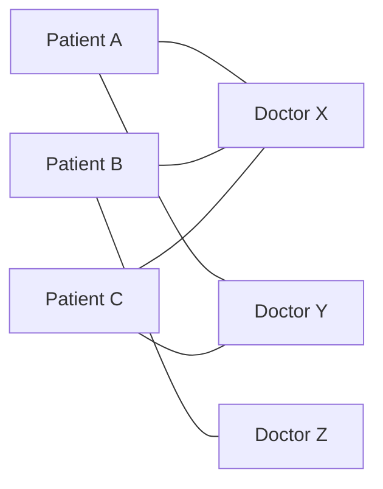
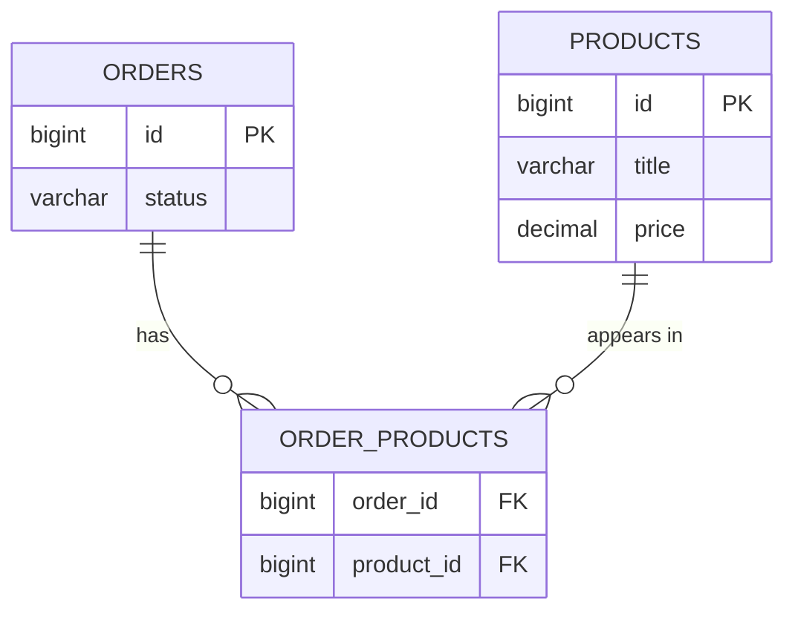

One category has many products, and a product belongs to one category. That relationship put a foreign key on the many side and the problem was solved. There is a relationship where that trick does not work at all.

# The shape

Take a hospital. **A patient books consultations with several doctors over time.** A doctor consults with a great many patients.



Neither side is the one side. Both are many.

> [!important] In a **many-to-many** relationship, each row on either side can be related to many rows on the other. It is written **m : n**, against the **1 : n** of one-to-many.

The same shape in a shop. An order contains many products — a phone, a screen guard, a charger. And one product appears in many orders, because thousands of people buy the same phone.

# Why the old trick fails

One-to-many worked by putting the primary key of one table into the other as a foreign key, on the many side. Try that here.

A product belongs to many orders. So the products table would need to hold many order ids in one row:

```text
 id | title         | price  | order_ids
 1  | iPhone 17 Pro | 130000 | 13, 19, 27, 41, 58
```

> [!warning] **This is bad design, and it breaks normalisation.** A column is supposed to hold one value. This one holds a list, and everything that follows from that is worse than it looks.

Work through removing product 1 from order 19.

**Find the product row.** Fine.

**Then search the list.** The order ids are just text in a cell. Finding `19` means scanning the list element by element — a linear search, inside a column, which the database cannot help you with.

**Then rewrite the whole cell** with `19` removed.

**Then do it all again on the other side**, because the orders table would carry `product_ids` in exactly the same way, and that list needs the product removed too.

> [!important] One conceptual operation — take this product out of this order — became **two list rewrites and two linear searches**, none of which the database can index, optimise, or check.

# The join table

The answer is not to store the relationship on either side. It is to give the relationship a table of its own.

> [!important] A **join table** — also called a **through table** — is a third table holding the primary keys of both related tables as foreign keys. It stores the relationship rather than either of the things being related.



Notice what happened to the arrows. **The many-to-many became two one-to-many relationships**, both pointing at the join table. Each of those is the shape that already had a solution.

## The rows

One row per pairing:

```text
 order_products
 order_id | product_id
 3        | 1
 3        | 2
 3        | 7
 5        | 3
```

Read it directly: order 3 contains products 1, 2 and 7. Order 5 contains product 3. Nothing is a list — each row is one fact.

## What removal costs now

```sql
1  DELETE FROM order_products
2  WHERE order_id = 3 AND product_id = 2
```

One statement. No searching a cell, no rewriting anything, no second table to keep in step. The database can index both columns and answer it immediately.

Several at once is the same statement with one operator changed:

```sql
1  DELETE FROM order_products
2  WHERE order_id = 3 AND product_id IN (1, 2, 7)
```

> [!important] Compare that against the list version. The difference is not that the query is shorter — it is that **the work is now something a database is built to do**, rather than something your code has to do by hand.

# The part that makes it genuinely better

Storing the relationship separately means the relationship can have properties of its own.

You want two iPhones and two chargers, not one of each. Under the list design there is nowhere to put that. Here it is a column:

```text
 order_products
 order_id | product_id | quantity
 3        | 1          | 2
 3        | 2          | 2
 3        | 7          | 1
 5        | 3          | 3
```

> [!important] **Quantity is a fact about the pairing, not about either side.** It does not belong on the product — the product does not have a quantity, an order line does. It does not belong on the order either. It belongs exactly where the join table puts it.

The hospital example makes the same point more forcefully. The join table between doctors and patients naturally carries an **appointment date**, and an **appointment id** of its own, because an appointment is a real thing in the business, not just a link between two rows.

> [!info] Which is a useful test when modelling. **If the pairing has facts of its own, the join table is not plumbing — it is an entity you have not named yet.** An appointment, an order line, an enrolment, a booking.

# The rule

> [!important] A many-to-many relationship is implemented with **a third table holding both primary keys as foreign keys**, and any number of extra columns describing the pairing itself.
