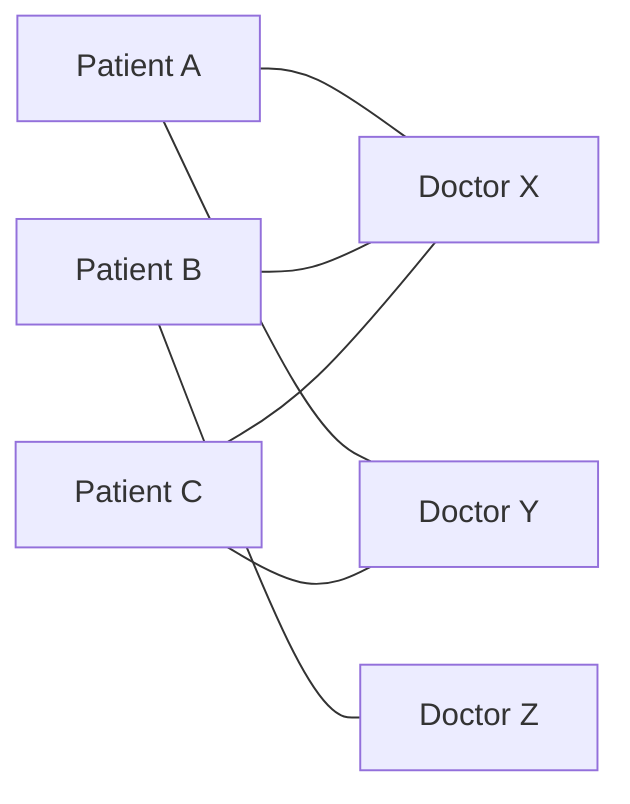
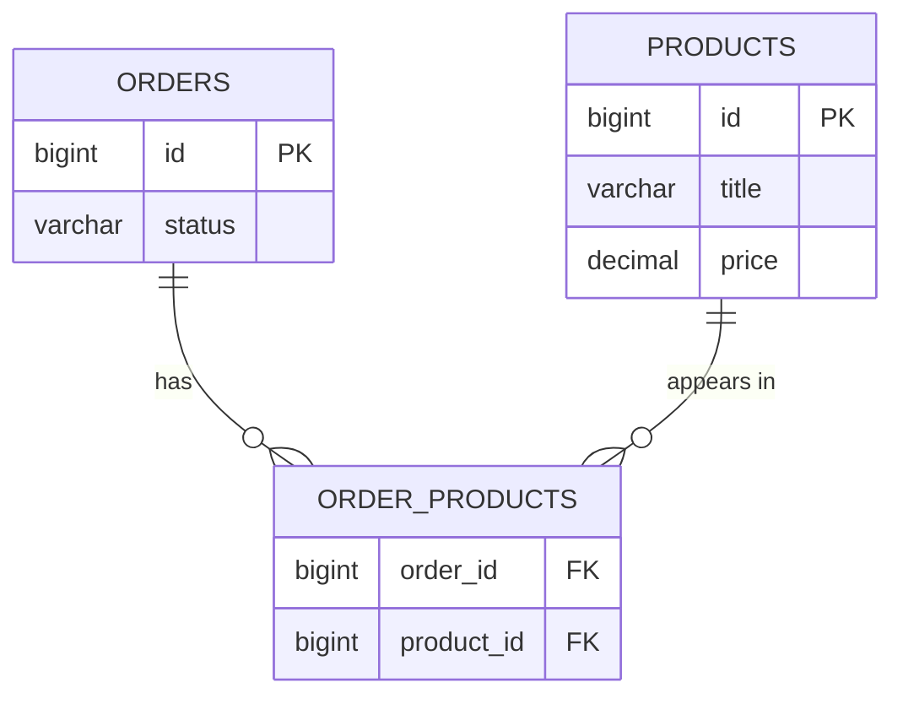

One category has many products, and a product belongs to one category. That relationship put a foreign key on the many side and the problem was solved. There is a relationship where that trick does not work at all.

# The shape

Take a hospital. **A patient books consultations with several doctors over time.** A doctor consults with a great many patients.



Neither side is the one side. Both are many.

> [!important] In a **many-to-many** relationship, each row on either side can be related to many rows on the other. It is written **m : n**, against the **1 : n** of one-to-many.

The same shape in a shop. An order contains many products — a phone, a screen guard, a charger. And one product appears in many orders, because thousands of people buy the same phone.

# Why the old trick fails

One-to-many worked by putting the primary key of one table into the other as a foreign key, on the many side. Try that here.

A product belongs to many orders. So the products table would need to hold many order ids in one row:

```text
 id | title         | price  | order_ids
 1  | iPhone 17 Pro | 130000 | 13, 19, 27, 41, 58
```

> [!warning] **This is bad design, and it breaks normalisation.** A column is supposed to hold one value. This one holds a list, and everything that follows from that is worse than it looks.

Work through removing product 1 from order 19.

**Find the product row.** Fine.

**Then search the list.** The order ids are just text in a cell. Finding `19` means scanning the list element by element — a linear search, inside a column, which the database cannot help you with.

**Then rewrite the whole cell** with `19` removed.

**Then do it all again on the other side**, because the orders table would carry `product_ids` in exactly the same way, and that list needs the product removed too.

> [!important] One conceptual operation — take this product out of this order — became **two list rewrites and two linear searches**, none of which the database can index, optimise, or check.

# The join table

The answer is not to store the relationship on either side. It is to give the relationship a table of its own.

> [!important] A **join table** — also called a **through table** — is a third table holding the primary keys of both related tables as foreign keys. It stores the relationship rather than either of the things being related.



Notice what happened to the arrows. **The many-to-many became two one-to-many relationships**, both pointing at the join table. Each of those is the shape that already had a solution.

## The rows

One row per pairing:

```text
 order_products
 order_id | product_id
 3        | 1
 3        | 2
 3        | 7
 5        | 3
```

Read it directly: order 3 contains products 1, 2 and 7. Order 5 contains product 3. Nothing is a list — each row is one fact.

## What removal costs now

```sql
1  DELETE FROM order_products
2  WHERE order_id = 3 AND product_id = 2
```

One statement. No searching a cell, no rewriting anything, no second table to keep in step. The database can index both columns and answer it immediately.

Several at once is the same statement with one operator changed:

```sql
1  DELETE FROM order_products
2  WHERE order_id = 3 AND product_id IN (1, 2, 7)
```

> [!important] Compare that against the list version. The difference is not that the query is shorter — it is that **the work is now something a database is built to do**, rather than something your code has to do by hand.

# The part that makes it genuinely better

**Storing the relationship separately means the relationship can have properties of its own.**

You want two iPhones and two chargers, not one of each. Under the list design there is nowhere to put that. Here it is a column:

```text
 order_products
 order_id | product_id | quantity
 3        | 1          | 2
 3        | 2          | 2
 3        | 7          | 1
 5        | 3          | 3
```

> [!important] **Quantity is a fact about the pairing, not about either side.** It does not belong on the product — the product does not have a quantity, an order line does. It does not belong on the order either. It belongs exactly where the join table puts it.

The hospital example makes the same point more forcefully, because there the extra columns are not an optimisation — they are the reason the row exists.

```text
 doctors                      patients
 id | name        | dept      id | name      | dob
 ---+-------------+------     ---+-----------+------------
 1  | Dr Mehra    | ENT       1  | Anita     | 1991-03-02
 2  | Dr Iyer     | Cardio    2  | Rakesh    | 1978-11-19
 3  | Dr Bose     | ENT       3  | Priya     | 2003-07-25

 appointments
 id  | doctor_id | patient_id | scheduled_at        | status
 ----+-----------+------------+---------------------+-----------
 101 | 1         | 1          | 2026-09-02 10:30    | COMPLETED
 102 | 1         | 2          | 2026-09-02 11:00    | COMPLETED
 103 | 2         | 1          | 2026-09-05 09:15    | SCHEDULED
 104 | 3         | 3          | 2026-09-05 16:45    | CANCELLED
 105 | 1         | 1          | 2026-09-19 10:30    | SCHEDULED
```

Read rows 101 and 105. **The same doctor and the same patient, twice.** Anita saw Dr Mehra on the 2nd and is booked again on the 19th — two different appointments that happen to share both foreign keys.

> [!important] That is the difference between the two designs stated plainly. **A list of doctor ids on the patient row cannot express this at all** — it can only record that Anita and Dr Mehra are related, not that they met on Tuesday and will meet again a fortnight later.

And `id 101` is doing real work. It is the number on the appointment card, what the reminder message references, what a cancellation names, what a prescription is attached to.

> [!important] **The pairing has become a thing you can point at**, which is exactly what the `quantity` column hinted at and this makes obvious.

> [!info] Which is a useful test when modelling. **If the pairing has facts of its own, the join table is not plumbing — it is an entity you have not named yet.** An appointment, an order line, an enrolment, a booking.

## The same shape, twice more

Both of these are students-to-courses and guests-to-rooms — plainly many-to-many — and in both the join table turns out to be the thing the business actually talks about.

**An enrolment.**

```text
 students                     courses
 id | name      | year        id | code     | title
 ---+-----------+------       ---+----------+---------------------
 1  | Anita     | 2           1  | CS201    | Databases
 2  | Rakesh    | 1           2  | CS310    | Distributed Systems
 3  | Priya     | 2           3  | MA110    | Linear Algebra

 enrolments
 id  | student_id | course_id | enrolled_on | grade | status
 ----+------------+-----------+-------------+-------+-----------
 501 | 1          | 1         | 2026-01-08  | F     | FAILED
 502 | 1          | 2         | 2026-01-08  | NULL  | ACTIVE
 503 | 2          | 1         | 2026-01-09  | NULL  | ACTIVE
 504 | 3          | 1         | 2026-01-08  | NULL  | WITHDRAWN
 505 | 1          | 1         | 2026-08-04  | NULL  | ACTIVE
```

**The grade is the giveaway.** A grade is not a property of the student — they have several. It is not a property of the course — it has hundreds. It belongs to one student taking one course, which is the pairing.

Rows 501 and 505 are the repeat, and the reason is the point: **Anita failed Databases in January and is retaking it in August.** Nobody re-enrols in a course they passed — the second attempt exists precisely because the first one has an outcome recorded against it.

> [!important] Which is why a list of course ids on the student row would be worse than merely inelegant. It would say Anita is related to Databases, once, with no way to record that she took it twice and got different results. **The list cannot hold the attempt, and the attempt is the thing the registrar cares about.**

> [!info] Row 504 has no grade because Priya withdrew. **A withdrawal is a status, not a mark**, and leaving `grade` null is how the schema says so — the same nullable-means-not-applicable reasoning as `deleted_at`.

**A booking.**

```text
 guests                       rooms
 id | name      | phone       id | number | type
 ---+-----------+--------     ---+--------+----------
 1  | Anita     | ...         1  | 101    | DELUXE
 2  | Rakesh    | ...         2  | 102    | STANDARD
 3  | Priya     | ...         3  | 201    | SUITE

 bookings
 id  | guest_id | room_id | check_in   | check_out  | rate    | status
 ----+----------+---------+------------+------------+---------+-----------
 901 | 1        | 1       | 2026-09-02 | 2026-09-05 | 4200.00 | CHECKED_OUT
 902 | 2        | 1       | 2026-09-06 | 2026-09-08 | 4200.00 | CONFIRMED
 903 | 3        | 3       | 2026-09-06 | 2026-09-11 | 9500.00 | CANCELLED
 904 | 1        | 2       | 2026-10-14 | 2026-10-16 | 2800.00 | CONFIRMED
```

**`rate` is the one worth stopping on.** The room has a price today; this booking has the price it was sold at. Those are different facts, and putting the rate on the room would mean a price change silently rewrites what past guests paid.

> [!important] Notice what all four tables have in common. **Two foreign keys, an identity of its own, and at least one column describing the event rather than either participant.** Quantity, appointment time, grade, rate — none of them belongs on either side.

> [!important] And each one has a **name in the business.** Nobody at a hotel says the guest-room link. They say booking. **When the pairing has a name people already use, it was always an entity** — the many-to-many was just how it looked from the database side.

# The rule

> [!important] A many-to-many relationship is implemented with **a third table holding both primary keys as foreign keys**, and any number of extra columns describing the pairing itself.
