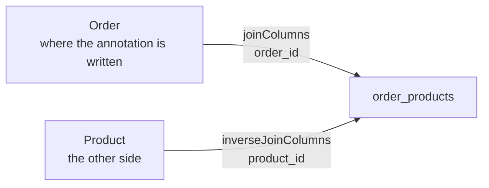

The join table has to exist in the database. There are two ways to get it there, and the first writes it for you from a single annotation — with a limitation that turns out to matter.

# The order entity first

Before the relationship, something to hang it on.

```java
1  // src/main/java/com/example/FakeCommerce/schema/OrderStatus.java
2  package com.example.FakeCommerce.schema;
3
4  public enum OrderStatus {
5      PENDING,
6      SHIPPED,
7      DELIVERED,
8      CANCELLED
9  }
```

An order is in exactly one of a fixed set of states, which is what an enum is for.

```java
1  // src/main/java/com/example/FakeCommerce/schema/Order.java
2  @Data
3  @AllArgsConstructor
4  @NoArgsConstructor
5  @Entity
6  @Builder
7  @Table(name = "orders")
8  public class Order extends BaseEntity {
9
10     private OrderStatus status;
11 }
```

Extending `BaseEntity` brings the id and its generation strategy, so the class declares one field.

> [!info] The table is named `orders`, not `order`. **`ORDER` is a reserved word in SQL** — it is half of `ORDER BY` — so a table called `order` has to be quoted everywhere it appears. Naming it `orders` sidesteps that entirely.

# `@JoinTable`

Now the relationship, declared on the order:

```java
1  // src/main/java/com/example/FakeCommerce/schema/Order.java
2  @ManyToMany
3  @JoinTable(
4      name = "order_products",
5      joinColumns = @JoinColumn(name = "order_id"),
6      inverseJoinColumns = @JoinColumn(name = "product_id")
7  )
8  private List<Product> products;
```

Three things are being said, and the third is the one people get wrong.

**Line 2 — `@ManyToMany`.** The relationship is many-to-many. Read it as a sentence about this class, exactly as `@ManyToOne` was read: many orders relate to many products.

**Line 4 — the table name.** What the join table should be called.

**Lines 5 and 6 — which column is which.** Both are foreign keys in the same table, so something has to say which belongs to which side.

> [!important] **`joinColumns` is the foreign key pointing back at the class you are writing this in.** `inverseJoinColumns` is the foreign key pointing at the other class. Here the annotation sits on `Order`, so `order_id` is the join column and `product_id` is the inverse.



Move the annotation to `Product` instead and the two swap over. The words are relative to where you are standing, which is why they are not simply called first and second.

> [!info] Both take an **array** of columns, not a single one. That is for a composite key — a table whose primary key spans several columns needs several foreign key columns to reference it.

# What it generates

No class was written for `order_products`. Starting the application produces it anyway:

```text
1  Hibernate: create table order_products (order_id bigint not null, product_id bigint not null) engine=InnoDB
2  Hibernate: create table orders (id bigint not null auto_increment, status varchar(255), primary key (id)) engine=InnoDB
3  Hibernate: alter table order_products add constraint FK... foreign key (product_id) references products (id)
4  Hibernate: alter table order_products add constraint FK... foreign key (order_id) references orders (id)
```

And the database agrees:

```text
1  Tables_in_fakecommerce
2  categories
3  order_products
4  orders
5  products
```

```text
1  describe order_products;
2  Field       Type    Null  Key
3  order_id    bigint  NO    MUL
4  product_id  bigint  NO    MUL
```

> [!info] **Verified.** Line 1 of the DDL creates the join table with exactly the two columns named in the annotation. Lines 3 and 4 add the foreign key constraints in both directions, so the database itself will refuse a row referencing an order or product that does not exist.

**Two columns. Nothing else.** That is the whole of what this mechanism produces, and it is the point at which it stops being enough.

# `List` or `Set`

The field was declared `List<Product>`. It could have been `Set<Product>`, and the choice says something.

> [!important] A **`List` permits the same product twice.** A **`Set` does not** — it is the collection type whose job is uniqueness.

Which is right depends on what a repeat is supposed to mean. If ordering two of the same phone is expressed by adding it to the list twice, a `List` is required. If a repeat is meaningless because quantity will be its own column, a `Set` is the honest type.

> [!warning] **A `Set` needs to be able to compare products.** Deciding whether two entries are the same object means `equals` and `hashCode`, and a `Set` of entities with the defaults may behave in ways you did not intend. Lombok's `@Data` generates both from all fields, which is rarely what you want for an entity whose identity is its id.

# Where this runs out

The quantity column from the previous note has nowhere to go.

> [!important] **`@JoinTable` creates a table with exactly the two foreign keys and nothing else.** There is no class, so there is no field to add, so there is no way to say that a pairing also has a quantity.

That is not a small gap. The whole argument for the join table was that a pairing can carry facts of its own — quantity, an appointment date, an appointment id. This mechanism gives you the table and takes away the ability to use it that way.

> [!important] So `@JoinTable` is the right choice when the relationship is **only** a relationship. The moment the pairing has a property, you need the table to be a class you control.
