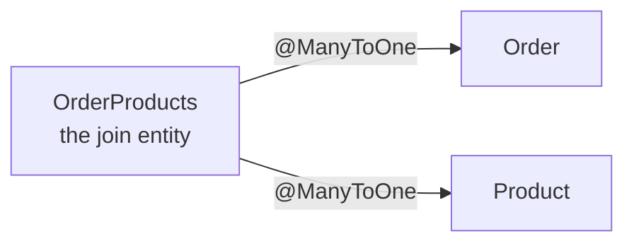

`@JoinTable` produced a table with two columns and no way to add a third. The alternative is to stop treating the join table as generated plumbing and write it as an entity like any other.

# The observation that makes it simple

Look at the join table on its own, ignoring the many-to-many framing for a moment.

```text
 order_products
 order_id | product_id | quantity
 3        | 1          | 2
 3        | 2          | 2
 3        | 7          | 1
```

Order 3 appears three times. **Many rows of `order_products` belong to one order.** The order knows nothing about them.

That is a many-to-one, and it is the same one-to-many shape from the previous folder — a foreign key on the many side, pointing at the one side.

> [!important] **A many-to-many is two many-to-ones with a table in the middle.** Once the join table is an entity, there is no new relationship type to learn. `OrderProducts` has a many-to-one to `Order` and a many-to-one to `Product`, and both were solved already.



# The class

```java
1  // src/main/java/com/example/FakeCommerce/schema/OrderProducts.java
2  package com.example.FakeCommerce.schema;
3
4  import jakarta.persistence.Entity;
5  import jakarta.persistence.FetchType;
6  import jakarta.persistence.JoinColumn;
7  import jakarta.persistence.ManyToOne;
8  import jakarta.persistence.Table;
9  import lombok.AllArgsConstructor;
10 import lombok.Builder;
11 import lombok.Data;
12 import lombok.NoArgsConstructor;
13
14 @Data
15 @AllArgsConstructor
16 @NoArgsConstructor
17 @Entity
18 @Builder
19 @Table(name = "order_products")
20 public class OrderProducts extends BaseEntity {
21
22     @ManyToOne(fetch = FetchType.LAZY)
23     @JoinColumn(name = "order_id", nullable = false)
24     private Order order;
25
26     @ManyToOne(fetch = FetchType.LAZY)
27     @JoinColumn(name = "product_id", nullable = false)
28     private Product product;
29
30     private Integer quantity;
31 }
```

Every annotation on it has appeared before.

**Line 20 — `extends BaseEntity`.** The join table gets a primary key of its own. It costs nothing, and it means a specific line of an order can be referred to directly — which is what the appointment id in the hospital example was.

**Lines 22 and 26 — `fetch = FetchType.LAZY`.** Loading an order line should not drag in the whole order and the whole product unless they are asked for. This is the same default-is-eager trap from the previous folder.

**Line 30 — `quantity`.** The column that had nowhere to go. Here it is an ordinary field, because this is now an ordinary class.

> [!info] The order side loses its `products` list entirely. `Order` goes back to holding just its status, and the relationship is expressed only from the join entity. Nothing forces that — an `Order` can map back to its lines — but the relationship works without it.

# A failure worth reading

Switching from one mechanism to the other while the tables already existed produced this:

```text
1  Error executing DDL "alter table order_products add column id bigint not null auto_increment"
2  Caused by: java.sql.SQLSyntaxErrorException:
3      Incorrect table definition; there can be only one auto column and it must be defined as a key
```

Follow what was being attempted. `@JoinTable` had already created `order_products` with two columns and no primary key. The new class extends `BaseEntity`, so Hibernate tried to **add an auto-increment id to the existing table** — and MySQL refuses to add an auto-increment column unless it is a key, which `ALTER TABLE ... ADD COLUMN` alone does not make it.

> [!important] **`ddl-auto: update` can only add things.** It compares classes against the current schema and issues the additions it can. It cannot restructure a table it created under a different set of assumptions, and there is no ordering of `ALTER` statements that gets from a keyless two-column table to one with a generated primary key.

The fix on a development machine is to drop the database and let it be built once from the finished classes:

```text
1  Hibernate: create table order_products (id bigint not null auto_increment, quantity integer,
2             order_id bigint not null, product_id bigint not null, primary key (id)) engine=InnoDB
```

```text
1  describe order_products;
2  Field       Type     Null  Key  Extra
3  id          bigint   NO    PRI  auto_increment
4  quantity    int      YES
5  order_id    bigint   NO    MUL
6  product_id  bigint   NO    MUL
```

> [!info] **Verified.** Compare against the two-column table `@JoinTable` produced. The same relationship now has a primary key of its own and a `quantity` column, because the table is described by a class rather than inferred from an annotation.

> [!warning] Dropping the database is available exactly once — on a machine whose data you can lose. This is the second time a schema change has been unresolvable by `ddl-auto`, and both times the escape was destroying the data. **That is what migrations exist to prevent**: a deliberate, ordered, reviewable script can add a column, backfill it, and add the key, which is precisely the sequence `ddl-auto` cannot invent.

See [[07-Database-Migrations]] and [[08-Flyway]], where that is what actually happens.

# Choosing between them

| | **`@ManyToMany` with `@JoinTable`** | **An explicit join entity** |
|---|---|---|
| You write | An annotation on one field | A class |
| The join table has | Exactly two foreign keys | Whatever you declare |
| A primary key of its own | No | Yes, if you want one |
| Extra columns | **Not possible** | Ordinary fields |
| Referring to one pairing | Not directly | By its id |
| Relationship types involved | One `@ManyToMany` | Two `@ManyToOne` |

> [!important] Reach for `@JoinTable` when the pairing is **only** a link and will stay that way. Write the entity the moment the pairing has, or might plausibly acquire, a property of its own — quantity, a date, a status, a price at time of order.

The second is not much more work, and the failure above shows the cost of changing your mind later.
