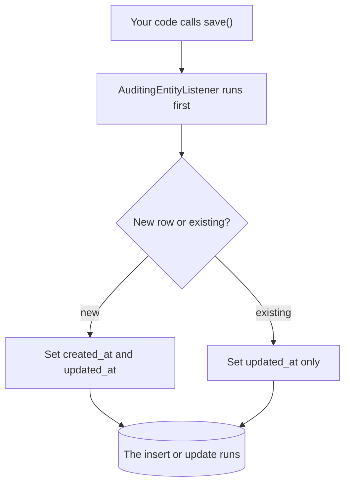

Almost every table in a real system wants to know when each row was created and when it was last changed. Writing those two columns onto every entity, and remembering to set them on every write, is exactly the kind of repetition the framework can take over.

# What is wanted

Two columns on every table:

| Column | Meaning |
|---|---|
| `created_at` | When this row was first written |
| `updated_at` | When it was last changed |

They answer questions that come up constantly — when did this order arrive, has this record been touched since we looked, what changed last Tuesday.

The manual version is to declare both on every entity and set them in every service method that writes. Which works, and fails the first time somebody forgets.

# Where they belong

There is already a class every entity extends, holding what every entity has.

```java
1  // src/main/java/com/example/FakeCommerce/schema/BaseEntity.java
2  @Data
3  @MappedSuperclass
4  public class BaseEntity {
5
6      @Id
7      @GeneratedValue(strategy = GenerationType.IDENTITY)
8      private Long id;
9  }
```

`@MappedSuperclass` **means the mappings inside are inherited by every entity extending it, without the parent becoming a table of its own.** Fields added here appear on every table.

# Three pieces

Auditing needs all three, and each does a different job.

## Turn it on

```java
1  // src/main/java/com/example/FakeCommerce/FakeCommerceApplication.java
2  package com.example.FakeCommerce;
3
4  import org.springframework.boot.SpringApplication;
5  import org.springframework.boot.autoconfigure.SpringBootApplication;
6  import org.springframework.data.jpa.repository.config.EnableJpaAuditing;
7
8  @SpringBootApplication
9  @EnableJpaAuditing
10 public class FakeCommerceApplication {
11
12 	public static void main(String[] args) {
13 		SpringApplication.run(FakeCommerceApplication.class, args);
14 	}
15 }
```

`@EnableJpaAuditing` **switches the feature on for the application. Without it the annotations below are read and nothing happens.**

## Mark the fields

```java
1  @CreatedDate
2  @Column(name = "created_at", nullable = false, updatable = false)
3  private LocalDateTime createdAt;
4
5  @LastModifiedDate
6  @Column(name = "updated_at")
7  private LocalDateTime updatedAt;
```

**`@CreatedDate`** — set this once, when the row is first saved.

**`@LastModifiedDate`** — set this every time the row is **saved**, including the first.

> [!important] **Line 2 carries `updatable = false`, and that is the interesting part.** It tells the database this column may never be changed by an update. Creation time is a fact about an event that already happened; making it unwritable means no later bug can quietly rewrite history.

> [!info] Both come from `org.springframework.data.annotation`, not from `jakarta.persistence`. This is a Spring Data feature rather than part of the JPA specification, which is why it needs switching on explicitly.

## Attach the listener

**The annotations describe intent. Something has to act on it.**

```java
1  @Data
2  @MappedSuperclass
3  @EntityListeners(AuditingEntityListener.class)
4  public class BaseEntity {
```

> [!important] **`@EntityListeners` registers a class whose methods run at points in an entity's life** — before it is inserted, before it is updated. 
> `AuditingEntityListener` is the one Spring Data provides, and it is where the actual work lives: on insert it calls the current time and writes it into whatever field carries `@CreatedDate`, and on update it does the same for `@LastModifiedDate`.



**Created is not touched on an update**, which is the whole reason there are two annotations rather than one.

# The finished class

```java
1  // src/main/java/com/example/FakeCommerce/schema/BaseEntity.java
2  package com.example.FakeCommerce.schema;
3
4  import java.time.LocalDateTime;
5
6  import org.springframework.data.annotation.CreatedDate;
7  import org.springframework.data.annotation.LastModifiedDate;
8  import org.springframework.data.jpa.domain.support.AuditingEntityListener;
9
10 import jakarta.persistence.Column;
11 import jakarta.persistence.EntityListeners;
12 import jakarta.persistence.GeneratedValue;
13 import jakarta.persistence.GenerationType;
14 import jakarta.persistence.Id;
15 import jakarta.persistence.MappedSuperclass;
16 import lombok.Data;
17
18 @Data
19 @MappedSuperclass
20 @EntityListeners(AuditingEntityListener.class)
21 public class BaseEntity {
22
23     @Id
24     @GeneratedValue(strategy = GenerationType.IDENTITY)
25     private Long id;
26
27     @CreatedDate
28     @Column(name = "created_at", nullable = false, updatable = false)
29     private LocalDateTime createdAt;
30
31     @LastModifiedDate
32     @Column(name = "updated_at")
33     private LocalDateTime updatedAt;
34 }
```

# What it does to the schema

Because this is the parent of every entity, restarting alters every table at once:

```text
  Hibernate: alter table categories add column created_at datetime(6) not null
  Hibernate: alter table categories add column updated_at datetime(6)
  Hibernate: alter table order_products add column created_at datetime(6) not null
  Hibernate: alter table order_products add column updated_at datetime(6)
  Hibernate: alter table orders add column created_at datetime(6) not null
  Hibernate: alter table orders add column updated_at datetime(6)
  Hibernate: alter table products add column created_at datetime(6) not null
  Hibernate: alter table products add column updated_at datetime(6)
```

Four tables, eight statements, from two fields written once.

# Watching it work

Creating a category through the API, with nothing in the service touching timestamps:

```json
  POST /api/v1/categories
  { 
	  "name": "electronics" 
  }
```

```json
  {
    "id": 1,
    "name": "electronics",
    "createdAt": "2026-02-22T11:14:07.482",
    "updatedAt": "2026-02-22T11:14:07.482"
  }
```

And in the table:

```text
  select * from categories;
  id | name        | created_at          | updated_at          |
  1  | electronics | 2026-02-22 11:14:07 | 2026-02-22 11:14:07 |
```

> [!important] Nothing in the service, controller or repository mentions time. **The behaviour is declared once on a class nobody instantiates**, and every entity in the application acquired it.

# Why nullable differs between the two

`created_at` is `not null`; `updated_at` is nullable, and that is deliberate.

Every row has a creation time — there is no row without one. Whether a row has ever been modified is a real question with a real answer, and **null is the honest way to say never**.

> [!info] Setting `updated_at` equal to `created_at` on insert, as the output above shows, is the other reasonable convention — it means updated always holds a value and you compare the two to tell whether anything changed. Either works. What matters is knowing which one your schema does, because a query for never-modified rows is written completely differently under each.
