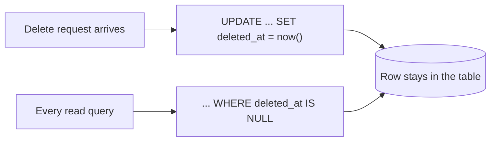

Creation and modification are now recorded automatically. Deletion is the third event in a row's life, and in production systems it is usually not allowed to happen at all.

# Why deletion is the problem

Somebody asks what happened with order 4471. If that order was deleted, there is no answer. Not a partial answer — nothing. The row is gone, and with it the record that it ever existed.

> [!important] **Deleting a row destroys evidence.** In a system of any size that is not an inconvenience, it is the loss of the ability to explain what the business did. Auditing, investigating a complaint, reconciling accounts, answering a regulator — all of them assume the history is still there.

Which leads to a convention that sounds like a workaround and is actually the norm.

> [!important] **Soft delete** means the row is never removed. It is **marked** as deleted, and every read is taught to skip marked rows. The data stays; only its visibility changes.

# Two ways to mark it

## Approach one — a boolean

```text
 id | name        | is_deleted
 1  | electronics | false
 2  | kitchenware | true
```

Direct, and it works. It also throws away the thing you wanted soft delete for.

> [!warning] **A boolean records that the row was deleted, not when.** For auditing, when is most of the value — the whole point was to be able to reconstruct what happened and in what order.

## Approach two — a nullable timestamp

```text
 id | name        | deleted_at
 1  | electronics | NULL
 2  | kitchenware | 2026-02-22 11:31:04
```

> [!important] **One column carries both facts.** `NULL` means the row is live. A timestamp means the row is deleted, and says exactly when.

One column instead of two, and it holds strictly more information. Approach two is the better design, and it is the one to use.



> [!warning] It is not free. Approach two has a real performance cost that shows up at scale, and it comes from that column being null for almost every row. That is [[06-Indexes-And-Nulls]], and it is worth reading before choosing this for a large table.

# The column

It goes where the other two went — on the class every entity extends:

```java
1  // src/main/java/com/example/FakeCommerce/schema/BaseEntity.java
2  @Column(name = "deleted_at")
3  private LocalDateTime deletedAt;
```

Nullable, necessarily. Null is what live means.

# Making delete stop deleting

The column exists. Nothing uses it yet — `repository.delete()` still issues a real `DELETE`.

```java
1  // src/main/java/com/example/FakeCommerce/schema/Category.java
2  @SQLDelete(sql = "UPDATE categories SET deleted_at = CURRENT_TIMESTAMP WHERE id = ?")
```

> [!important] **`@SQLDelete` replaces the SQL Hibernate would have generated for a delete.** Every path that would have issued `DELETE FROM categories WHERE id = ?` now issues this update instead. Its stated purpose in Hibernate is exactly this — implementing soft deletes.

The `?` is filled with the id, the same way it would have been for the delete it replaced.

> [!info] This changes deletion at the level of the entity, not the call site. Service code keeps calling `delete()` and does not need to know. **Nothing in the application has to be rewritten** — which also means nothing in the application shows that deletion behaves differently, so this is worth knowing before reading such a service.

# Making reads skip them

Marked rows are still in the table, so `SELECT * FROM categories` still returns them. Every query in the application would need `WHERE deleted_at IS NULL` appended, forever, without exception.

```java
1  // src/main/java/com/example/FakeCommerce/schema/Category.java
2  @SQLRestriction("deleted_at IS NULL")
```

> [!important] **`@SQLRestriction` appends a condition to every query Hibernate generates for this entity.** Not one query — all of them, including derived queries, `findAll`, and association loads.

# The finished entity

```java
1  // src/main/java/com/example/FakeCommerce/schema/Category.java
2  package com.example.FakeCommerce.schema;
3
4  import org.hibernate.annotations.SQLDelete;
5  import org.hibernate.annotations.SQLRestriction;
6
7  import jakarta.persistence.Entity;
8  import jakarta.persistence.Table;
9  import lombok.AllArgsConstructor;
10 import lombok.Builder;
11 import lombok.Data;
12 import lombok.NoArgsConstructor;
13
14 @Data
15 @AllArgsConstructor
16 @NoArgsConstructor
17 @Builder
18 @Entity
19 @Table(name = "categories")
20 @SQLDelete(sql = "UPDATE categories SET deleted_at = CURRENT_TIMESTAMP WHERE id = ?")
21 @SQLRestriction("deleted_at IS NULL")
22 public class Category extends BaseEntity {
23
24     private String name;
25 }
```

> [!info] Both annotations come from `org.hibernate.annotations`, not `jakarta.persistence`. Soft delete is not part of the JPA specification — this is Hibernate providing something the standard does not.

# Watching it work

**A read, before deleting anything:**

```text
1  GET /api/v1/categories
```

```text
1  Hibernate: select c1_0.id, c1_0.created_at, c1_0.deleted_at, c1_0.name, c1_0.updated_at
2             from categories c1_0 where c1_0.deleted_at is null
```

> [!info] **Verified.** Nothing in the repository method asked for that filter. `where c1_0.deleted_at is null` on line 2 was appended by `@SQLRestriction`.

**Now delete it:**

```text
1  DELETE /api/v1/categories/1
2  → 200 OK
```

```text
1  Hibernate: UPDATE categories SET deleted_at = CURRENT_TIMESTAMP WHERE id = ?
```

> [!info] **Verified.** The response is a success and no `DELETE` was issued. `@SQLDelete` substituted the update.

**The row is still there:**

```text
1  select * from categories;
2  id | name        | created_at          | updated_at          | deleted_at          |
3  1  | electronics | 2026-02-22 11:14:07 | 2026-02-22 11:14:07 | 2026-02-22 11:31:04 |
```

**And the API no longer returns it:**

```text
1  GET /api/v1/categories
2  → []
```

> [!important] Both halves are working at once. **The data survived and the application cannot see it** — which is exactly what soft delete is for.

# The part that does not scale

The two annotations went on `Category`. They do nothing for anything else.

> [!warning] **`@SQLDelete` and `@SQLRestriction` have to be repeated on every entity**, with the table name changed each time. There is no shared place to put them — they cannot go on `BaseEntity`, because each one names its own table in raw SQL.

So `Order`, `Product` and `OrderProducts` each got their own copy:

```java
1  // Order.java
2  @SQLDelete(sql = "UPDATE orders SET deleted_at = CURRENT_TIMESTAMP WHERE id = ?")
3  @SQLRestriction("deleted_at IS NULL")
```

```java
1  // OrderProducts.java
2  @SQLDelete(sql = "UPDATE order_products SET deleted_at = CURRENT_TIMESTAMP WHERE id = ?")
3  @SQLRestriction("deleted_at IS NULL")
```

> [!important] The contrast with auditing is sharp and worth noticing. **Auditing was declared once on `BaseEntity` and every table inherited it.** Soft delete cannot be, because its behaviour is expressed as SQL naming a specific table. An entity added later and not given these two annotations will hard-delete, silently, and nothing will warn you.

# Opting out on purpose

Not every table wants this. A join table is the obvious case — when a product is removed from an order, keeping a soft-deleted order line forever may be more noise than history.

> [!important] Leaving the annotations off an entity means it hard-deletes normally. **This is a per-entity decision, not an application-wide one**, and choosing differently for a join table than for the things it joins is a legitimate design.

What soft delete does not change is the rest of the relationship. A soft-deleted order line stays in the table, and every read skips it, so the order simply appears not to contain that product.

# Cascade types

One related idea, named here and not yet used.

> [!important] **A cascade type controls what happens to related rows when something happens to the row they belong to.** Delete a category and its products arguably should not survive it; save a category with new products attached and those products should be saved too.

That interacts directly with everything above — under soft delete, cascading a delete means cascading a timestamp rather than a removal. Working through it is easier once there is an order API exercising these relationships.
